# 桂圓帳房 — 使用手冊

這份是**照畫面分區的查閱型手冊**——想知道某個畫面怎麼操作,照目錄找那一節看就好,
不是照做生意的順序排的。**第一次上手、想照順序走一遍完整流程**,請看
[營運流程SOP.md](營運流程SOP.md);同事想深入了解每個畫面怎麼記帳、對應什麼會計科目,
看 [功能手冊.md](功能手冊.md);技術細節見 [系統文件.md](系統文件.md)。

---

## 一、開始使用

1. 打開 `app` 資料夾,**雙擊 `啟動.bat`**。
2. 第一次會跑一兩分鐘裝東西,之後很快。
3. 出現黑色視窗、瀏覽器自動打開 **http://127.0.0.1:8000** 就成功了。
4. **用的時候黑視窗不要關**,關了網站就停了。用完直接關視窗即可。

> 目前畫面上的數字是「示範假資料」,可以放心點來點去練習。等要正式用,再把真資料建進去(或請人協助匯入)。


### 在 iPad / 手機上用(同一個 Wi-Fi)

App 跑在電腦上,iPad 只是「遠端的螢幕」——**電腦要開著、`啟動.bat` 要在跑**。

1. 電腦、iPad 連**同一個 Wi-Fi**。
2. 看 `啟動.bat` 黑視窗裡印出的 `http://192.168.x.x:8000`(那台電腦的區網位址)。
3. iPad 用 Safari 打那個網址。
4. Safari 分享鈕 →「**加入主畫面**」→ 桌面就有一顆「桂圓帳房」圖示,點開全螢幕,像 App 一樣。

> 第一次連,Windows 可能跳出防火牆詢問,選「允許」。
> 離開這個 Wi-Fi 就連不到;資料一直都只在那台電腦上。

---

## 二、畫面導覽(左側選單)

選單分四區,點區名可以收合展開(**你自己收合/展開的狀態,這台電腦、這個瀏覽器會記住**,
換頁不會彈回去):

| 區 | 選單 | 用途 |
|---|---|---|
| | **儀表板** | 一頁看營運全貌;最上面「需要注意」是今天該處理的事 |
| | **＋ 記一筆(九宮格)** | 要記哪一種交易的入口頁,九張卡片點進去就是原本的畫面(詳見第四節) |
| 每天做的 | **訂單** | 所有訂單清單;點「＋ 新增訂單」開單;點單號看 / 改一張訂單 |
| 每天做的 | **進貨** | 買進來的成本:鮮果收購、包材、木柴、委外、設備 |
| 每天做的 | **營運費用** | 逐月登記房租、人事、驗證費等固定支出 |
| 出貨 / 退貨 | **出貨作業** | 揀貨單、出貨標籤 / 送貨單、食品標示,都可列印;右上「物流異常處理」處理破損 / 遺失 / 退貨 |
| 出貨 / 退貨 | **退貨 / 折讓** | 客人退貨或折讓的紀錄;大部分情況直接在訂單頁按「整筆退單」就好 |
| 看數字 | **財務健康** | 每月從營收算到稅前利潤 + 累積稅前 + 毛利率趨勢(要先填每月營運費用) |
| 看數字 | **獲利報表** | 三個分頁:獲利分析 / 收款帳齡 / 跨產季比較,可匯出 Excel |
| 看數字 | **定價試算** | 抓成本、算單位成本、對照售價的估算工具;**純參考,不會動到帳上任何數字** |
| 看數字 | **總帳** | 系統依你填的業務資料自動組出的複式分錄,主要給同事核對帳務用,平常不用特別管(見第四節) |
| 看數字 | **銀行帳戶明細** | 現金 / 各銀行帳戶各自的進出流水 + 累計餘額(見第四節) |
| 設定一次的 | **客戶資料庫** | 客戶名單、明細、新增、編輯、合併重複 |
| 設定一次的 | **商品目錄** | 你賣的每個品項規格、定價、單位成本 |
| 設定一次的 | **供應商** | 進貨的對象名單 |
| 設定一次的 | **銷售管道** | 官網 / 市集 / 批發 / LINE… |
| 設定一次的 | **庫存** | 每個商品現有幾包;登錄分裝入庫、盤點、報廢,也能看每一筆進出的明細 |
| 設定一次的 | **固定資產** | 焙灶 / 剝殼機 / 搖蜜機 / 冷藏 / 貨車… 建卡後系統每月自動提折舊,算進財務健康,也會記進總帳 |

- **待確認**(系統提醒有資料沒填完整)、**產季目標**(設定整季營收目標)沒放在選單裡:
  待確認從儀表板「需要注意」的紅字進;產季目標從儀表板「產季目標 & 進度」卡點「設定目標」進。
- 右上角(儀表板、報表頁)可切 **產季**(可複選,預設最新一季)。

---

## 三、一個核心觀念:分開建檔

這套系統把資料分成兩種,**觀念對了,操作就順了**。

### 主檔 —— 建一次,之後一直用
像通訊錄和型錄。內容不常變,先建好放著。

| 主檔 | 就是 | 建的時機 |
|---|---|---|
| **銷售管道** | 官網 / 市集 / 批發 / LINE… | 一開始建好,很少再動 |
| **商品目錄** | 每個品項規格(桂圓乾 300g、龍眼肉 600g…)+ 各分級定價 | 有新品或改價時 |
| **客戶** | 每一個買過的人 / 店 / 單位,含電話、地址、分級 | 第一次跟這個客人往來時 |

### 交易 —— 每次發生就記一筆
就是 **訂單(+ 訂單明細)**。每賣一次記一張。

### 關鍵:訂單不是「重打一次資料」,是「挑」

開一張訂單時,你**不會**再輸入客戶的電話地址、也不會重打商品名稱和售價 ——
你只是從既有的客戶清單「挑一個人」、從商品目錄「挑幾樣東西」,填數量,系統自動帶價。

```
         ┌─ 客戶(挑一個)
訂單 ────┼─ 銷售管道(挑一個)
         └─ 訂單明細 ── 商品(挑) × 數量 × 單價
```

### 為什麼要這樣分

1. **不用重複輸入** —— 老客戶下第 10 張單,不用再打一次他的資料。
2. **資料一致** —— 客戶電話改一次,所有相關訂單都跟著對;不會這張寫對、那張寫錯。
3. **報表才算得出來** —— 因為每張訂單都連到「同一個客戶編號」「同一個商品編號」,系統才能把「這個客人買過幾次」「這支產品賣多少」串起來。名字打得不一樣,系統就當成不同人 / 不同東西,報表就亂了。

### 建立順序(第一次導入時)

**先** 銷售管道 → **再** 商品目錄(順便設定價、單位成本)→ **再** 客戶 → **最後才** 開訂單。
(平常運作時,只有「客戶」會邊做邊補;商品和管道很少動。)

### 一個比喻

- 商品目錄 = 菜單
- 客戶資料庫 = 常客名冊
- 訂單 = 一張出貨單:寫「誰、點了菜單上的哪幾樣、幾份」,不會把整份菜單和客人的身家再抄一遍。

---

## 四、記一筆(九宮格)—— 要記帳,先看這頁

側邊選單「＋ 記一筆(九宮格)」是所有記帳動作的統一入口,九張卡片對應九種交易,
點進去就是原本的畫面填,系統會自動組出分錄記進「總帳」(下一節說明)。


**你每天真正會用到的只有前 3 張**(對應第二節「每天做的」那三個選單):

| 卡片 | 就是 | 多常用 |
|---|---|---|
| 銷售 / 出貨 | 訂單 | 每天 |
| 採購物料 | 進貨 | 常常 |
| 營運支出 | 營運費用 | 每月 |
| 設備相關 | 固定資產 | 買設備才會用到 |
| 生產入庫 | 焙好 / 搖好蜜做成成品入庫時,登記數量 + 這批貨值多少錢 | 偶爾 |
| 其他收益 | 利息收入、政府補助等不是賣東西賺來的錢 | 很少 |
| 其他費用 | 其實併進「營運支出」的類別選單裡,不是另一個畫面 | — |
| 資本異動 | 增資、盈餘轉列公積 | 幾乎不會用到,同事在管 |
| 帳務調整 | 其他 8 類都套不上時,手動記一筆(要懂借貸科目)| 幾乎不會用到,同事在管 |

「生產入庫」「其他收益」「資本異動」「帳務調整」這四張是給比較特殊的情況用的,平常
用不到也沒關係;真的要用,填法都很直覺(日期、金額、備註幾個欄位),存檔就自動記好。

### 總帳是什麼

**總帳**(選單「看數字 → 總帳」)是系統依你上面填的每一筆業務資料,自動組出來的
會計分錄明細——你不用懂「借方 / 貸方」是什麼,這頁主要是給比較懂記帳的同事核對
帳務對不對用的。你只要記得:**這裡的內容不能直接改,要改回去改原本那筆訂單 / 進貨 /
費用,總帳會自動跟著更新**。


---

## 五、每天最常做的事

### 1. 開一張新訂單

**訂單** 選單點進去先看到清單,右上「＋ 新增訂單」開新單。

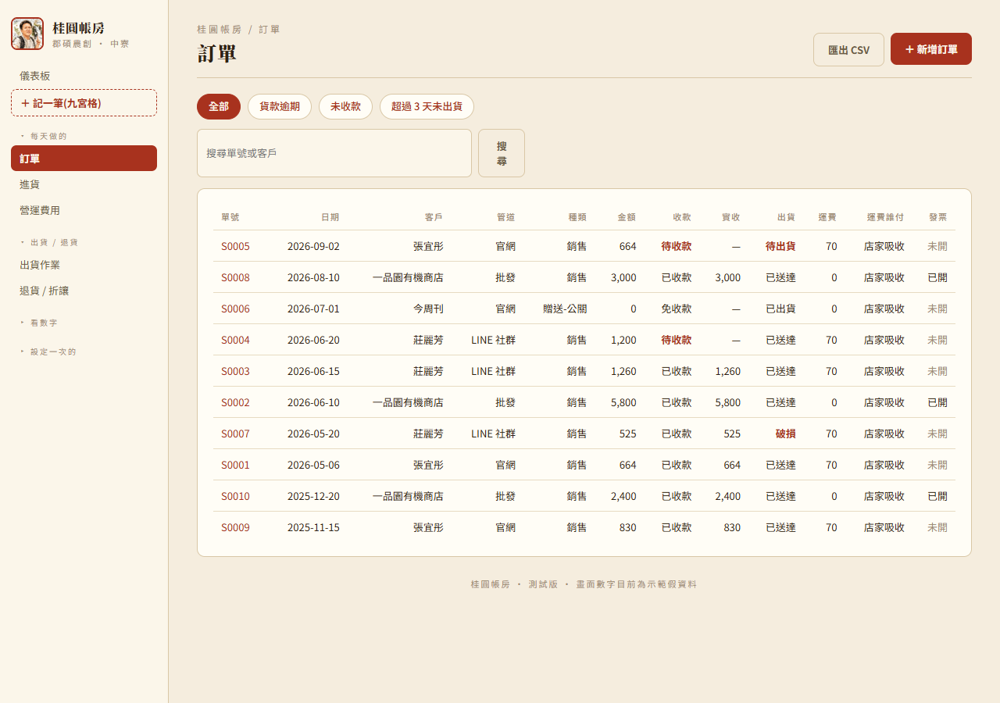

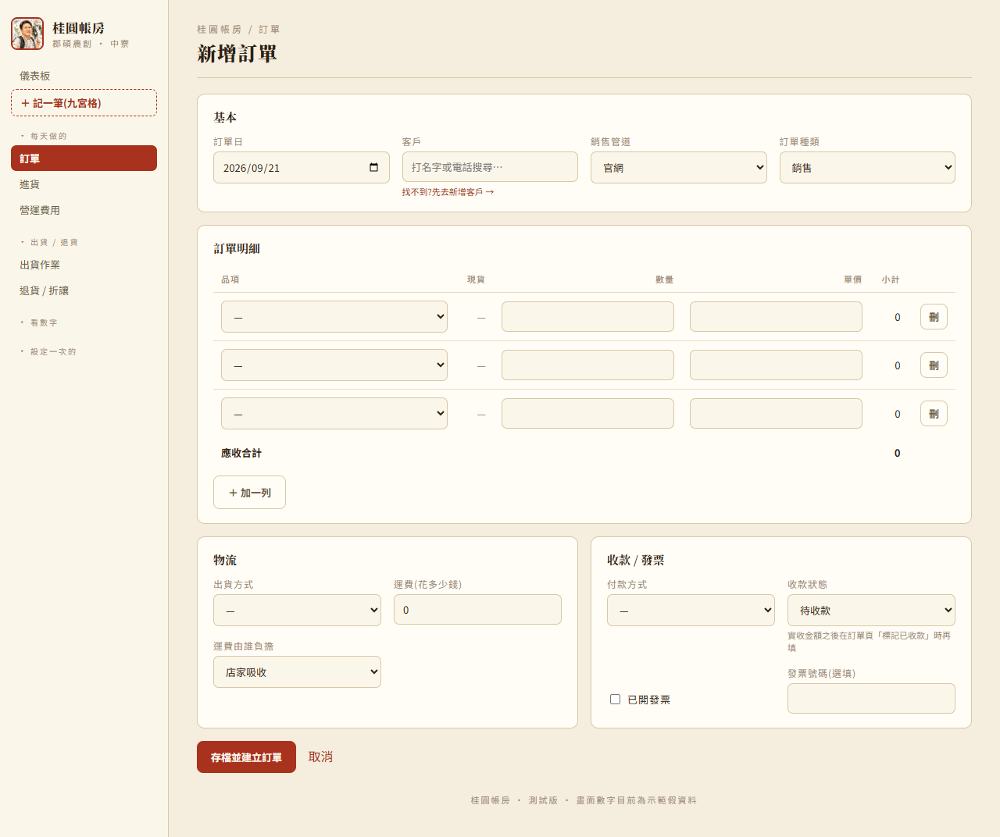

1. **訂單日**:預設今天,需要可改。
2. **客戶**:在框裡打名字或電話,下面會跳出清單。每筆會顯示「分級 · 電話 · 最近購買 · 幾筆訂單」,**認清楚是哪一位再點**。
   - 選好後下方會出現一張小卡:電話、地址、最近 3 筆訂單、累計消費 —— 再確認一次沒選錯人。
   - **名單裡找不到** → 點「找不到?先去新增客戶 →」,把客戶建好會自動跳回來。
3. **銷售管道**:這張單從哪來(官網 / 市集 / 批發…)。
4. **訂單種類**:一般賣就是「銷售」;送人選「贈送-公關」;補寄選「理賠重寄」等。
5. **訂單明細**:
   - 每列選品項、填數量。
   - **單價留空會自動帶入該客戶分級的定價**;要特價就自己打。
   - 不夠填 → 點「＋ 加一列」;多的 → 點「刪」。
   - 搭贈的東西可以加一列、勾為「贈品」(不算錢)。
6. **物流**:出貨方式、運費(花多少錢)、運費由誰負擔(店家吸收 / 客戶付,純記錄用,不影響任何金額計算)。
7. **收款**:付款方式、收款狀態(還沒收就「待收款」)。
8. **發票**:有開發票就勾「已開發票」——**勾了之後發票號碼欄位會變成必填**,沒填不給存檔;沒開發票就不用勾,發票號碼留空即可。
9. **存檔並建立訂單** → 會跳到這張訂單的明細頁。


### 2. 收到貨款了

打開那張訂單(訂單清單點單號,或儀表板「貨款逾期未收」點進去)。
「收款」卡裡先填**實收金額**(實際收到多少就填多少,不一定等於訂單金額 —— 部分收款就填實際收到的數)、
收款日,再按右上角 **「標記已收款」**。**本產季營收算的是這個實收金額,不是訂單開的金額** ——
沒標記收款,這張單再大都不會算進營收 / 毛利裡。系統也會同時在總帳補一筆收款分錄,不用你管。

### 3. 出貨了

打開訂單 → 右上角 **「標記已出貨」**(自動填今天)。
要記物流單號 → 在「出貨」區填 **物流單號**、必要時改物流商、出貨狀態,按下方「儲存」。

### 4. 改一張已建立的訂單

打開訂單明細頁:
- **品項**:直接改品項 / 數量 / 單價,加減列,按「儲存」→ 金額自動重算。
- **改客戶**:上方「客戶」框重新搜尋、選一位,按「儲存」。
- **複製訂單**:右上「複製訂單」→ 同客戶、同品項開一張新單(日期填今天),適合回頭客重複下同樣的東西。
- **刪除訂單**:右上「刪除訂單」,會問一次確認。刪掉後**沒辦法復原**,連同這張單的品項、退貨紀錄、
  庫存進出、總帳分錄都會一起刪掉、庫存數字跟著調回去。真的建錯單、要整個消掉才用這個;客人整單退貨用下面的
  「整筆退單」就好,不用刪單。

### 5. 包裹破損 / 遺失

**物流異常** 頁:
- 找到那筆,選「處理方式」(重寄 / 退款 / 換貨 / 折讓),填說明。
- 要重寄 → 勾 **「一併建立理賠重寄單」**,系統會複製原訂單品項、開一張金額 0 的重寄單。
- 按「儲存」。

### 6. 客人整張訂單退貨

打開那張訂單,下方「退貨 / 折讓」區按 **「整筆退單(全退)」**,確認一次就好 ——
系統會把這張單的貨全部退回庫存、金額全額沖銷,適合「客人整張都不要了」這種情況。
系統會自動判斷這張單有沒有收過款:**已經收款的,分錄會記成真的退現金;還沒收款的,
分錄會記成打折欠款**,不用你判斷,存檔就對了。

只有部分品項要退、或是折讓不退貨(金額少收但貨不退回)這種比較細的情況,
展開下面「只退部分品項 / 折讓(進階)」自己填:發生日期、類型(退貨 / 折讓)、沖減金額、
退回品項與數量(有退實體貨才選)、貨是否可再賣(可賣就選「是」,系統會自動加回庫存)。


### 7. 記一筆進貨

**進貨** 選單先看到清單,右上「＋ 記一筆進貨」選供應商、類別、填金額。**設備類記得勾
「這是設備」**——勾了之後這筆不算一次性費用,會另外建固定資產卡逐年提折舊,不要跟一般
進貨混在一起。

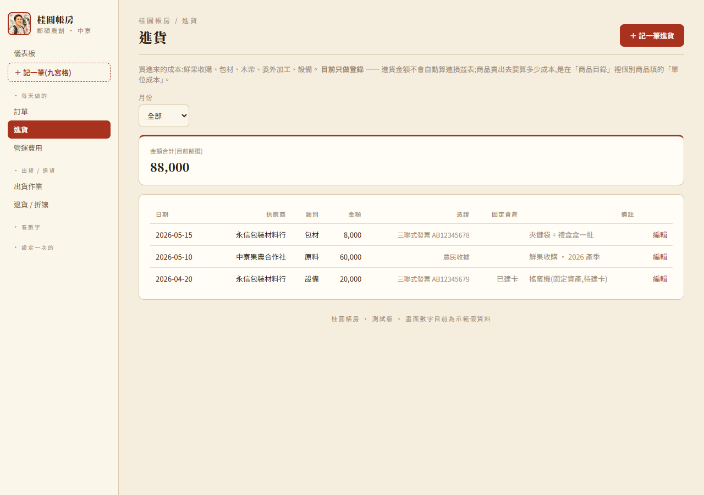

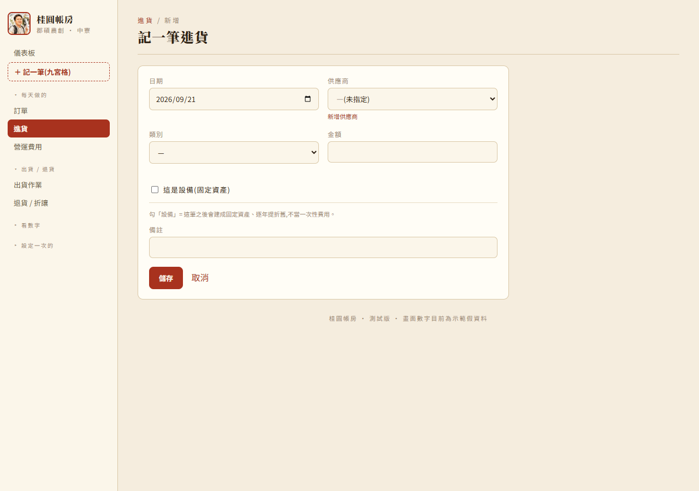

存檔後(設備除外)會先看到一張「確認分錄」畫面,系統依你剛剛填的內容自動組好分錄草稿,
看一眼付款帳戶、稅額對不對,不確定就留預設值,按「確認存檔」才會真的存進去。**這裡如果
憑證類型選了「發票」,發票號碼也是必填的。**


### 8. 記一筆營運費用

**營運費用** 選單先看到逐月清單,右上「＋ 新增一筆」選月份、項目、填金額。

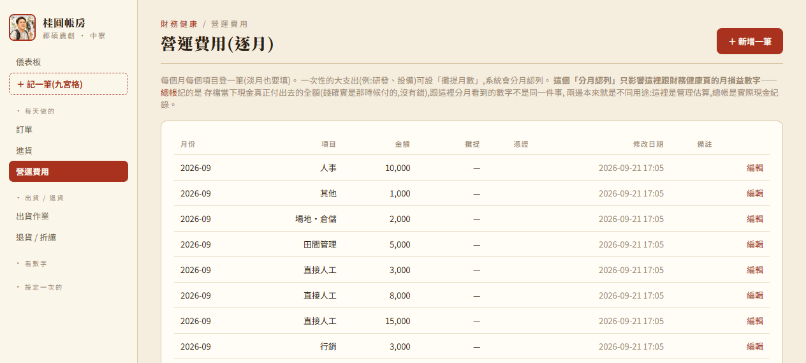

一次性大支出(研發、設備零件)可設
「攤提月數」,系統會分月認列進財務健康的損益,但**總帳這邊記的是存檔當下現金真正付出去的
全額**——這兩個數字本來看的東西不一樣,不是算錯。

如果類別選到「研發」,畫面會提醒你:如果是設備 / 機器的零件、組裝費用,建議改到「固定資產」
登記才會正確逐年提折舊;「研發」比較適合沒有形成實體設備的費用(配方試驗、委外檢驗)。


跟進貨一樣,存檔前也會先看一次分錄確認畫面,憑證類型選「發票」的話發票號碼一樣必填。

---

## 六、客戶

### 新增

**客戶資料庫 → ＋ 新增客戶**。填名稱(必填)、電話、**分級**(零售 / 批發 / 團購主 / 機構 / 公關對象 —— 影響自動帶價)、主要管道、發票抬頭 / 統編、單據需求、預設收件地址。

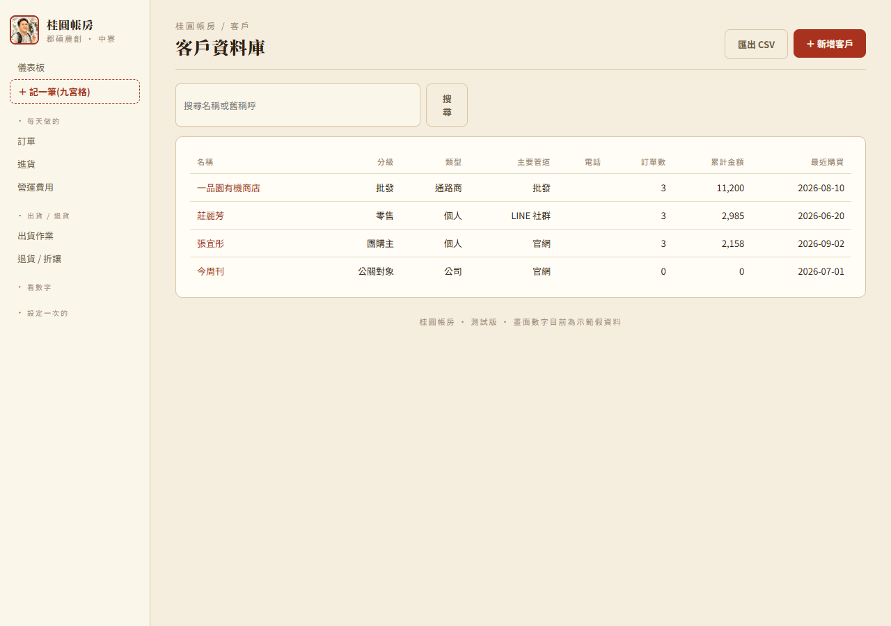

### 搜尋

清單上方搜尋框,可打名字、舊稱呼、電話。

### 重名怎麼辦

- 建檔時如果已有同名,系統會列出現有那幾位(含電話、最近購買、地址),請你判斷:
  - **同一人** → 按「取消」,回去選現有那位。
  - **不同人** → 名稱加個能區分的字(電話末碼、地區、來源,如 `陳美玲(0912…321)`),勾「確認這是不同的人,仍要新增」。
- 系統靠「客戶編號」認人,名字一樣也是不同資料、各自的訂單歷史。

### 合併重複客戶

不小心建重了 → 打開其中一位的明細頁 → 右上「**合併到其他客戶**」→ 搜尋要**保留**的那位 → 確認。
來源客戶的所有訂單、地址、舊稱呼都會搬過去,來源被刪除。**無法復原,請看清楚再按。**

### 刪除客戶

客戶編輯頁也能「刪除」,但只要這位客戶已經有訂單就會被擋下來(系統會直接說明原因)。
建錯、從沒下過單的客戶才刪得掉;已經有交易紀錄的客戶,想處理重複請用上面的「合併」。

---

## 七、主檔維護(商品 / 管道 / 供應商)

### 商品目錄
- 「＋ 新增商品」/ 每列「編輯」。
- **商品編號**:每種品項＋規格一個專屬代號(桂圓乾 300g 一個、500g 另一個)。定好**不要再改**,所有訂單靠它連回商品。
- **單位成本**:這個品項單位成本多少(例如一包 300g 桂圓乾成本多少),系統算「毛利」「稅前利潤」都是拿營收扣這個數字,填得準不準直接決定毛利準不準。
- 表單最下面「**定價**」:填零售 / 批發 / 團購 / 機構 / 內部各自的價,新增訂單就會自動帶。
- 商品編輯頁可以「刪除」,但如果已經有訂單用過它、庫存還有量、有退貨紀錄等,系統會擋下來並具體說明卡在哪(例如「有 5 張訂單用過這個商品、現有庫存還有 7 包」),把那些清乾淨才能刪。

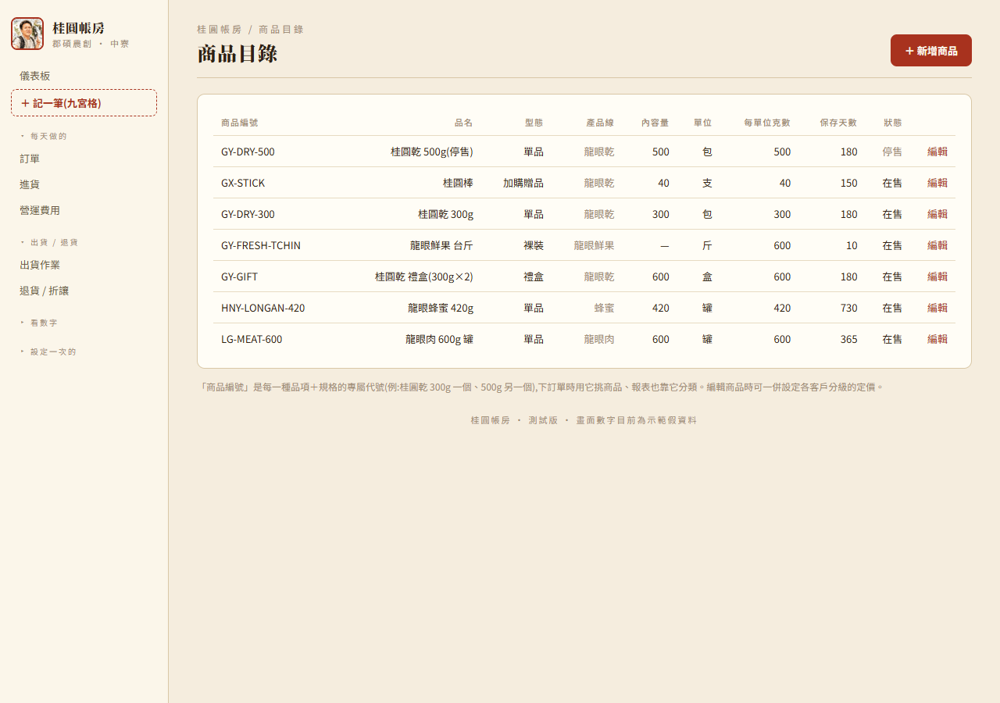

### 銷售管道
- 「＋ 新增管道」:代碼、名稱、分類、帳期天數。
- 同樣可以「刪除」,若已經被訂單、客戶(設為主要管道)或定價用過會被擋下並說明原因。

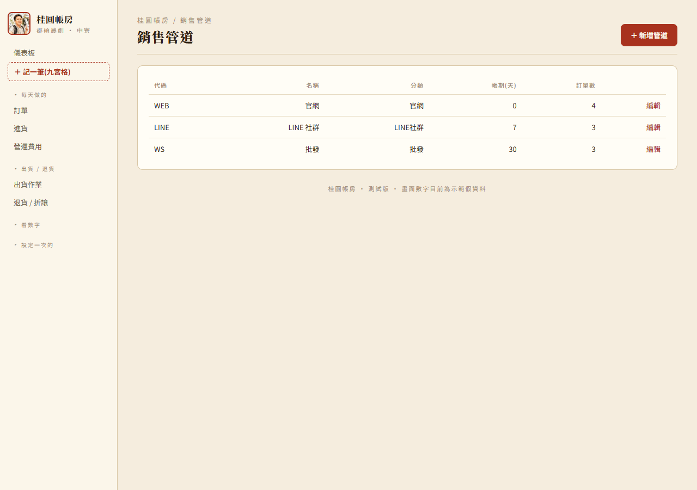

### 供應商
- **供應商** 頁登記買進來的對象(原料 / 包材 / 委外加工 / 設備 / 服務);「進貨」開單時要挑一個供應商。

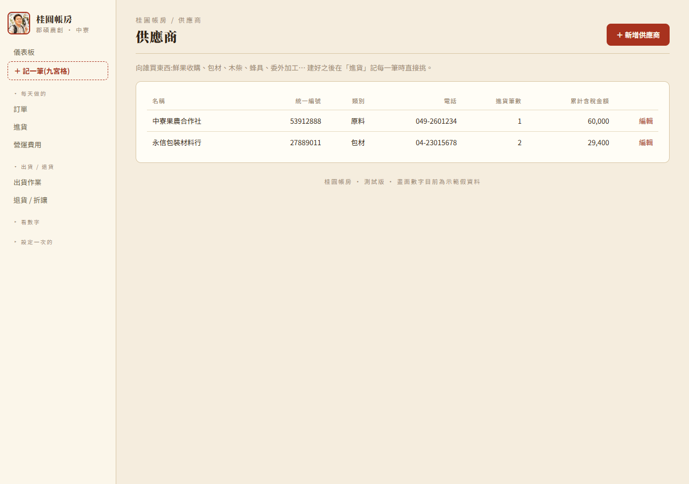

---

## 八、庫存

**庫存** 頁看每個商品「現在還有幾包能賣」,並記錄進出。

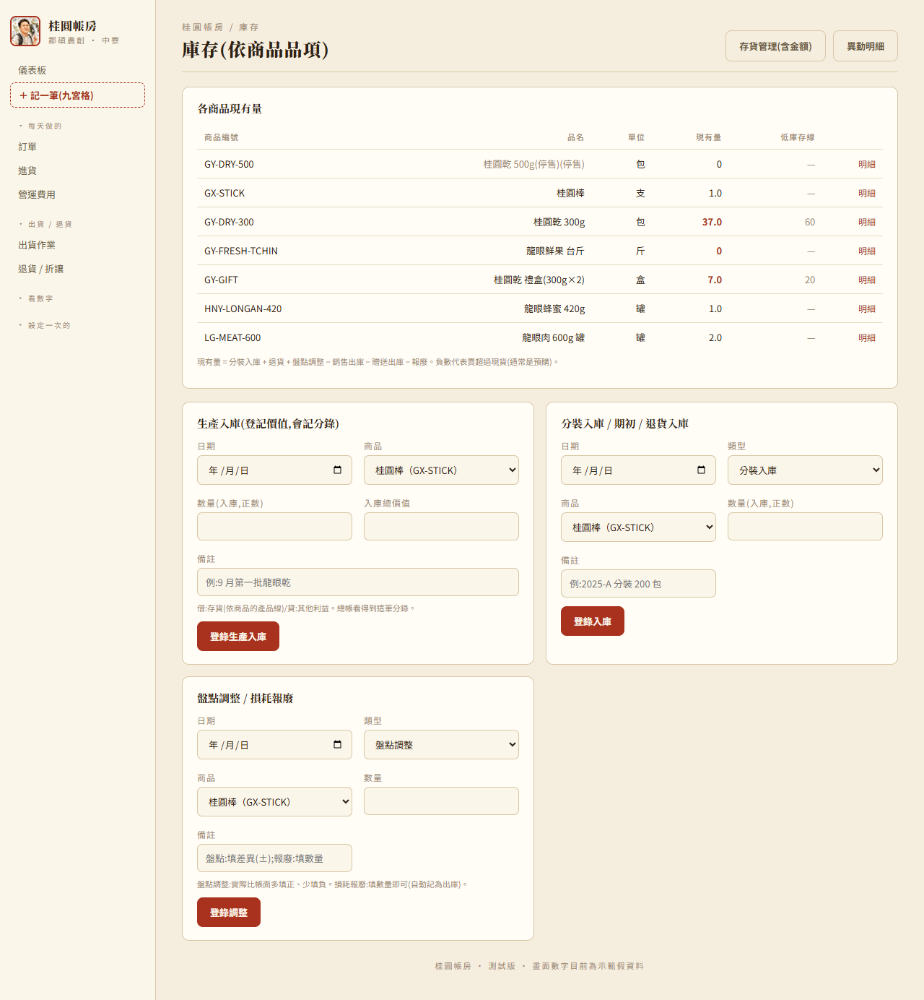

### 觀念
- 一窯桂圓焙好後**分裝成一包一包**(300g、禮盒…)→ 這叫「**分裝入庫**」,要登錄。
- 之後每開一張訂單,系統**自動扣庫存**(不用手動)。改訂單、刪品項,庫存跟著調。
- 現有量 = 分裝入庫 + 退貨 + 盤點多的 − 賣掉 − 送掉 − 報廢。

### 每天 / 每批要做的
1. **焙好分裝完** → 庫存頁下方「分裝入庫」:選商品、填包數、按「登錄入庫」。
2. **這批貨值多少錢也想記進帳** → 用上面的「**生產入庫**」卡片,除了數量,多填一個「入庫總價值」,
   系統會多記一筆分錄(這個原本是「分裝入庫」的加強版,平常不記錢只記數量就用「分裝入庫」就好)。
3. **盤點**(實際數一數和帳面對) → 「盤點調整」:多了填正數、少了填負數。
4. **壞掉 / 過期丟掉** → 「損耗報廢」:填數量(自動當出庫)。
5. **客人退貨回來還能賣** → 「退貨入庫」。

### 警示
- 開訂單時,選了商品會在下面顯示「**現貨 N**」;不夠會變紅字(還是可以送出,因為可能是預購)。
- 儀表板「需要注意」會出現「**庫存為負 X 個品項(超賣)**」「**庫存偏低 X 個品項**」。
- 低庫存線在「商品目錄」每個商品可設(`low_stock`);不設就只在賣超過現貨(負數)時才提醒。

### 異動明細
庫存頁右上「異動明細」→ 每一筆進出的流水,可依商品篩選,關聯訂單可點進去。
**手動登錄的那幾筆**(分裝入庫 / 盤點調整 / 損耗報廢 / 退貨入庫,不是訂單自動產生的)可以直接刪除
(會問一次確認);訂單自動產生的進出不能單獨刪,要處理要從那張訂單本身下手。

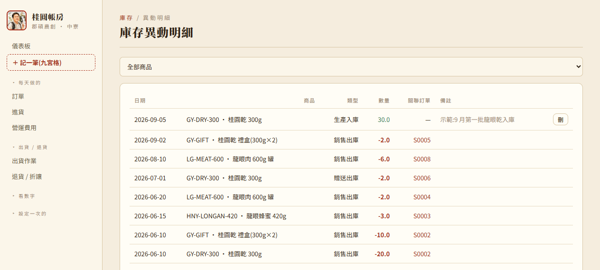

### 存貨管理(含金額)

庫存頁右上「存貨管理(含金額)」按鈕進去,看的是同一批庫存資料,但多算了「值多少錢」——
依商品列出這段期間的期初 / 入庫 / 出庫 / 期末,數量跟金額都有,金額是拿商品目錄的「單位成本」
概算的。平常不用特別看,想知道存貨大概值多少錢的時候翻一下就好。


---

## 九、固定資產

**固定資產** 頁登記焙灶、剝殼機、搖蜜機、冷藏、貨車這類不是一次性費用、要逐年提折舊的設備。


- 「＋ 新增一台」填名稱、類別(選了會帶預設耐用年數)、取得日、成本、政府補助款(有才填)。
- 存檔後系統會自動記一筆「設備取得」分錄,以後每個月你打開這頁,系統會順便把還沒記過的
  折舊月份補齊,不用手動一筆一筆記。
- 進貨頁勾「這是設備」存檔的那筆,可以直接點「建卡→」把金額日期帶過來,不用重打一次。
- 處分(賣掉 / 報廢)才填「處分日」,填了之後就不會再繼續提折舊。


---

## 十、出貨作業

**出貨作業** 頁把「今天要出的貨」整理成可列印的文件。

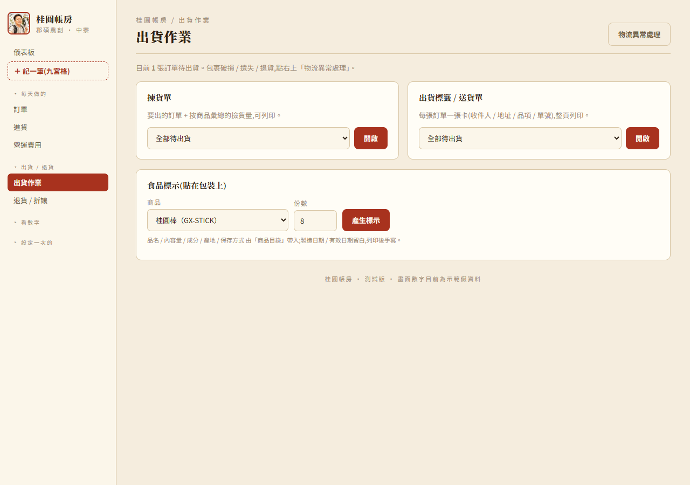

### 揀貨單
- 「全部待出貨的揀貨單」或選某個訂單日。
- 上半:**按商品彙總**(桂圓乾 300g 合計 40 包、禮盒 12 盒…)→ 拿著去庫存撿貨。
- 下半:逐張訂單的收件人與品項。
- 右上「列印」。

### 出貨標籤 / 送貨單
- 每張訂單一張卡:收件人、電話、地址、品項、單號、寄件人。整頁列印、剪下貼箱。
- 寄件地址 / 電話第一次要在程式的 `SENDER` 設定(main.py),現在是 `[寄件地址]` 佔位。

### 食品標示
- 選商品 + 份數 → 產生標示貼紙(品名 / 內容量 / 成分 / 產地 / 保存方式 / 製造日期 / 有效日期 / 製造商)。
- 內容量、成分、產地、保存方式在「商品目錄」編輯;製造日期、有效日期系統不會自動填,列印出來自己手寫上去。
- 食品業者登錄字號、營養標示等法規細項請自行確認補上。

---

## 十一、看儀表板

整理過後,儀表板只留「一眼要看的」:

- **需要注意**(橘色區):今天該處理的事,每個標籤可點進去處理(逾期未收 / 待出貨超時 / 破損遺失 / 待確認資料)。
- **4 個 KPI**:本產季營收(**已經實收的錢**,還沒收到的訂單不算)、**本產季稅前利潤**、毛利率、還沒收到的貨款。
- **本產季至今損益簡表**:營收 → −銷貨退回與折讓 → −銷貨成本 → 毛利 → −運費 → −營運費用 → **稅前利潤**,一次看完,右上連到財務健康看每月明細。進行中的產季,營運費用只算「已經過去的月份」,不會預先把還沒發生的費用也算進去,避免季初看起來嚇人的赤字。
- **產季目標 & 進度**:目標營收 / 實際 / 達成率 / 依速度預估季末 / 損益兩平需營收(先點卡上「設定目標」到產季目標頁設定)。
- **月營收 / 毛利趨勢**:儀表板唯一一張圖,滑過看各月金額與毛利率。
- 右上角可複選 **產季**(那個產季有訂單、或你登錄過那季的營運費用,就會出現在下拉),預設選最新一季。「逾期幾天」一律用**今天**的日期算,不用另外切。

> 更深入的看法搬到別頁:累積稅前利潤、毛利率趨勢 → 財務健康;各通路 / 品項 / 新客回頭 / Top 客戶 → 報表「獲利分析」。

---

## 十二、看報表

### 三個分頁

| 分頁 | 看什麼 |
|---|---|
| **獲利分析** | 每個商品 / 每個管道的營收、折扣、成本、**毛利、毛利率**;品項營收佔比;新客 vs 回頭客;本產季 Top 客戶 |
| **收款帳齡** | 未收款金額分 0–15 / 16–30 / 31 天以上;逐筆清單可點進去追款;下面還有「最近已收回」清單,可以回頭核對 |
| **跨產季比較** | 2024 vs 2025 的營收 / 訂單 / 毛利對照;產季內各月營收疊圖 |


每個分頁右上角有 **「匯出這頁 CSV ↓」**,會帶入目前選的產季,用 Excel 打開中文正常。
訂單、客戶清單頁也各有匯出鈕。

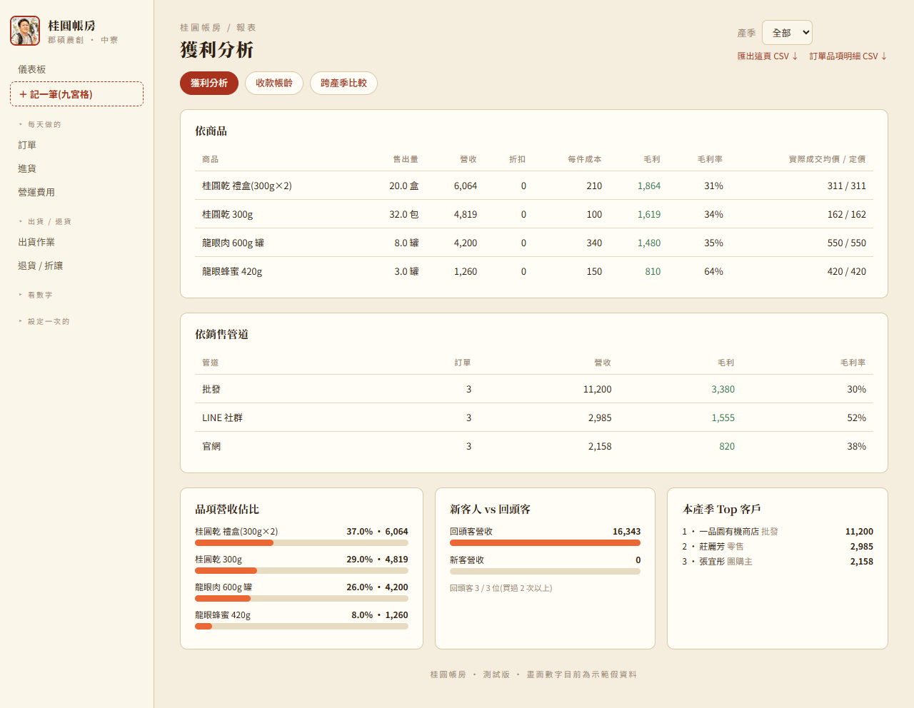

### 財務健康(月損益)

報表看的是「毛利」;**財務健康** 這頁再往下算到 **稅前利潤**。

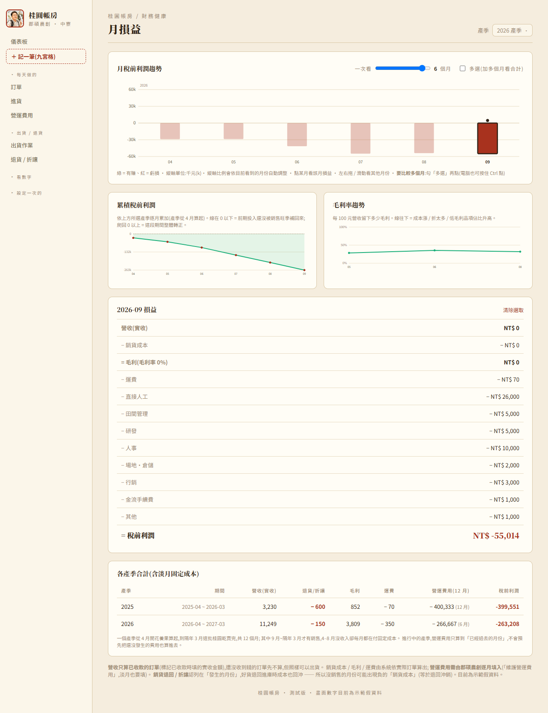

- 上方選月份。表格由上到下:營收 → −銷貨成本 → 毛利 → −運費 → −各項營運費用 → **= 稅前利潤**(綠色代表有賺、紅色代表虧)。
- **營收、成本、毛利、運費** 由系統的實際訂單自動算,營收算的是**已收到的實收金額**。
- **營運費用要你逐月填** —— 點右上「維護營運費用」→「＋ 新增一筆」。每筆可標:
  - **項目**:直接人工 / 田間管理 / 驗證費 / 研發 / 人事 / 場地・倉儲 / 行銷 / 金流手續費 / 設備維護 / 培訓 / 其他,以及一批更細的「其他費用-XX」子項(什項購置 / 勞務費 / 設計費 / 手續費 / 交通費 / 包裝費 / 檢驗費 / 印刷費 / 規費 / 燃料費),還有文具用品 / 交際費 / 捐贈 / 伙食費 / 職工福利 / 佣金支出 / 進出口費用 / 產品保固費用
  - **攤提月數**:一次性大支出(研發、設備)填 N,系統分 N 個月認列。金額欄填實際花的錢,合計不變。
- **損益兩平點**:固定成本 ÷ 毛利率 = 每月營收要做到多少才不虧;和本月實際營收比對。
- **月稅前利潤趨勢**:一眼看出哪幾個月在賺、哪幾個月被固定支出吃掉。**淡月(4–8 月是開花養果期、幾乎沒收入)照樣有人事房租,所以是紅的** —— 這正是要盯的地方,營運費用淡月也要記。
- **各產季合計**:已經結束的產季,拿整季收入減掉整年 12 個月的開銷,回答「這批桂圓到底賺不賺」;還在進行中的產季,只減掉「已經過去的月份」的開銷,不會預先算進還沒發生的支出。

> 沒填營運費用的月份,稅前利潤會等於毛利(偏高、不準)。要準,每個月都要把開銷填進去。

### 銀行帳戶明細

**銀行帳戶明細**(選單「看數字」)是依帳戶(現金 / 各家銀行)整理出來的進出流水,
逐筆算累計餘額。帳戶名單是你之前在進貨 / 費用 / 訂單等地方填過的「付款帳戶」名稱,
不用另外維護。**同一個帳戶,每次都要打一樣的名稱**(例如都打「郵局」,不要這次打
「郵局」下次打「中華郵政」),不然系統會把它們當成兩個不同帳戶,餘額就會兜不起來。


### 產季目標

側邊欄「分析 → 產季目標」:每個產季填一個整季營收目標,存檔後儀表板的「產季目標 & 進度」卡就會算達成率、
依速度預估季末、損益兩平需營收。**還沒開賣、只有前期投入費用的產季**(例如 4–8 月剛登錄完營運費用、還沒下第一筆訂單)
也會出現在這頁和產季下拉裡,方便你提早設目標、看前期燒了多少。

---

## 十三、定價試算

**定價試算** 頁是給你估算「這個東西賣多少錢才划算」的工具——填材料成本、人工、製造費用,
系統算出建議售價。**這一頁純粹是參考估算,存的數字不會動到訂單、成本、營收裡任何一個數字。**

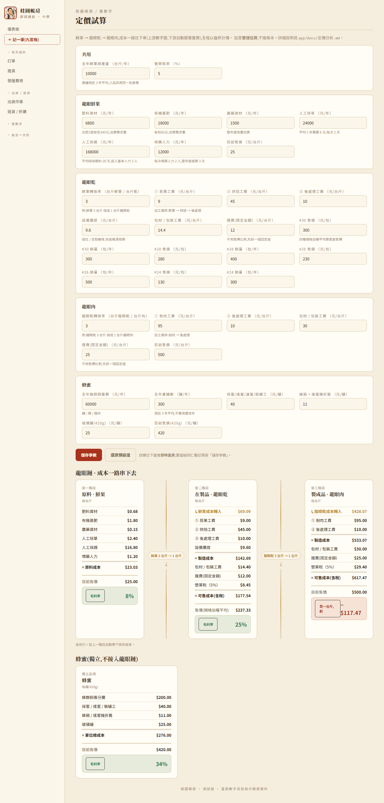

---

## 十四、資料安全

- **每次啟動會自動備份**一份當天的資料庫到 `app\備份\` 資料夾,保留最近 30 天。
- 想還原到某天:**關掉 App** → 到 `備份\` 找到那天的檔 → 複製到 `app\` 底下、改名成 `guiyuan_ledger.db`(蓋掉現有的)→ 重新啟動。
- 建議**每隔一陣子把整個 `app` 資料夾複製到隨身碟或雲端**,電腦壞了才有得救。

---

## 十五、名詞小辭典

| 詞 | 意思 |
|---|---|
| **產季** | 一批桂圓的完整週期:當年 4 月初開花養果 → 隔年 3 月底賣完,以起始年命名(如 2026 產季 = 2026-04 ~ 2027-03)。銷售集中在 9 月~隔年 2 月。不是單純的西元年。 |
| **毛利** | 營收扣掉商品的單位成本後剩下的。毛利率 = 毛利 ÷ 營收。 |
| **實收金額** | 這張訂單實際收到的錢(標記已收款時填的),系統算營收 / 毛利都用這個,不是訂單開出來的金額。 |
| **運費** | 這張訂單實際花出去、付給物流商的錢。「運費由誰負擔」只是記錄用的標籤,不影響任何金額。 |
| **折扣** | 賣得比「定價」低的差額(系統即時算,不影響訂單應收金額本身)。 |
| **分級** | 客戶類型(零售 / 批發 / 團購主 / 機構 / 公關對象),決定新增訂單自動帶哪個價。 |
| **待確認** | 系統發現的不完整資料(例:新客戶還沒指定分級),補完後標記處理。 |
| **理賠重寄** | 包裹出事後重新寄一份,金額算 0,不算營收。 |
| **已開發票** | 訂單 / 進貨 / 費用上的一個勾選(或憑證類型選「發票」)+ 發票號碼欄位,**勾了 / 選了就一定要填發票號碼**,只是記一筆帳,不會算稅額。 |
| **整筆退單** | 訂單頁的一鍵按鈕:這張單的貨全部退回庫存、金額全額沖銷,適合客人整張都退的情況。 |
| **總帳 / 分錄 / 傳票** | 系統依你填的業務資料自動組出的會計記錄,平常不用管,看第四節。想深入了解看 [功能手冊.md](功能手冊.md)。 |
| **付款帳戶** | 進貨 / 費用 / 其他收益等畫面填的「用哪個帳戶收付款」,留空 = 現金;同一個帳戶每次要打一樣的名稱。 |

---

## 十六、常見問題

**Q:我改了東西,畫面沒變?**
A:如果只是新增 / 修改資料(開訂單、改客戶),重新整理頁面即可。如果是請人改了程式,要關掉黑視窗、重跑 `啟動.bat`。

**Q:客戶下拉找不到人?**
A:先確認拼字;真的沒有就點「找不到?先去新增客戶」。

**Q:訂單金額怎麼算的?**
A:各列(數量 × 單價)加總(贈品不算錢)= 應收合計。改品項後按「儲存」會重算。運費是另外記的一筆花費,不算進應收合計裡。

**Q:一張訂單想整個作廢?**
A:訂單明細頁右上角有「刪除訂單」,會問一次確認,刪掉後連同品項、退貨紀錄、庫存異動、總帳分錄都會一起清掉,**無法復原**。如果是客人整單退貨(貨要退回庫存),用「整筆退單」按鈕比較合適,訂單本身會保留紀錄。

**Q:勾了「已開發票」但發票號碼不給我存檔?**
A:這是故意設計的——開了發票就一定要有發票號碼,系統會擋下沒填號碼的存檔。真的還沒拿到號碼,先不要勾「已開發票」,等拿到號碼再回來勾、填上去、存檔。

**Q:黑視窗出現紅色錯誤?**
A:把整段訊息截圖或複製給維護人員。
