# 桂圓帳房 — 功能手冊

給想完整了解系統怎麼記帳的人看(同事)。日常操作流程的白話版說明見
[使用手冊.md](使用手冊.md);資料庫欄位 / 路由等程式細節見 [系統文件.md](系統文件.md)。

---

## 一、系統怎麼運作:兩層資料

系統把資料分成兩層,**家易只填業務表單,總帳是系統依對照表自動組出來的**,不用另外
手動記帳:

```
業務表單(訂單 / 進貨 / 費用 / 生產入庫 / …)
        │  存檔時,依 app/ledger.py 的對照表自動組成複式分錄
        ▼
總帳(ledger_entry)── 借方合計一定等於貸方合計
```

對照表(哪個類別記哪個會計科目)全部集中在 `app/ledger.py`,想調整科目代碼直接改那個
檔案的常數就好,不用動其他程式。這份對照表是**第一版、依常理判斷的猜測**,已經對照過
「會計科目表」正式版逐一核對修正,但還有幾個正式表沒有列出對應科目的項目,標成「待確認」
(見第六節)。

### 選單結構

側邊選單分四個可收合的群組(每天做的 / 出貨・退貨 / 看數字 / 設定一次的),
最上面固定有「儀表板」跟「＋ 記一筆(九宮格)」兩個入口。

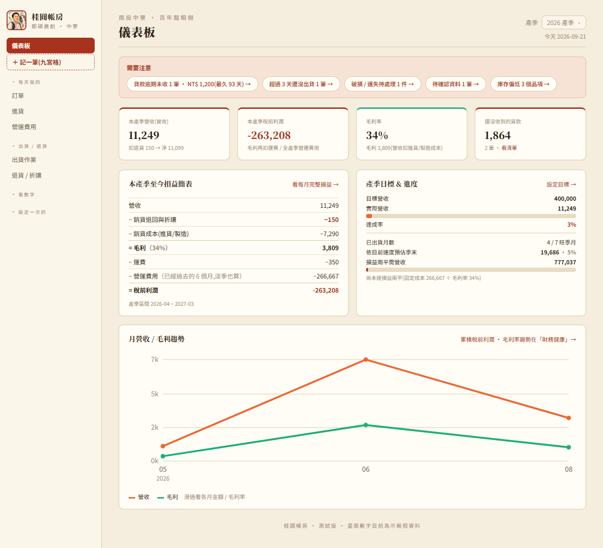

### 記一筆九宮格總覽

「記一筆」頁把 9 種交易類型攤開成卡片,對應同事原本設計的「帳務設定表」9 宮格分類。
其中 4 種(銷售/出貨、採購物料、營運支出、設備相關)本來就有家易熟悉的業務畫面,直接
沿用;其他 4 種(生產入庫、其他收益、資本異動、帳務調整)是新蓋的記帳原生畫面;
「其他費用」則是併進「營運支出」既有畫面的類別選單,沒有另開新畫面。

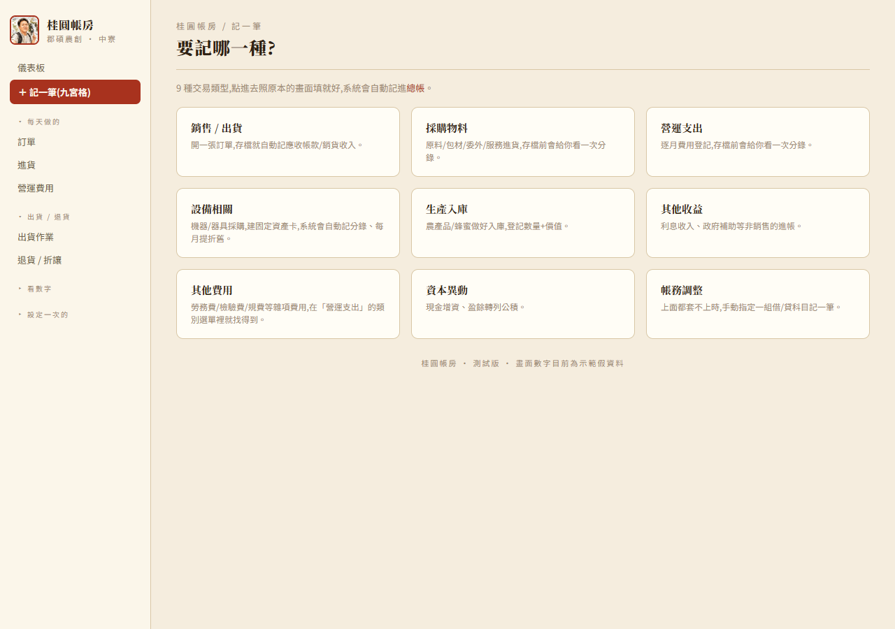

---

## 二、9 宮格逐一說明

### 1. 銷售 / 出貨(訂單)

家易熟悉的訂單畫面,**不經過確認畫面,存檔背景自動記**——訂單是最高頻操作,不想多插
一個步驟。一張訂單對到**兩張獨立傳票**:

| 傳票 | 記帳時機 | 分錄 |
|---|---|---|
| `order_sale`(前綴 `S`) | 訂單存檔當下,不管收沒收到錢 | 借:應收帳款(全額)/ 貸:銷貨收入(依產品線拆多筆,`4111-01`~`04`,沒歸屬產品線用通用 `4110`)+ 借:銷貨成本(`5111`,單一科目不拆線)/ 貸:存貨(依產品線拆,`COGS_INVENTORY_ACCOUNTS`)+ 運費 > 0 時再加借:6188-11 其他費用-運費(待確認)/ 貸:1102 現金 |
| `order_payment`(前綴 `R`) | 標記已收款那一刻,實收金額 > 0 才記 | 借:現金 / 銀行存款(依訂單的付款帳戶)/ 貸:應收帳款 |

訂單種類不是「銷售」(贈送、樣品、內部領用等)不記 `order_sale`(回傳空分錄,連運費那組也不記)。
金額或品項改變、複製訂單、標記部分收款,對應傳票都會**整張重開**(先刪舊列再插新列,
不是疊加)。刪除訂單時,兩張傳票跟著清掉。

**訂單匯入**(選單「訂單」頁「匯入(Google 表單 / Excel)」):上傳 .csv/.xlsx、預覽確認後
批次建立的訂單,記的也是上面同一組 `order_sale`/`order_payment` 傳票,不是另一套邏輯——
差別只在訂單資料從哪裡來(手動打,還是從表單/Excel 解析)。`GET /orders/import/template`
(2026-10-02 新增)依目前「在售」商品現抓一份範本 .csv,欄位名稱永遠跟商品清單同步,不用
手動維護一份靜態範本檔。詳細設計見 `docs/系統文件.md` §3.20。

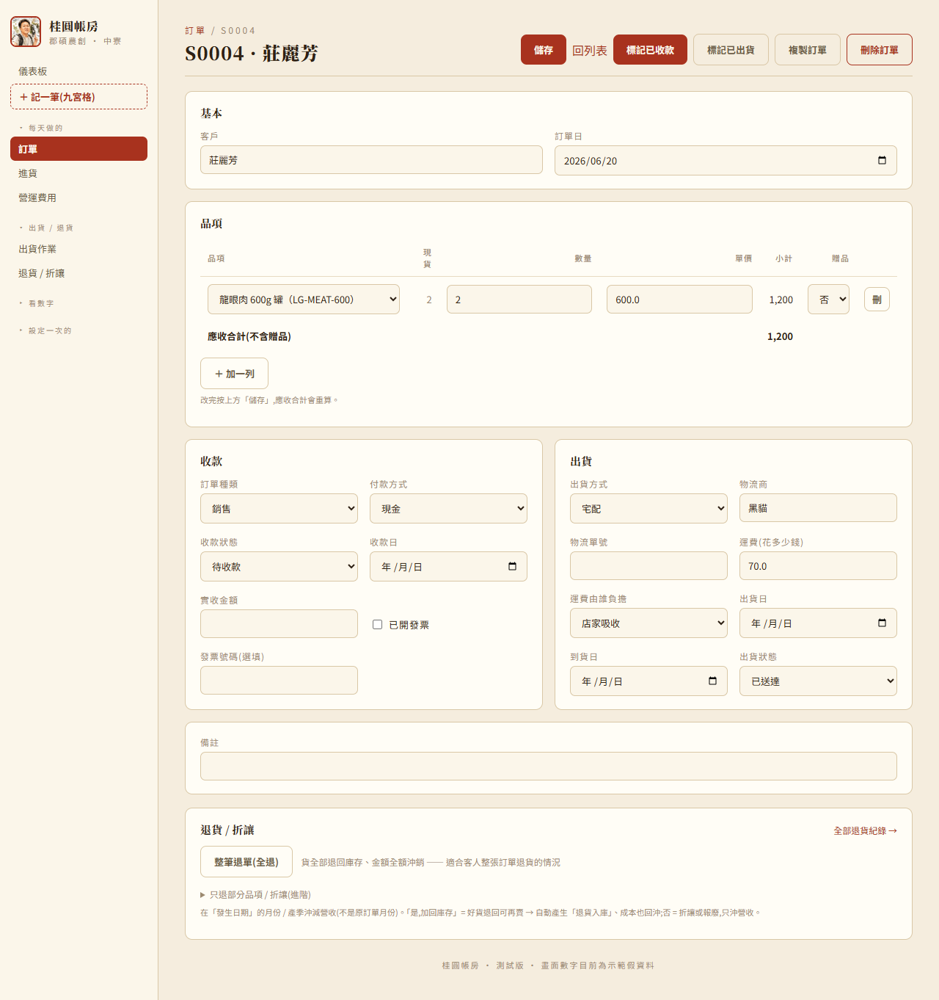

### 2. 採購物料(進貨)

存檔前會先看一次「確認分錄」畫面,可以微調付款帳戶 / 稅額 / 憑證類型再真的存檔。
憑證類型選到「發票」,發票號碼是必填的。

| 類別 | 科目(借方) |
|---|---|
| 原料 / 包材 | `1315 原料`(正式表沒有專門的「包材」科目,兩者併記) |
| 委外加工 | `1314 在製品`(委外加工完成前算在製品成本) |
| 服務 / 其他 | `6188 其他費用` |
| 設備 | 不記這裡——勾「這是設備」走固定資產那條路(見第 4 項) |

貸方是現金 / 銀行存款(依付款帳戶),有稅額另外借記 `1423 進項稅額`。

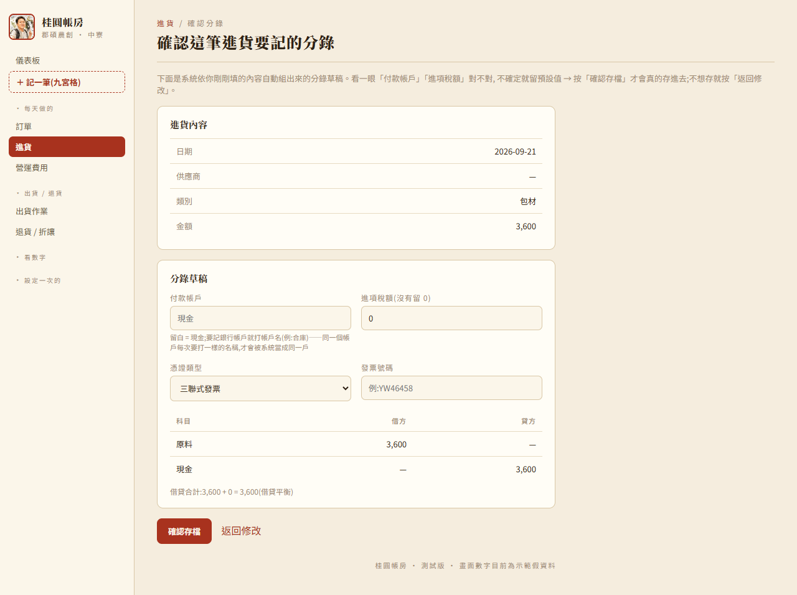

> **跟庫存(`stock_move`)無關**:這張單只記成本進總帳,不會寫任何 `stock_move` 列、
> 不會讓「商品目錄」裡可銷售的庫存數字變動。庫存要靠「庫存」頁的「分裝入庫」/
> 「生產入庫」另外登錄,兩邊是獨立的動作,不會互相觸發。

### 3. 營運支出

一樣先看確認畫面再存檔。類別 → 科目對照(第一版猜測,`ledger.EXPENSE_ACCOUNTS`):

| 類別 | 科目 |
|---|---|
| 直接人工 | `6110-01 薪資支出-直接人工` |
| 人事 | `6110-02 薪資支出-人事` |
| 場地・倉儲 | `6111 租金支出` |
| 行銷 | `6117 廣告費` |
| 設備維護 | `6116 修繕費` |
| 培訓 | `6131 訓練費` |
| 金流手續費 | `6188-04 其他費用-手續費` |
| 驗證費 | `6188-07 其他費用-檢驗費` |
| 研發 | `6188-12 其他費用-研發`(**留給真正沒有形成實體設備的費用用**——申報表那筆 78 萬研發費已確認是烘焙機器零件成本,該走固定資產,不是這裡;畫面選到這個類別會提醒使用者) |
| 其他 | `6188 其他費用` |
| 其他費用-什項購置 / 勞務費 / 設計費 / 手續費 / 交通費 / 包裝費 / 檢驗費 / 印刷費 / 規費 / 燃料費 | `6188-01`~`10`(直接對應正式科目表) |
| 文具用品 | `6112 文具用品` |
| 交際費 | `6120 交際費` |
| 捐贈 | `6121 捐贈` |
| 伙食費 | `6127 伙食費` |
| 職工福利 | `6128 職工福利` |
| 佣金支出 | `6130 佣金支出` |
| 進出口費用 | `6132 進出口費用` |
| 產品保固費用 | `613501 產品保固費用` |
| 利息費用 | `7510 利息費用` |

以上 9 項是同事「會計科目表」2026-09-23 更新檔補的獨立費用科目,已對應好、直接對照
正式表代碼,不用等確認(「利息費用」是同一天給正式三表範例時連帶補的代碼)。原本
「田間管理」在這份清單裡,**2026-10-01 已經整個拿掉**——不是找到代碼了,是這個類別
在公司帳上根本不該存在,見第九節「已拿掉的科目」。

「攤提月數」欄位**只影響財務健康頁的月損益顯示**(分月認列),總帳記的是存檔當下現金
真正流出的全額——這是刻意的:總帳反映真實現金流,財務健康頁是另一套管理用的估算,
兩者用途不同、數字本來就不會一樣。

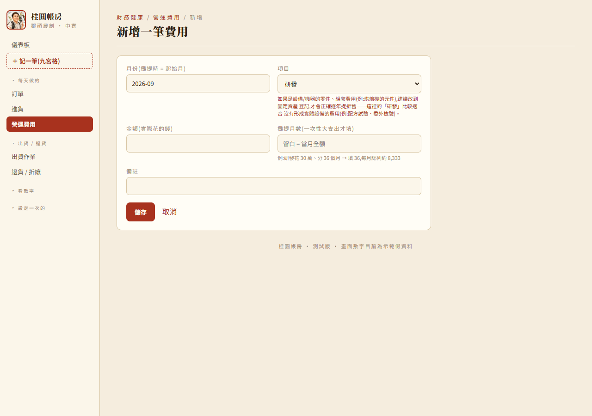

### 4. 設備相關(固定資產)

買入跟折舊分兩條路記帳:

**買入**——存檔整張重開,借設備科目(全額成本)/ 貸現金銀行存款(= 成本 − 政府補助款)/
貸 `7190-01 其他收入-政府補助`(補助款 > 0 才加這筆,重用「其他收益」的科目)。

| 類別 | 科目 |
|---|---|
| 機器設備 | `1616 機器設備` |
| 房屋建築 | `1611 房屋` |
| 電腦設備 / 生財器具 | `1691 辦公設備`(併記) |
| 運輸設備 | `1616-02`(**待確認**,正式表沒有運輸設備科目) |

**折舊**——沒有「存檔」這種天然觸發點(是時間流逝就該發生的事),改成**開 `/assets`
頁時,系統順便把還沒記過的月份補上**,已經記過的月份不動(不是整張重開,是缺的月份才
補)。借 `6124 折舊` / 貸 `1616-99 累計折舊`(共用科目,不分資產類別;正式表沒有專門
對應,比照正式表自己的 `1405`/`1406`生產性生物資產那組命名模式類推)。

> 第一次上線打開 `/assets` 頁,會把每台資產從取得月到當月**所有欠的月份一次補齊**,
> 總帳會一次出現好幾張折舊傳票,這是正確反映現實,不是重複記帳。

處分(填處分日)之後不再產生新的折舊月份,但**如果處分日設定得比系統已經補過的月份
早,已經記過的未來月份不會自動回沖**(這種情況正常使用下很少見,真遇到用「帳務調整」
手動沖銷)。資產處分當下的損益(帳面淨值轉列處分損益)目前沒有做,留到之後真的有處分
案例再看。

刪除資產卡,買入 + 所有折舊傳票一次清掉。

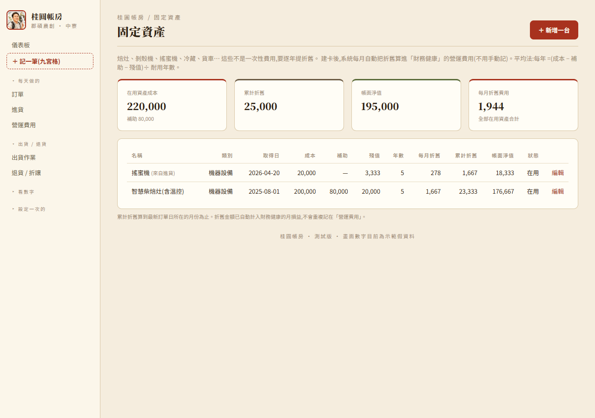
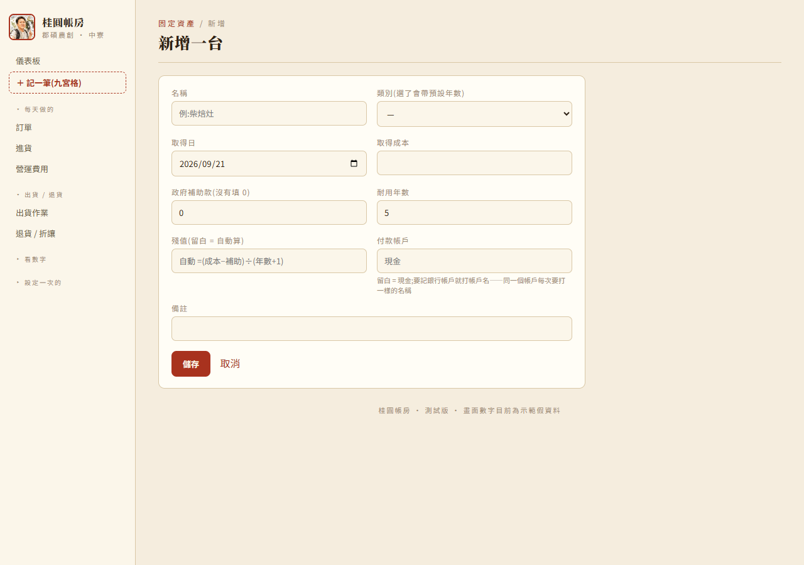

### 5. 生產入庫

掛在既有「庫存」頁的新卡片,不是獨立資源——沿用 `stock_move` 表,`move_type` 多一個
「生產入庫」。存檔時同時:①寫一筆庫存異動(比照「分裝入庫」)②借存貨(依商品的產品線)
/ 貸 `7250 生物資產淨FV利益`(對應同事表裡的「淨FV利益」,2026-09-23 已經改成專門科目,
不再是代打的 `6498`)。

### 6. 其他收益

新畫面,借現金(含稅)/ 貸收入 + 貸 `2214 銷項稅額`(有稅才加)。

| 類別 | 科目 |
|---|---|
| 利息收入 | `7101 利息收入` |
| 政府補助收入 | `7190-01 其他收入-政府補助` |
| 其他 | `7190-99 其他收入-其他` |

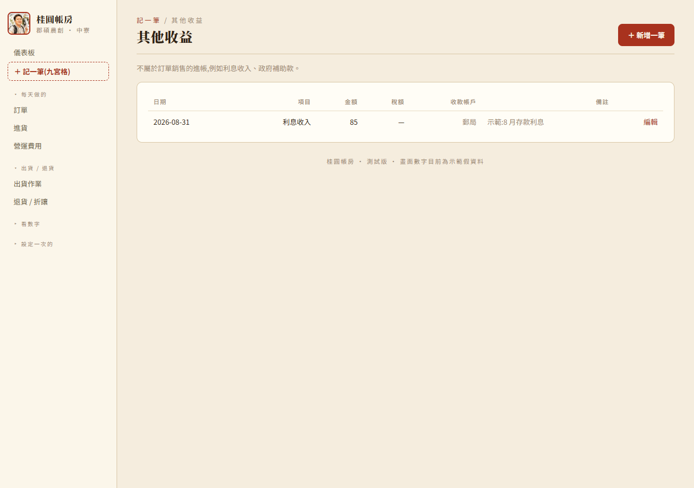
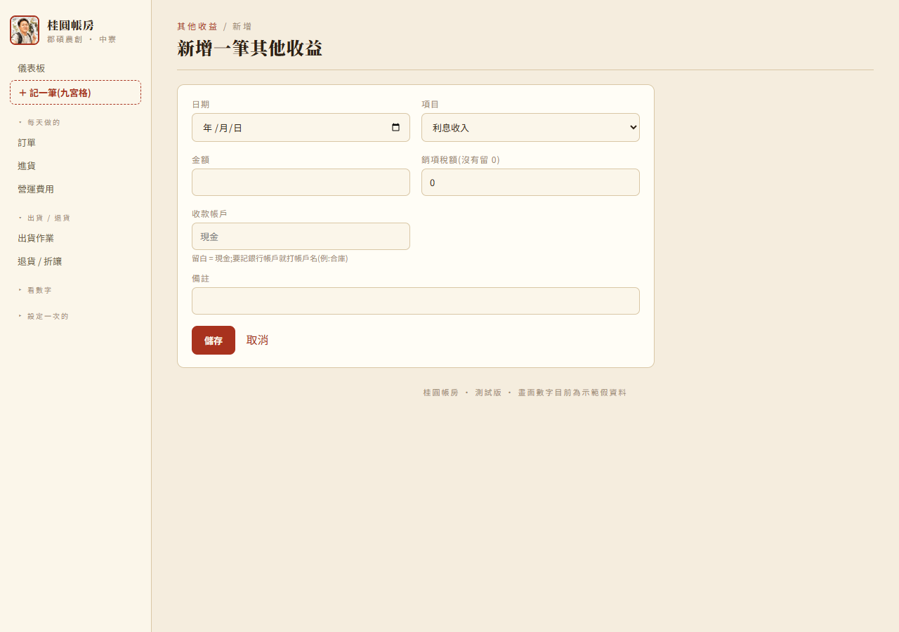

### 7. 其他費用

**沒有獨立畫面**——正式科目表裡「其他費用」就是 `6188` 系列,跟營運支出同一個費用
區間,所以併進「營運支出」既有畫面的類別選單(見上面第 3 項的 `6188-01`~`10`)。
九宮格卡片點進去會導去營運支出畫面。

### 8. 資本異動

新畫面,兩種類型:

| 類型 | 分錄 |
|---|---|
| 現金增資 | 借現金(依付款帳戶)/ 貸 `3110 普通股股本` |
| 盈餘轉列公積 | 借 `3351 累積盈虧` / 貸 `3310 法定盈餘公積`(**待確認**——同事草稿有這個科目,正式表沒列,先沿用草稿代碼) |

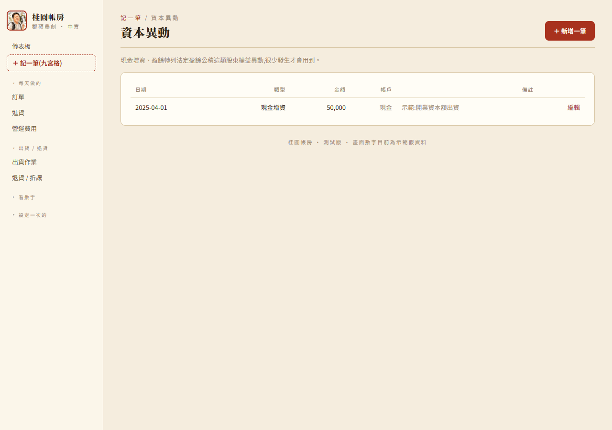
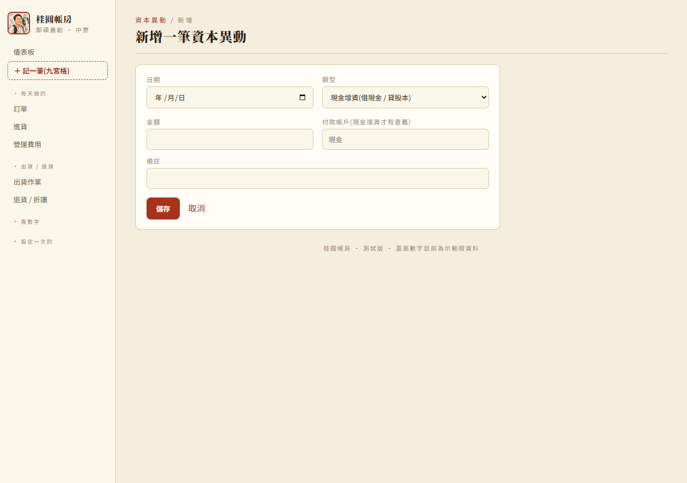

### 9. 帳務調整

新畫面,其他 8 類都套不上時的例外出口——直接指定一組借方科目 + 貸方科目 + 金額,
系統記這一借一貸,不會另外加稅額或現金腳。借 / 貸科目下拉選單列出系統目前**所有**
已知的科目(`ledger.ALL_ACCOUNTS`,攤平所有對照表常數、去重、依代碼排序)。

這個畫面需要使用者自己判斷「這筆該記哪個科目、放借方還是貸方」,**定位上比較適合同事
用**,不是家易日常操作的一部分。

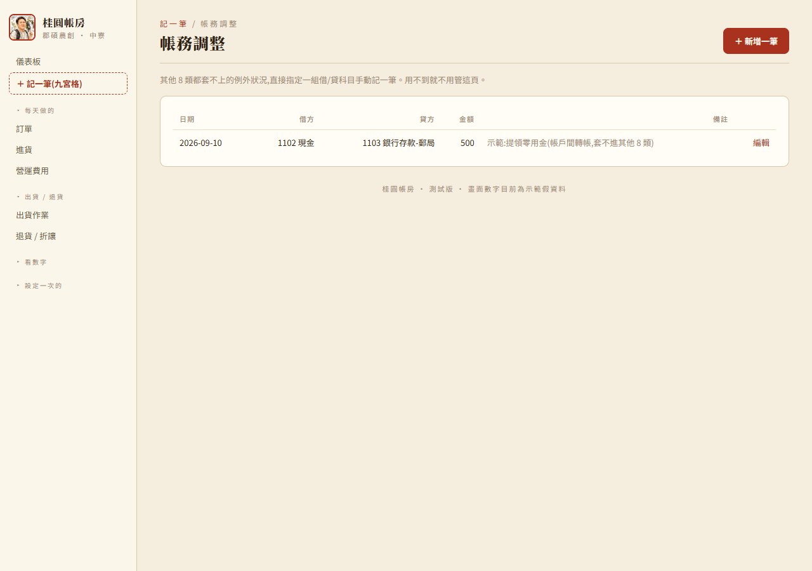
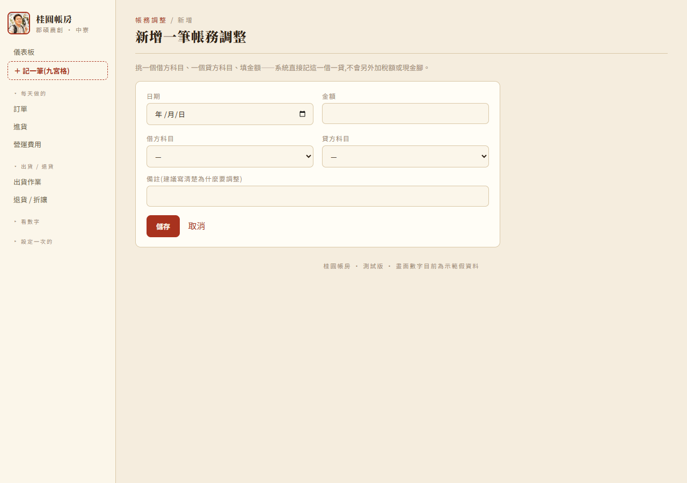

---

## 三、銷貨退回 / 折讓(不在九宮格裡,但邏輯相關)

`sales_return` 記的退貨 / 折讓,比照訂單,不經過確認畫面、存檔背景自動記。沖銷方向
依原訂單**目前的付款狀態**決定(已跟使用者確認:已收款的訂單退貨 / 折讓,錢是真的退
現金給客戶,不是留抵):

| 原訂單狀態 | 分錄 |
|---|---|
| 已收款 | 借 `4170 銷貨退回` 或 `4190 銷貨折讓` / 貸現金銀行存款(真退錢) |
| 待收款 / 部分收款 | 借 `4170` 或 `4190` / 貸 `1172 應收帳款`(打折欠款) |

好貨退回可再賣(`restock=1`)時,再鏡射訂單成立那組分錄,借存貨(依產品線)/ 貸
`5111 銷貨成本`,把成本原路沖回;折讓或報廢退貨(`restock=0`)不沖成本(已經沉沒)。

兩個建立入口(訂單頁單筆表單、「整筆退單」一鍵)都會記帳;刪除退貨紀錄、刪除整張
訂單,對應傳票都會連動清掉。

**已知限制**:部分收款訂單如果退貨金額超過「還欠的部分」,理論上該拆一部分退現金、
一部分沖應收,目前先一律當沖應收處理,不拆分——這種混合情況很少見,真遇到用
「帳務調整」手動處理差額。

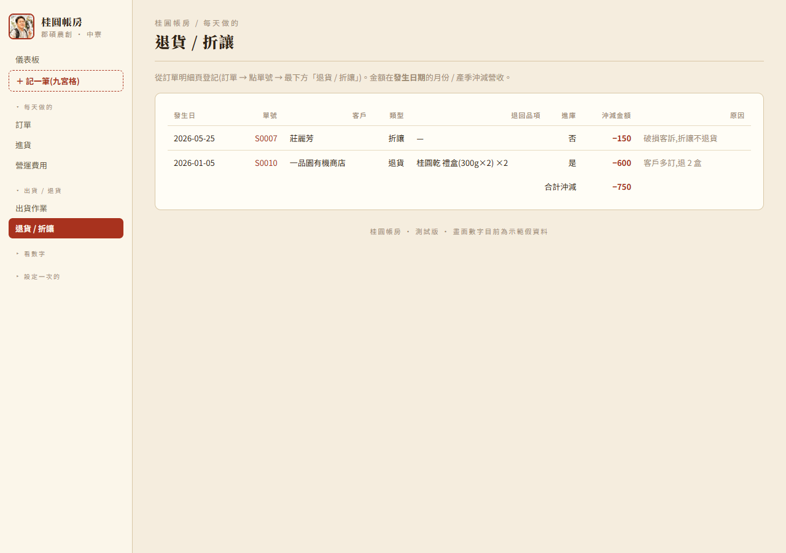

---

## 四、總帳頁

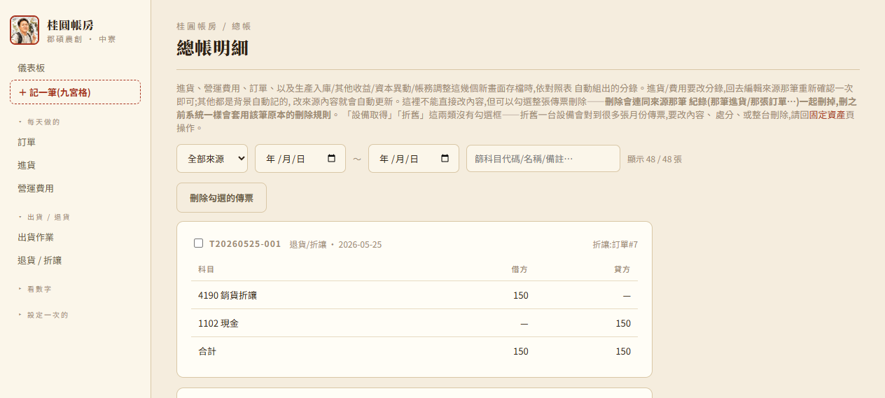

### 篩選

- **來源下拉**:依交易類型篩(進貨 / 營運費用 / 訂單成立 / 訂單收款 / 生產入庫 / 其他收益 /
  資本異動 / 帳務調整 / 設備取得 / 折舊 / 退貨・折讓 / 年度結轉)。
- **日期範圍 + 關鍵字**(科目代碼 / 名稱 / 備註):純前端即時篩選,不用重新整頁查詢。

### 勾選刪除

勾選傳票、按「刪除勾選的傳票」——**刪除會連同來源那筆業務紀錄(那筆進貨 / 那張訂單…)
一起刪掉,而且會重用該來源自己原本的刪除邏輯**,不會繞過既有的檢查規則(例如訂單刪除
本來會一併清庫存異動、物流異常關聯,勾選刪除走的是同一套)。

**「設備取得」「折舊」「年度結轉」這三類沒有勾選框**——折舊一台設備會對到很多張月份
傳票,勾一張沒辦法只刪那個月、又不能整台資產跟著刪掉,要管理(改內容 / 處分 / 整台刪除)
一律回「固定資產」頁操作;年度結轉要撤銷,回「正式報表」頁操作(見第五節)。

### 傳票號碼前綴

| 前綴 | 來源 |
|---|---|
| `P` | 進貨 |
| `E` | 營運費用 |
| `S` | 訂單成立 |
| `R` | 訂單收款 |
| `F` | 生產入庫 |
| `I` | 其他收益 |
| `Q` | 資本異動 |
| `M` | 帳務調整 |
| `K` | 設備取得 |
| `D` | 折舊 |
| `T` | 退貨 / 折讓 |
| `Y` | 年度結轉 |

同一天同前綴,序號從 001 累加。

---

## 五、正式三表(試算表 / 資產負債表 / 綜合損益表)+ 年度結轉

這三張是給同事做帳 / 報稅用的**正式報表**,直接從 `ledger_entry` 彙總,口徑要跟總帳
分毫不差——跟「財務健康」「獲利報表」那套業務表算法是分開的兩套,**不共用邏輯**,
數字本來就不用對得起來。**年度一律用西曆年(1~12 月)**,跟系統其他地方的「產季」
(4 月~隔年 3 月)是兩條不同時間軸,這頁**不提供切換**。

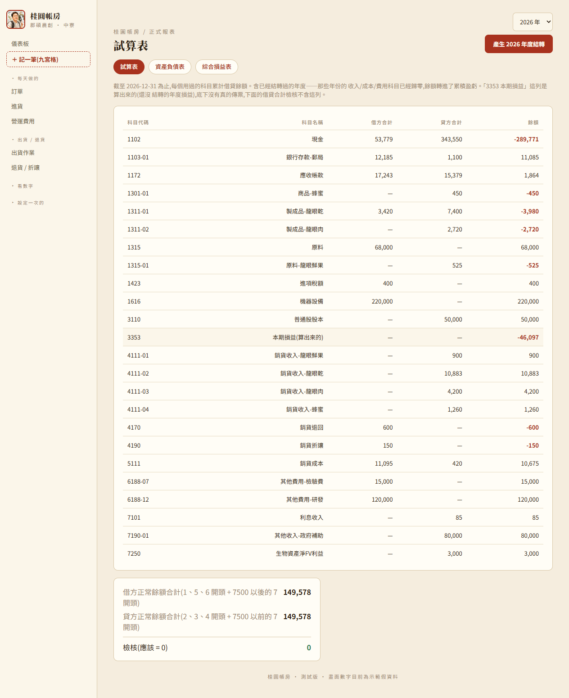

### 試算表

`queries.trial_balance(as_of)`:每個用過的科目,累計到 `as_of`(含)為止的借貸合計。
**含已經貼過的年度結轉傳票**——結轉會把已結束年度的 4~7 開頭科目沖平、餘額留在
累積盈虧,試算表才會對。下方的檢核值比照同事的分組規則(1、5、6 開頭 + 7500 以後的
7 開頭,減去 2、3、4 開頭 + 7500 以前的 7 開頭),理論上永遠是 0——這不是新的驗證邏輯,
只是因為每張傳票本來就借貸相等,顯示出來給同事一個熟悉的核對數字。「3353 本期損益」
那一列是算出來的(`queries._unclosed_pnl`,還沒結轉的年度損益),底下沒有真的傳票,
檢核值不含這列。

### 資產負債表

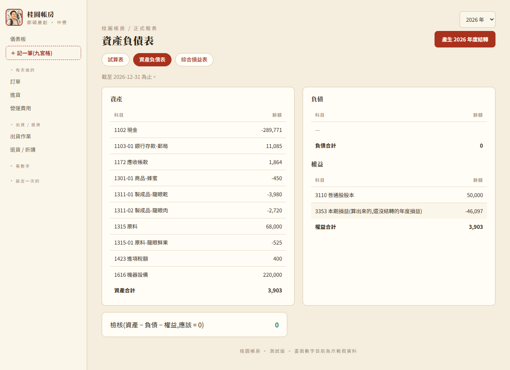

試算表篩代碼開頭 1/2/3 的列,權益區額外附上「本期損益」顯示行(算法同上,讓資產負債表
結轉之前也能配平)。**一個設計上的小坑**:這個顯示行最早只抓 `as_of` 當年的損益,
如果前面有年度沒結轉,資產負債表會對不起來——後來改成抓「所有還沒結轉過的年度」
才解決,細節見 `app/docs/工作日誌.md` 2026-10-01 條目。

### 綜合損益表

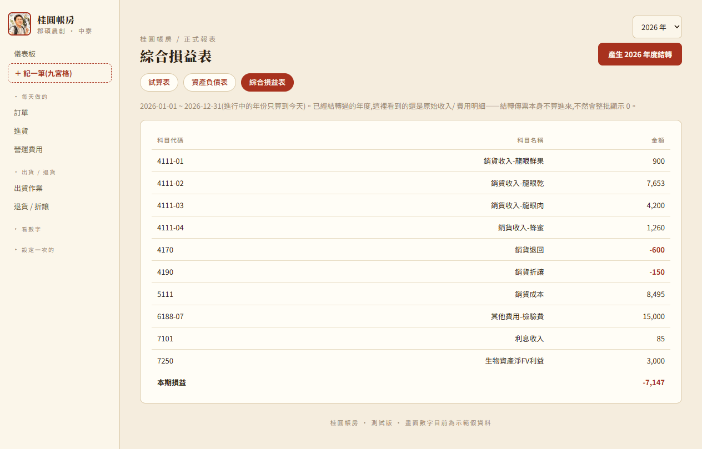

`queries.income_statement(year)`:只抓當年度(進行中的年份只算到今天)、代碼開頭
4/5/6/7,**排除年度結轉傳票本身**——結轉會把這些科目沖平,不排除的話已經結轉過的
年度會整批顯示 0。

### 年度結轉

右上角「產生 OOOO 年度結轉」按鈕(`ledger.compose_year_closing_entries`):把該年度
4~7 開頭科目的餘額全部沖平,方向相反的沖銷腿貼成一張傳票,淨額(=本期損益)轉入
`3351 累積盈虧`。存檔前會檢查這一年是否已經結轉過(`source_id=year`),防重複貼;
`year_closing` 不進 `_LEDGER_DELETERS`、總帳頁沒有勾選框,要撤銷要在這頁按「撤銷結轉」。

---

## 六、銀行帳戶主檔

2026-09-23 起,每家銀行有自己的固定子代碼(`1103-01`/`02`/`03`…),不再像以前全部
共用 `1103`(只靠科目名稱分)。第一次在「付款帳戶」欄位打一個系統沒看過的名字,
`ledger._cash_account()` 會自動在 `bank_account` 主檔新增一筆、指派代碼——**不用
先手動開戶**。代碼一旦指派就永久不變,這張表沒有刪除功能。

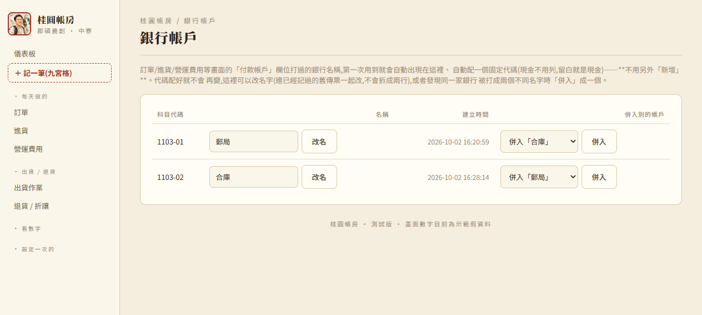

- **改名**:`bank_account_save()` 除了改名稱,也會
  `UPDATE ledger_entry SET account_name=? WHERE account_code=?` 回填所有舊傳票,
  `/cash` 不會被拆成兩行。改成跟別的帳戶撞名會被擋下來,提示改用「併入」。
- **併入**:`POST /bank-accounts/merge`——把來源帳戶底下所有傳票的 `account_code`/
  `account_name` 全部改成目標帳戶的,再刪掉來源帳戶主檔。代碼刪除後不會被重新指派
  (`_cash_account()` 用 `MAX(id)+1` 發號)。

---

## 七、全鏈路毛利分析

`/chain-margin`——**管理視角估算,不進總帳、不寫回任何真實帳目**,跟上面的正式三表
是完全獨立的機制,金額不會因為這頁而改變。

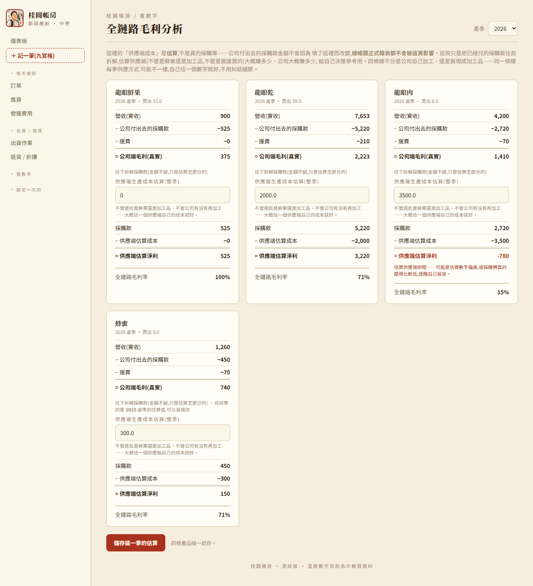

郡碩沒有自有果園,但老闆(家易)自己有果園,郡碩跟他買鮮果或加工品——買鮮果可能自己
加工再賣、也可能買加工品直接包裝賣,同一條產品線每季供應方式都可能不同,系統不判斷
是哪一種。`queries.chain_margin(season)` 直接重用 `product_line_pnl(season)` 回傳的
`revenue`/`direct_material`/`ship_cost`(刻意不碰 `profit`/`shared_alloc`,那些含共同
費用分攤跟折舊,混進來會讓估算淨利失去意義),加上 `chain_cost_param` 表存的「供應端
生產成本估算」(整季總額,不是單價 × 數量——鮮果以外的產品線沒有乾淨的換算率),算出
`supply_profit`(供應端估算淨利)、`company_profit`(公司端毛利,簡化版只扣採購款
跟運費)。估算值**依產季分開存**,查不到當季資料時往回帶最近一季的值當預設,不自動
補列、不會動到已經存過的資料。

---

## 八、其他管理報表

以下是家易 / 同事實際會打開來核對進度、判斷該不該催款、該不該補貨的報表——不是總帳
分錄本身,跟上面第五節「正式三表」是不同用途(**別搞混了:這裡的「報表」是業務表算法,
第五節才是真的從總帳算出來的正式報表**)。

### 應收帳款帳齡(獲利報表 → 收款帳齡分頁)

分桶(0–15 / 16–30 / 31 天以上)+ 未收款清單(可直接點「標記收款」)+ 最近已收回清單。
資料來源是 `order.payment_status`,不是查總帳的應收帳款科目餘額。

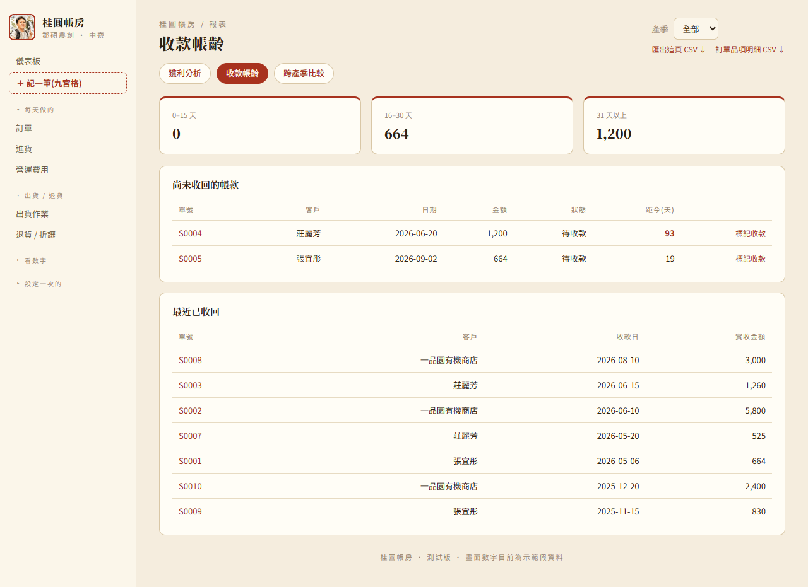

### 銀行帳戶明細

依科目(`1102 現金` / `1103-XX 銀行存款-X`,見第六節「銀行帳戶主檔」)從總帳篩出來,
逐筆算累計餘額。`Q.cash_accounts()` 用 `LIKE '1103%'` 抓整組子代碼,不是只比對舊的
共用代碼 `1103`。帳戶名單直接從總帳裡實際用過的科目抓,不是另外維護的固定清單——
**同一個帳戶每次填的「付款帳戶」名稱要一致**,不然會自動建成兩個不同代碼的帳戶;
真的打錯了,第六節的「併入」功能可以合併回去,不用重打舊傳票。

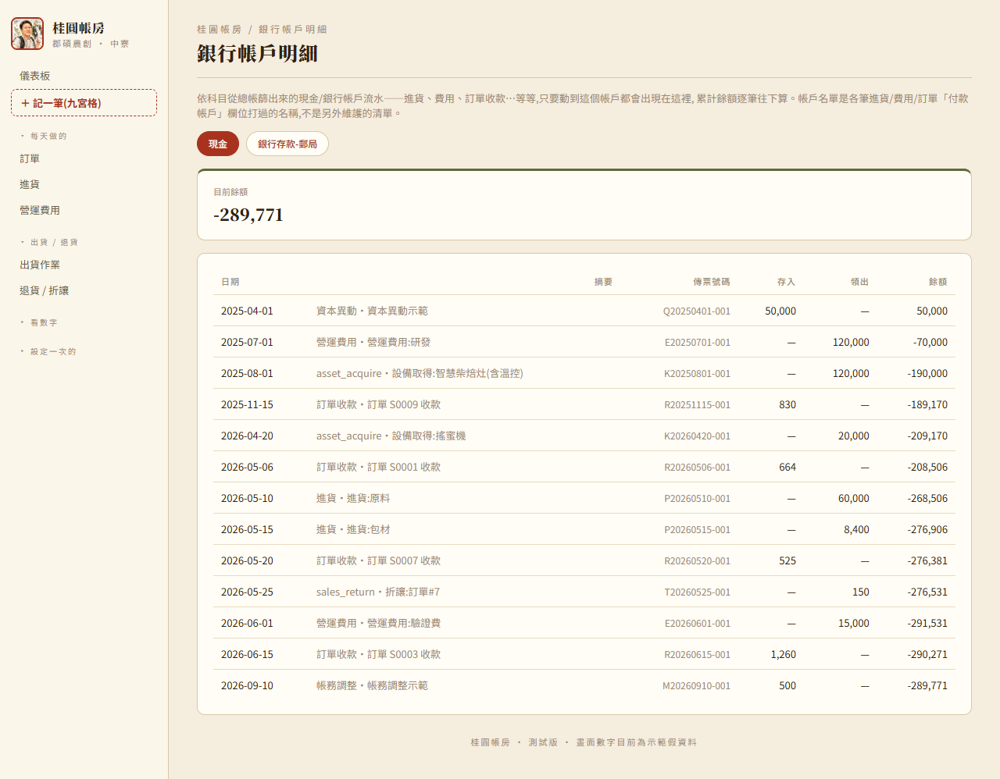

### 存貨管理(含金額)

現有的庫存異動只有數量,這張報表乘上商品目錄的「單位成本」概算金額,依商品列出
期初 / 入庫 / 出庫 / 期末(數量 + 金額),跟現在算毛利用的是同一套單位成本邏輯
(不分批次)。

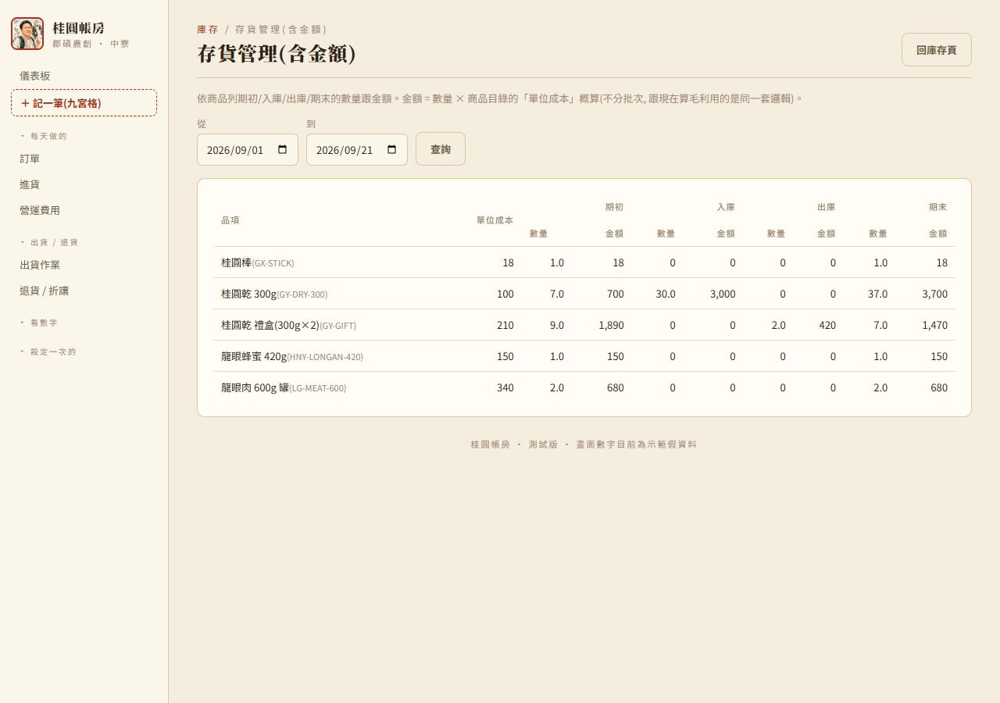

---

## 九、科目對照表全覽

以下是 `app/ledger.py` 目前所有的科目對照常數,**這是第一版、依常理判斷的猜測**,
已對照同事「會計科目表」逐一核對過,標「待確認」的項目正式表完全沒有對應科目,
需要同事確認怎麼處理。要調整代碼,直接改 `app/ledger.py` 對應常數就好,不用改其他
程式(銀行帳戶的 `1103-XX` 子代碼例外,那是 `bank_account` 主檔自動指派的,見第六節)。

這份表整理到 2026-10-02,中間經過幾輪跟同事核對的修正(2026-09-23 確認了 6188-01~10
那組子科目、新增 8 個獨立費用科目;同一天同事給了正式三表的範例,連帶換了一批新代碼
7101/7190/7250/7510,取代原本代打用的 4881-01/02/09、6498;2026-10-01 確認「田間管理」
不是漏掉代碼,是這個科目在公司帳上根本不該存在,整個拿掉——郡碩是跟小農/合作社採購,
不是自己種,見下面「已拿掉的科目」)。

| 科目代碼 | 科目名稱 | 用在哪裡 |
|---|---|---|
| `1102` | 現金(正式表叫「零用金」) | 各類現金收付的預設帳戶 |
| `1103-01`、`1103-02`… | 銀行存款-X | 付款帳戶不是「現金」時,每家銀行各自固定子代碼(第六節) |
| `1172` | 應收帳款 | 訂單成立(借)/ 收款(貸)/ 未收款退貨折讓(貸) |
| `1300` | 存貨(通用) | 沒歸屬產品線的商品 COGS |
| `1301-01` | 商品-蜂蜜 | 訂單 COGS、生產入庫(`COGS_INVENTORY_ACCOUNTS`) |
| `1311-01`/`02` | 製成品-龍眼乾 / 龍眼肉 | 同上 |
| `1314` | 在製品 | 進貨類別「委外加工」 |
| `1315` | 原料 | 進貨類別「原料」「包材」 |
| `1315-01` | 原料-龍眼鮮果 | 訂單 COGS、生產入庫(`COGS_INVENTORY_ACCOUNTS`) |
| `1423` | 進項稅額 | 進貨 / 費用有稅額時 |
| `1611` | 房屋 | 固定資產類別「房屋建築」 |
| `1616` | 機器設備 | 固定資產類別「機器設備」「其他」(通用) |
| `1616-02` | 機器設備-運輸設備(**待確認**) | 固定資產類別「運輸設備」 |
| `1616-99` | 累計折舊(**比照正式表模式類推**) | 每月折舊分錄貸方 |
| `1691` | 辦公設備 | 固定資產類別「電腦設備」「生財器具」 |
| `2214` | 銷項稅額 | 其他收益有稅額時 |
| `3110` | 普通股股本 | 資本異動「現金增資」 |
| `3310` | 法定盈餘公積(**待確認**) | 資本異動「盈餘轉列公積」 |
| `3351` | 累積盈虧 | 資本異動「盈餘轉列公積」、年度結轉淨額轉入(`3351-03` 子碼含意待確認,目前一律用 `3351` 總碼) |
| `4110` | 銷貨收入(通用) | 訂單,沒歸屬產品線的商品 |
| `4111-01`~`04` | 銷貨收入-各產品線 | 訂單,依商品的產品線拆(`REVENUE_ACCOUNTS`) |
| `4170` | 銷貨退回 | 退貨 |
| `4190` | 銷貨折讓 | 折讓 |
| `5111` | 銷貨成本 | 訂單 COGS(借方,單一科目不拆產品線)、退貨成本回沖 |
| `6110-01`/`02` | 薪資支出-直接人工 / 人事 | 營運費用 |
| `6111` | 租金支出 | 營運費用「場地・倉儲」 |
| `6112` | 文具用品 | 營運費用「文具用品」 |
| `6116` | 修繕費 | 營運費用「設備維護」 |
| `6117` | 廣告費 | 營運費用「行銷」 |
| `6120` | 交際費 | 營運費用「交際費」 |
| `6121` | 捐贈 | 營運費用「捐贈」 |
| `6124` | 折舊 | 每月折舊分錄借方 |
| `6127` | 伙食費 | 營運費用「伙食費」 |
| `6128` | 職工福利 | 營運費用「職工福利」 |
| `6130` | 佣金支出 | 營運費用「佣金支出」 |
| `6131` | 訓練費 | 營運費用「培訓」 |
| `6132` | 進出口費用 | 營運費用「進出口費用」 |
| `613501` | 產品保固費用 | 營運費用「產品保固費用」 |
| `6188` | 其他費用(通用) | 進貨類別「服務」「其他」;營運費用「其他」 |
| `6188-01`~`10` | 其他費用子項 | 營運費用(什項購置 / 勞務費 / 設計費 / 手續費 / 交通費 / 包裝費 / 檢驗費 / 印刷費 / 規費 / 燃料費) |
| `6188-04` | 其他費用-手續費 | 營運費用「金流手續費」 |
| `6188-07` | 其他費用-檢驗費 | 營運費用「驗證費」 |
| `6188-12` | 其他費用-研發 | 營運費用「研發」(真正沒有形成實體設備的費用) |
| `7101` | 利息收入 | 其他收益「利息收入」 |
| `7190-01` | 其他收入-政府補助 | 其他收益「政府補助收入」;設備買入的補助款也用這個 |
| `7190-99` | 其他收入-其他 | 其他收益「其他」 |
| `7250` | 生物資產淨FV利益 | 生產入庫貸方(同事表裡叫「淨FV利益」) |
| `7510` | 利息費用 | 營運費用「利息費用」(目前系統沒有「借款」畫面,先併進營運費用選) |

### 已拿掉的科目

- **田間管理**(原本暫掛 `6188-11`)——2026-10-01 確認:郡碩沒有自有果園,跟小農/
  合作社採購鮮果,田間管理是供應端自己的成本,已經包含在採購價裡,公司帳上不會有
  這筆費用。`EXPENSE_ACCOUNTS`、`queries.OPEX_CATS` 都已經移除這個類別。

### 待同事確認的科目問題

1. **運輸設備**(`1616-02`)——正式表沒有對應科目,先掛在機器設備底下。
2. **法定盈餘公積**(`3310`)——同事草稿有這個科目,正式表沒列,先沿用草稿代碼。
3. **`3351-03`**——同事試算表範例裡「去年的 3351-03 + 去年的 3353 = 今年的 3351-03」
   這條滾存公式提到的子碼,含意不確定,目前年度結轉淨額一律轉入 `3351` 總碼,沒有
   細分子科目。
4. ~~研發費用~~ —— 已解決:申報表那筆 78 萬研發費是烘焙機器零件成本,該走固定資產,
   不是營運費用的「研發」類別。
5. ~~田間管理~~ —— 已解決,見上面「已拿掉的科目」。

---

## 十、已知限制

| 項目 | 說明 |
|---|---|
| 固定資產處分損益 | 處分當下沒有計算 / 記錄帳面淨值轉列處分損益的分錄 |
| 折舊回溯 | 處分日設定得比系統已經補過的折舊月份早,已經記過的未來月份不會自動回沖 |
| 部分收款退貨 | 退貨金額超過還欠的部分時,沒有自動拆成部分退現金 + 部分沖應收 |
| 付款帳戶一致性 | 「付款帳戶」是自由輸入 + 自動完成建議,不是強制下拉,同一帳戶打字不一致還是有可能發生——不過現在發生了可以在「銀行帳戶」頁用「併入」修正,不用重打舊傳票(第六節) |
| 全鏈路毛利分析的公司端毛利 | 簡化版,只扣採購款 + 運費,不含共同費用分攤跟折舊,刻意跟 `/lines`(各產品線損益完整版)的口徑分開(第七節) |

---

## 十一、想改科目對照,從哪裡下手

- 進貨 / 訂單 / 費用等類別 → 科目的對照:`app/ledger.py` 裡對應的常數字典(例如
  `EXPENSE_ACCOUNTS`、`PURCHASE_ACCOUNTS`),直接改字典的值即可,不用動任何路由或模板。
- 營運費用的類別清單本身:`app/queries.py` 的 `OPEX_CATS`。
- 改完建議重跑一次 `python seed.py --force` 重灌示範資料,再打開幾個畫面確認分錄長相
  正確、`/ledger` 每張傳票借貸還是平衡。
