# 展示腳本(給郡碩農創 demo 前自己先跑一遍)

用途:demo 前照這份走一次 —— ①每個功能都點過確認正常、②對一下數字、③練一下怎麼講。
全部是 `seed.py` 產生的**示範假資料**,重點是「結構對不對、能不能回答老闆的問題」,不是數字本身。

**2026-09-17 全部重寫**:配合這幾天的畫面簡化(拿掉產品線分類、批次功能、費用/進貨的稅務欄位),
舊版腳本裡「各產品線賺不賺」「產品線設定」「焙製批次」這些畫面已經不在導覽選單裡了,照舊版走會
在 demo 現場找不到路。這版連同截圖一起重新走一遍現在的畫面,圖存在 `screenshots/` 資料夾。

啟動:關掉舊的黑視窗 → 雙擊 `啟動.bat` → 瀏覽器開 http://127.0.0.1:8000
demo 前建議先 `python seed.py --force` 重灌一次乾淨的假資料,數字才會跟這份文件一致。

---

## 0. 一句開場(給家易)

> 「這是拿假資料做的樣子。重點不是這些數字,是想跟你確認:①這套『怎麼分類、怎麼算』對不對;
> ②有沒有漏掉你會在意的成本;③如果你想看到這個程度,我們就一起把你的真資料整理進來。」

---

## 1. 儀表板(首頁)

**點:** 左上「儀表板」

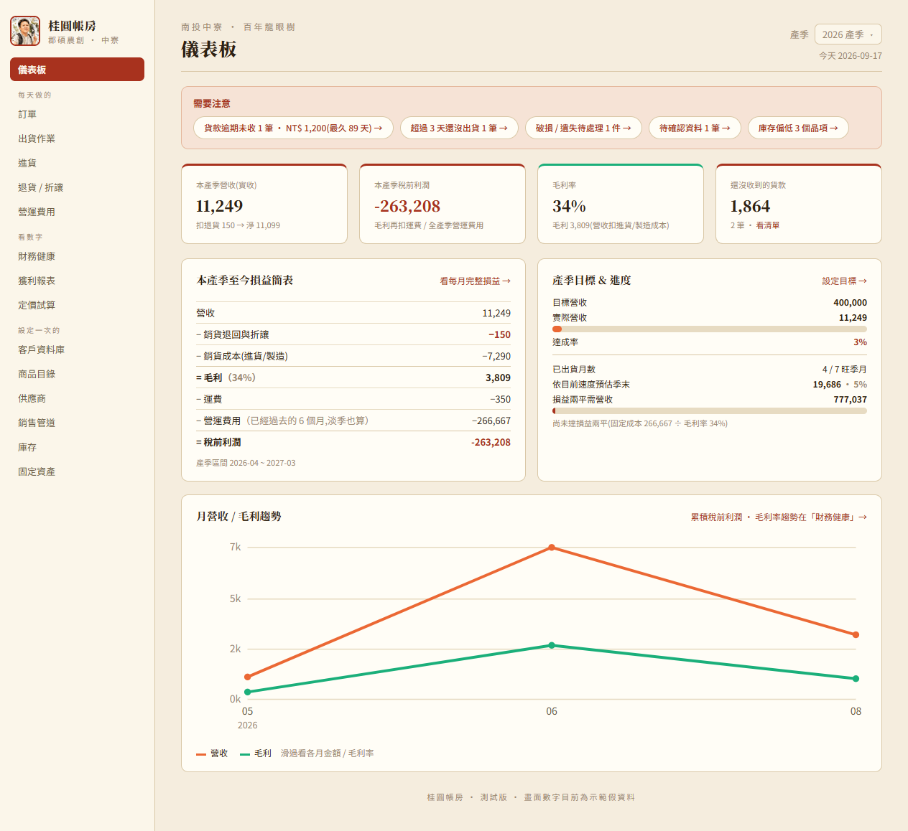

**應該看到:**
- 頂端「需要注意」幾個橘色標籤(貨款逾期未收、超過 3 天還沒出貨、破損/遺失待處理、待確認資料、庫存偏低)
- 4 個 KPI 卡:本產季營收(實收)、本產季稅前利潤、毛利率、還沒收到的貨款
- 「本產季至今損益簡表」卡:營收 → −銷貨退回與折讓 → −銷貨成本 → 毛利 → −運費 → −營運費用 → 稅前利潤
- 「產季目標 & 進度」卡:目標營收、實際營收、達成率、已出貨月數、依速度預估季末、損益兩平需營收
- 「月營收 / 毛利趨勢」圖(滑鼠移上去看各月)

**怎麼講:** 「一頁看完:這季賣多少、扣掉所有開銷剩多少、目標達成沒。」

**要注意:** 剛開季(4 月)或旺季還沒到的月份,「稅前利潤」看起來會是一大包負的——這是因為
營運費用(人事、田間管理…)每個月都要付,但銷售旺季通常集中在後幾個月。這不是算錯,是「前期
投入還沒被賣出去的量補回來」,demo 時可以順帶說明,不然數字看起來會嚇人。

**順手確認:** 右上「產季」切換,數字要跟著變;橘色標籤點下去會跳到對應頁。

---

## 2. 開一張訂單(每天做的核心)

**點:** 左側「每天做的 → 訂單」→「＋ 新增訂單」

**示範:** 打客戶名字搜尋 → 點選 → 品項選一個商品(單價會依客戶分級自動帶)→ 填數量 → 存檔

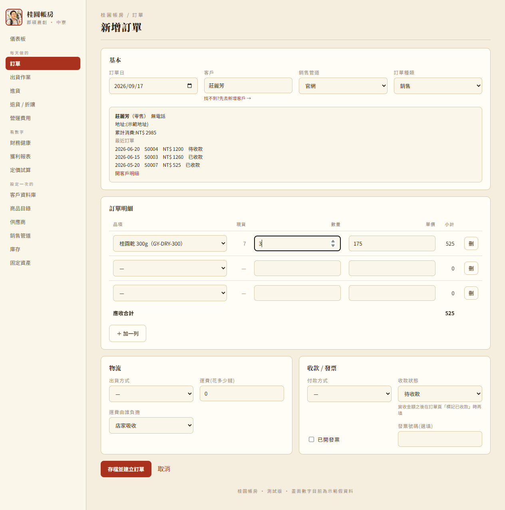

存檔後進訂單明細,依序示範「標記已收款」(要先在下面「收款」卡填實收金額)、「標記已出貨」:

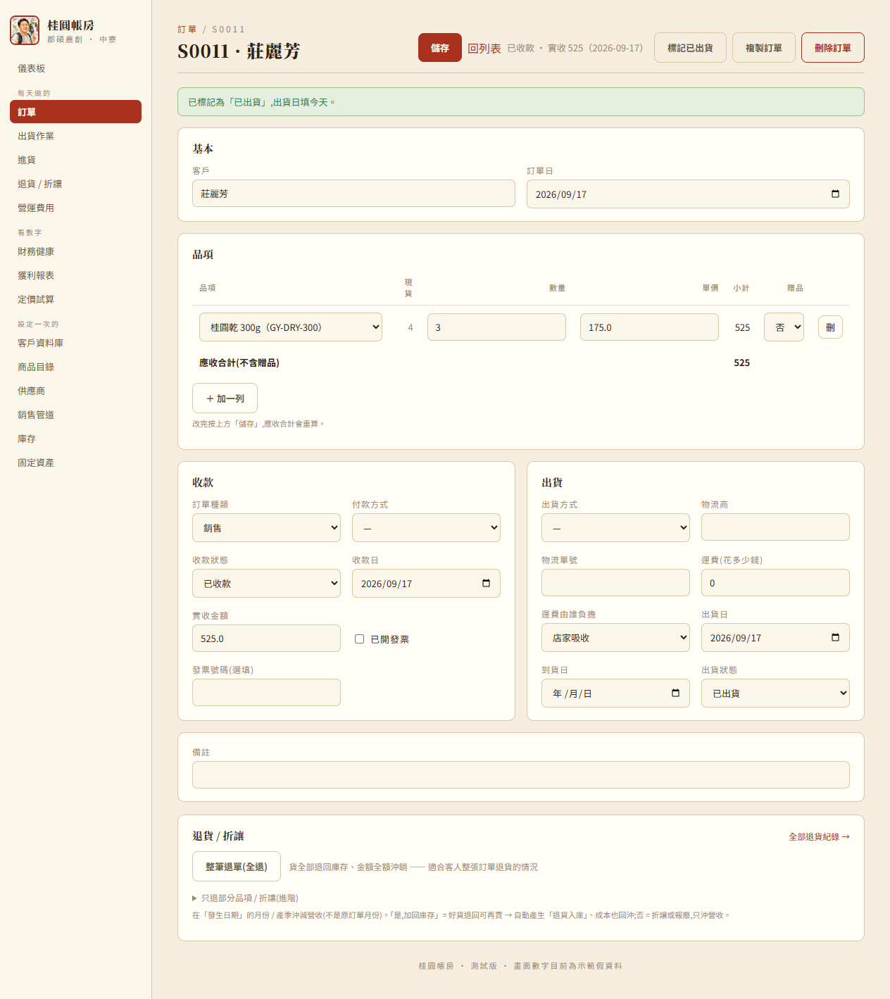

**怎麼講:** 「賣出去就開一張訂單,收到錢按『標記已收款』,出貨按『標記已出貨』。儀表板跟財務
健康的數字都是照這裡自動算的,不用另外記帳。」

**順手確認:** 訂單清單可篩「貨款逾期 / 未收款 / 超過 3 天未出貨」、可搜尋單號或客戶;
右上可匯出 CSV。

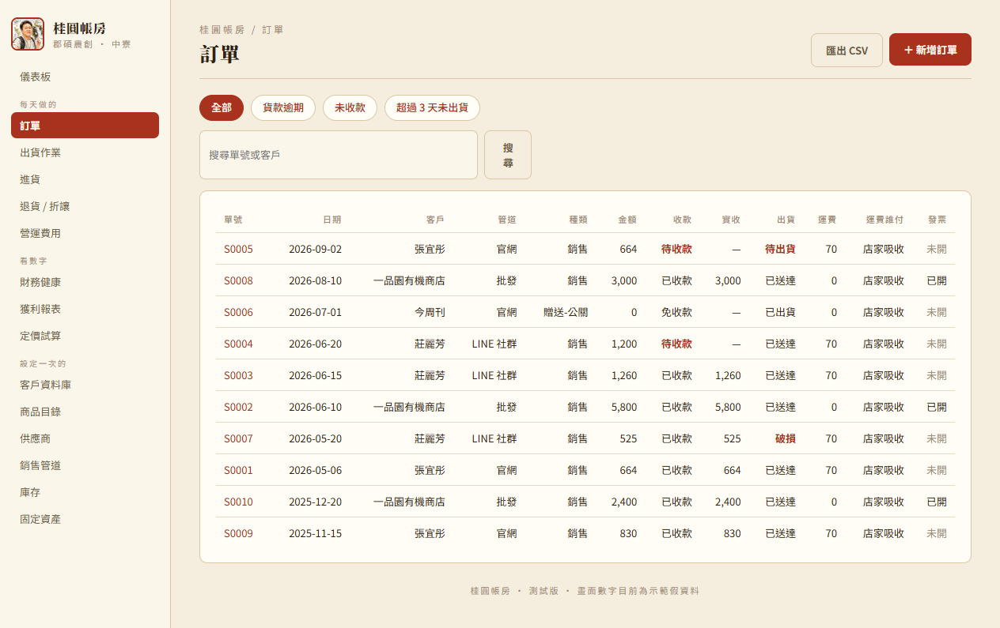

---

## 3. 記一筆進貨

**點:** 「每天做的 → 進貨」→「＋ 記一筆進貨」

**示範:** 日期、供應商(下拉,沒有可先「新增供應商」)、類別(原料/包材/委外加工/設備…)、
金額 → 存。勾「這是設備」的話之後可以在固定資產頁「建卡」提折舊。

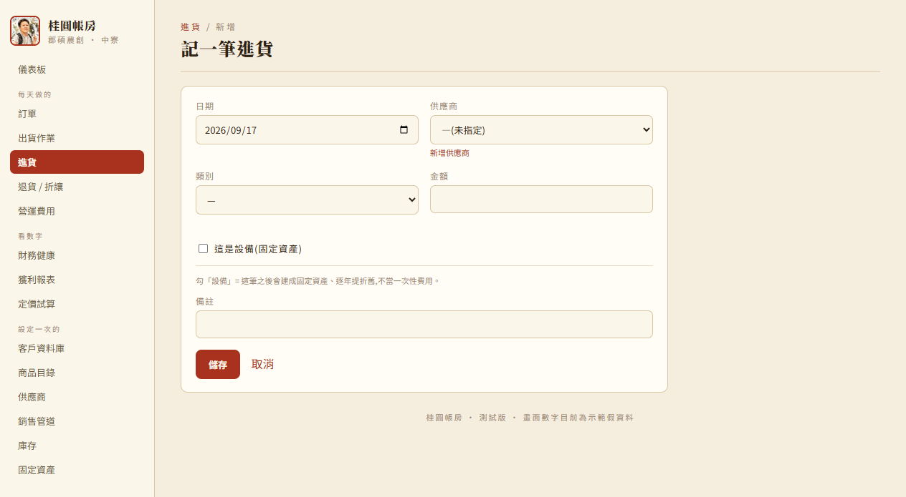

**怎麼講:** 「買鮮果、包材、木柴、委外加工都記這裡。目前先當單純登錄用,商品賣出去要算多少
成本,是在『商品目錄』裡個別商品填的『單位成本』。」

**順手確認:** 進貨清單上方可依月份篩;標「設備」的那筆右邊有「建卡 →」連結。

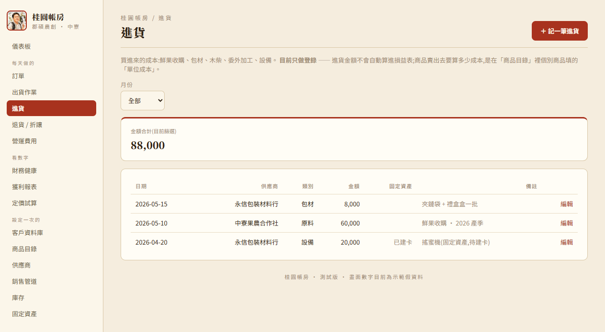

---

## 4. 營運費用(每月要維護的)

**點:** 左側「每天做的 → 營運費用」→「＋ 新增一筆」

**示範:** 月份、項目(下拉,例如「直接人工」「田間管理」「研發」)、金額、一次性大支出才填
「攤提月數」→ 存 → 回列表看到。

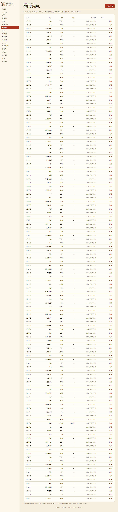

**怎麼講:** 「營收、成本、毛利是訂單自動算的;營運費用要你每月填一次,淡季也要填,才看得出
真實的損益。研發那種一次花一大筆的,填『攤提月數』它會自己分月攤,不會某個月爆一筆。」

---

## 5. 財務健康

**點:** 「看數字 → 財務健康」

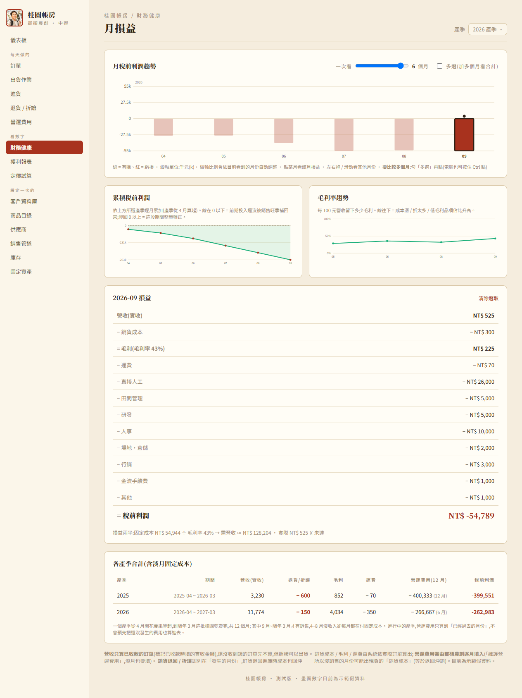

**應該看到:** 月稅前利潤趨勢(綠=賺 紅=虧)、累積稅前利潤、毛利率趨勢、選定月份的完整損益
明細、各產季合計表。

**順手確認:**
- 趨勢圖**點某個月** → 下面損益明細列出那月的完整損益;勾「多選」再點幾個月 → 看合計
- 淡月是紅的 —— 沒收入還是要付固定成本 + 折舊 + 研發攤提

**怎麼講:** 「這頁看『這個月/這幾個月賺不賺』,跟儀表板算法一致,只是可以拆到月份細看。」

---

## 6. 獲利報表(3 個頁籤)

**點:** 「看數字 → 獲利報表」

**頁籤一:獲利分析**(依商品 / 依銷售管道毛利,品項營收佔比,新客 vs 回頭客,本產季 Top 客戶)

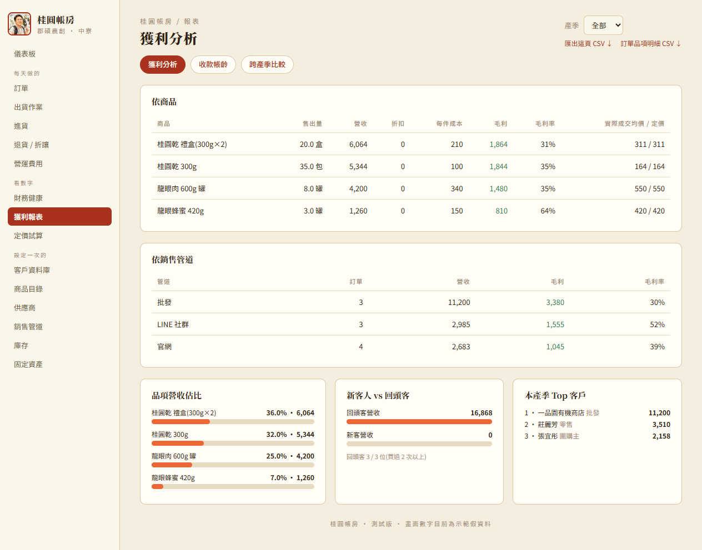

**頁籤二:收款帳齡**(還沒收到的貨款,依逾期天數分桶)

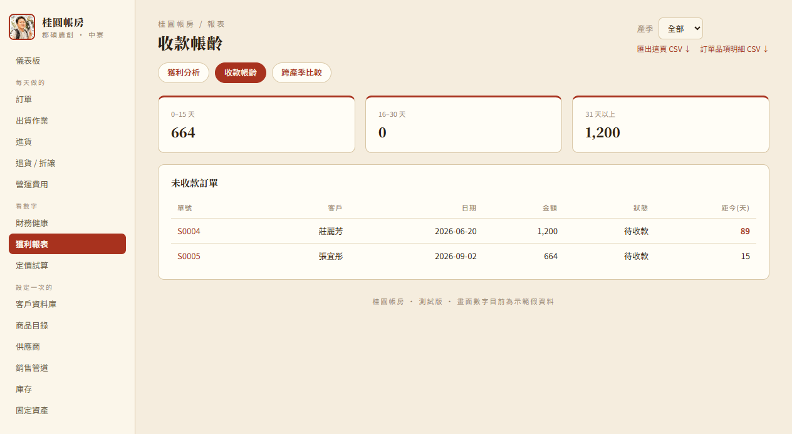

**頁籤三:跨產季比較**(今年 vs 去年同期,各項數字並排)

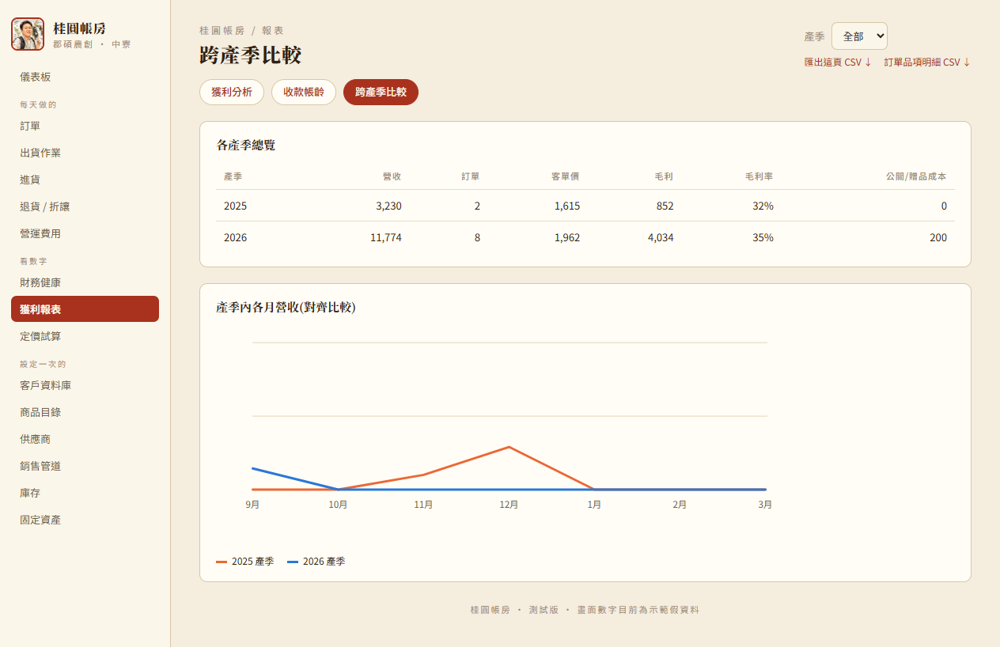

**怎麼講:** 「這裡回答『哪個商品/哪個通路賺、客戶回不回購、錢卡在誰那裡、今年比去年好不好』。」

---

## 7. 固定資產 + 折舊

**點:** 「設定一次的 → 固定資產」

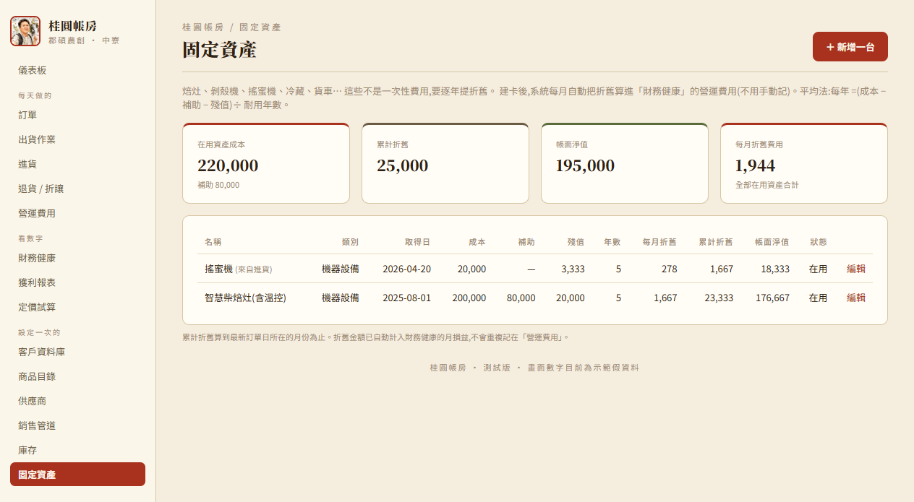

**應該看到:** 目前示範資料 2 台(搖蜜機、智慧柴焙灶〔含 10 萬政府補助〕);上方四格:
在用資產成本、累計折舊、帳面淨值、每月折舊。

**示範新增:** 「＋ 新增一台」→ 填名稱、選類別(會自動帶耐用年數)、取得日、成本、補助 →
「殘值」留白(自動算)→ 下面即時顯示每年/每月折舊 → 存。

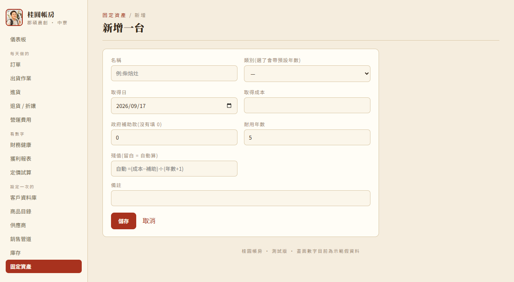

**怎麼講:** 「焙灶、機器、貨車這種不是一次性費用,要逐年提折舊。建卡後系統每月自動把折舊算進
財務健康,不用手動記。有政府補助的,補助那部分不提折舊。」

**順手確認:** 回「進貨」頁,標了「設備」的那筆右邊有「建卡 →」,點了會把金額/日期帶進來。

---

## 8. 客戶資料庫

**點:** 「設定一次的 → 客戶資料庫」

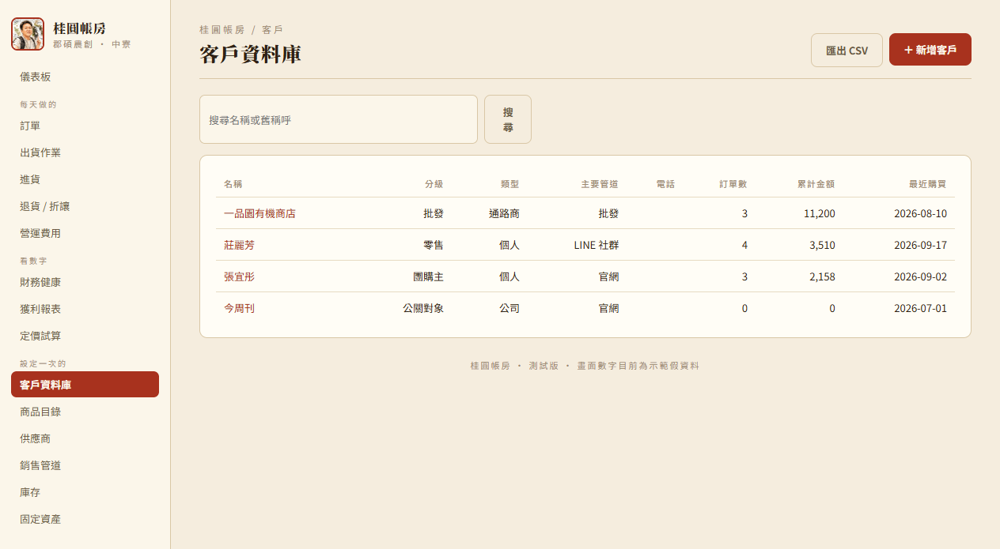

**應該看到:** 清單欄位——名稱、分級、類型、主要管道、電話、訂單數、累計金額、最近購買;
右上「＋新增客戶」「匯出 CSV」;上方可搜尋名稱或舊稱呼。

**示範新增:** 「＋新增客戶」→ 填名稱(必填)、電話、類型、分級、主要銷售管道、Email、聯絡人、
標籤;下面「開單據 / 收件」區塊填發票抬頭、統一編號、單據需求、收件人、收件電話、郵遞區號、
地址;最後備註 → 存。

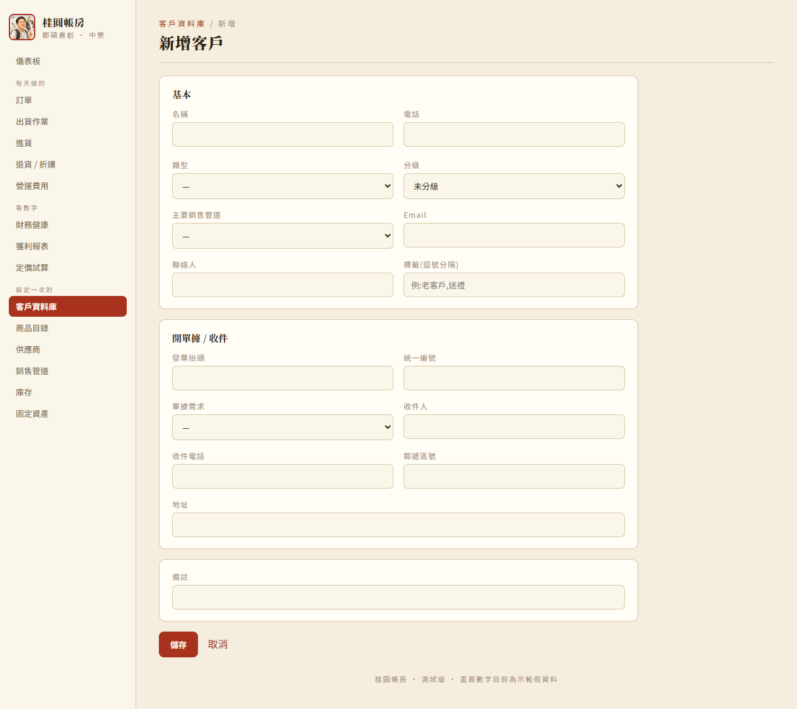

**怎麼講:** 「每個客戶開一張檔,分級決定新增訂單時自動帶的價格。」

**順手確認:** 點進客戶明細可以看往來紀錄、累計消費;新增時如果名稱跟既有客戶同名,系統會
提醒是不是同一人,避免重複建檔。

---

## 9. 商品目錄

**點:** 「設定一次的 → 商品目錄」

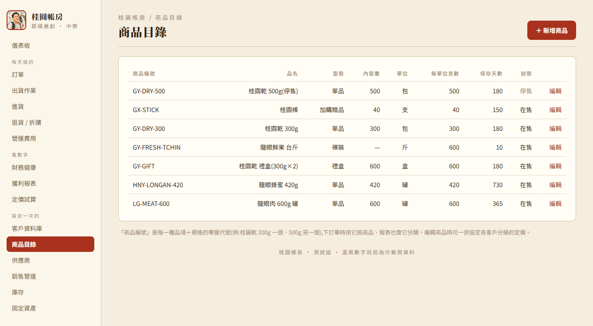

**應該看到:** 每個品項的商品編號、品名、型態、內容量、單位、每單位克數、保存天數、狀態
(在售/停售)。

**示範新增:** 「＋新增商品」→ 商品編號(必填,例:GY-DRY-300)、品名(必填)、型態、舊稱呼/
原代號、內容量、每單位克數、計價單位、包裝型態、保存天數/條件、原料成分、國際條碼、
**單位成本(算毛利用)**、狀態、是否「僅供贈品」、備註;下方「定價」可分別填零售/批發/團購/
機構/內部各分級的價,留空的分級之後系統會用折扣自動處理 → 存。

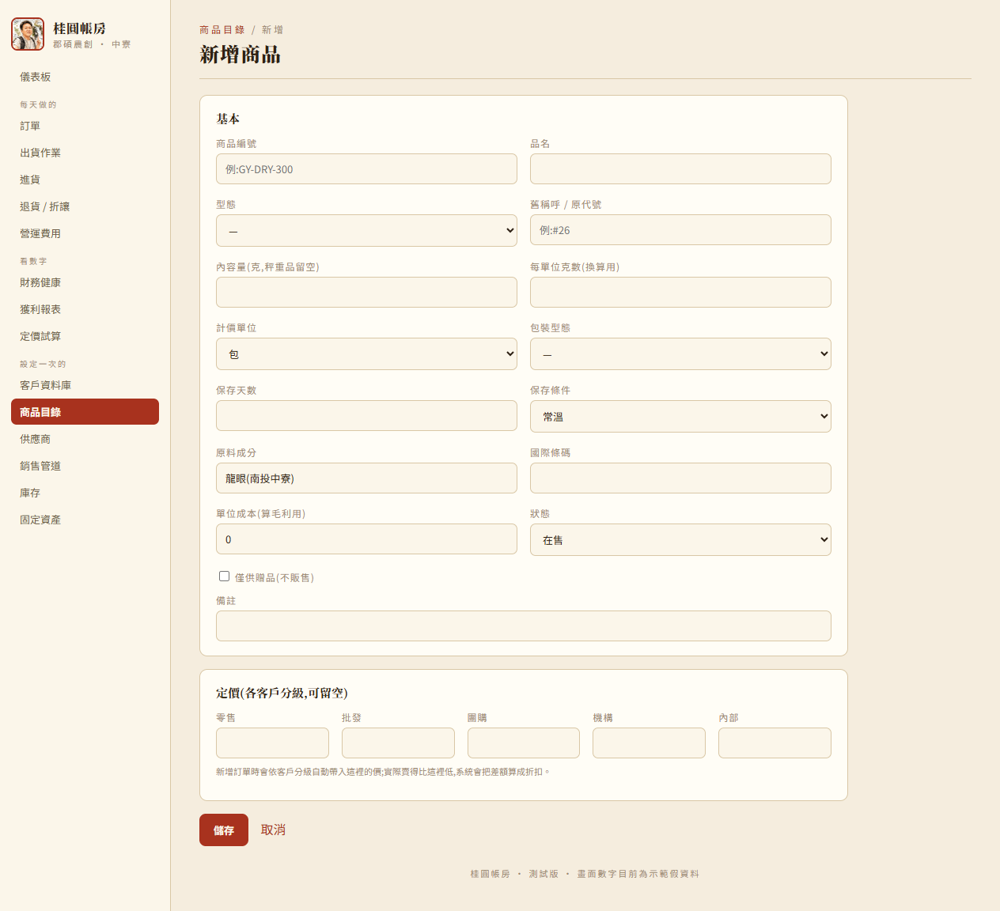

**怎麼講:** 「單位成本是算毛利的關鍵,要照實填,不然報表上的毛利會不準。」

**順手確認:** 「商品編號」是每種品項 + 規格的專屬代號(例:桂圓乾 300g 一個、500g 另一個),
一物一號;編輯商品時可以一併改各分級定價。

---

## 10. 供應商

**點:** 「設定一次的 → 供應商」

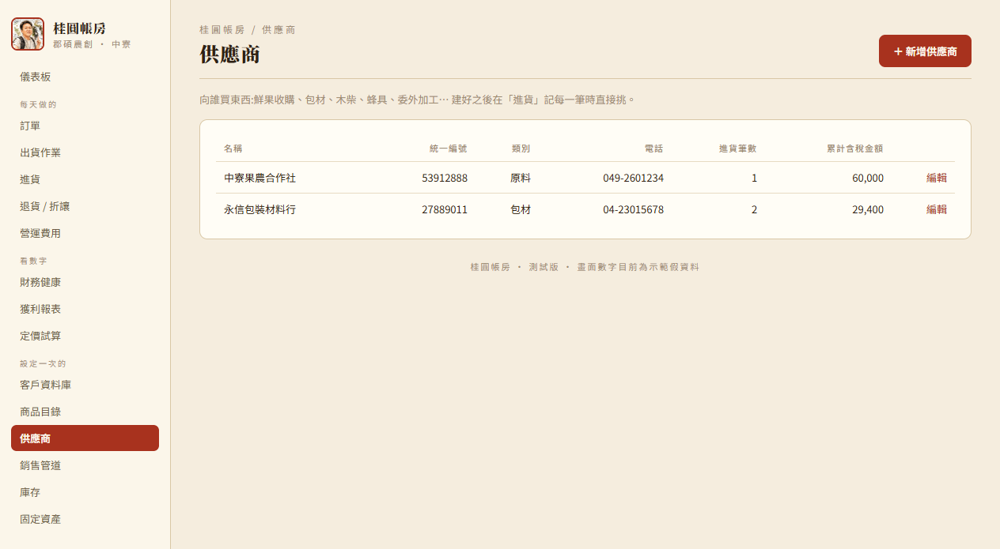

**示範新增:** 「＋新增供應商」→ 名稱(必填)、統一編號(農民/個人可空)、類別、電話、備註 → 存。

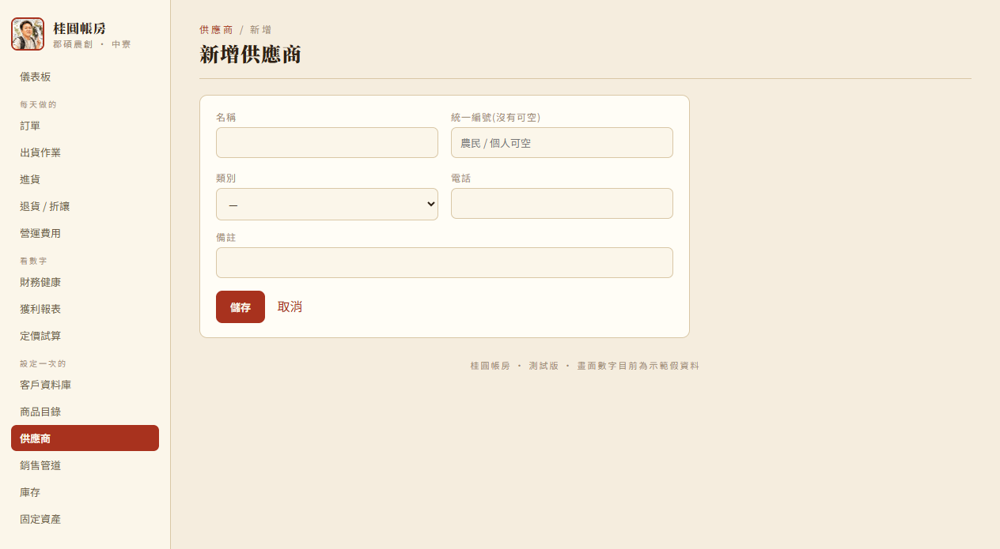

**怎麼講:** 「進貨表單選供應商之前,要先在這裡建檔。」

**順手確認:** 已經有進貨紀錄的供應商沒辦法刪除。

---

## 11. 銷售管道

**點:** 「設定一次的 → 銷售管道」

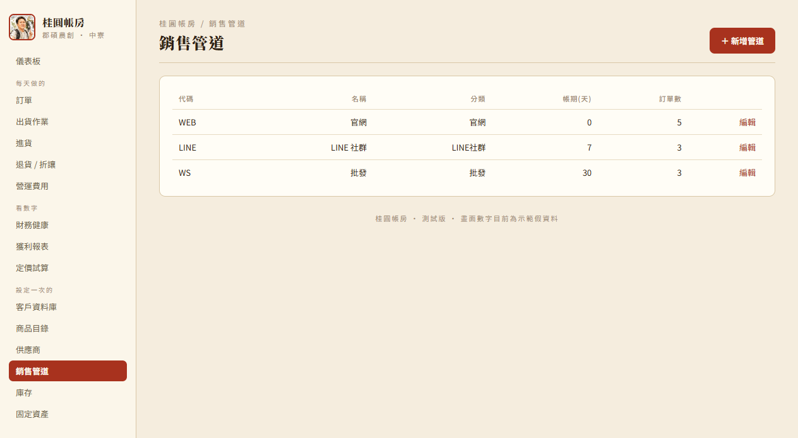

**示範新增:** 「＋新增管道」→ 代碼(必填,例:WEB)、名稱(必填)、分類、帳期(天)、備註 → 存。

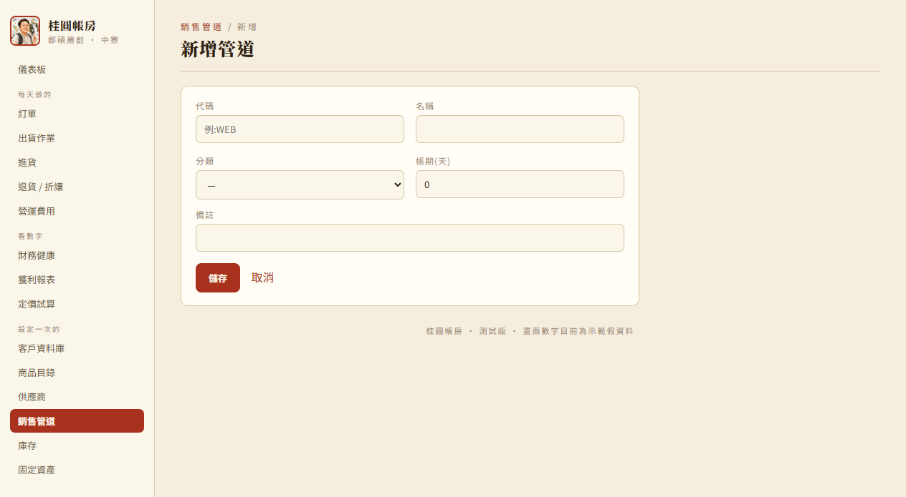

**怎麼講:** 「客戶下單時選的管道,也是獲利報表『依銷售管道』拆分毛利的依據。」

**順手確認:** 銷售管道可以刪除,系統會先擋掉還有訂單引用的管道。

---

## 12. 庫存

**點:** 「設定一次的 → 庫存」

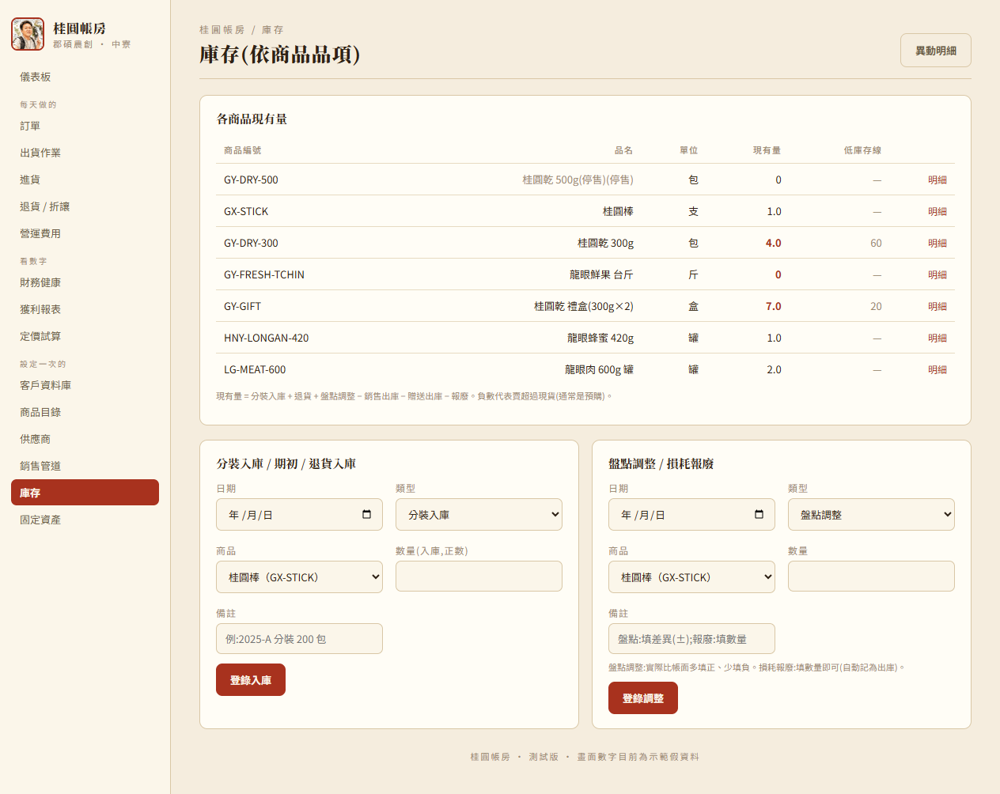

**應該看到:** 各商品現有量、低庫存線;現有量 = 分裝入庫 + 退貨 + 盤點調整 − 銷售出庫 −
贈送出庫 − 報廢(負數代表賣超現貨,通常是預購)。

**示範登錄:** 左邊卡「分裝入庫 / 期初 / 退貨入庫」:日期、類型、商品、數量(入庫填正數)、
備註 →「登錄入庫」;右邊卡「盤點調整 / 損耗報廢」:日期、類型、商品、數量、備註 →
「登錄調整」(盤點調整實際比帳面多填正、少填負;損耗報廢填數量即可,自動記為出庫)。

**怎麼講:** 「訂單出貨會自動扣庫存,你只要在這裡登錄『進了多少貨』或『盤點差多少』。」

**順手確認:** 右上「異動明細」可以查每筆進出紀錄的完整歷史。

---

## 13. 出貨作業

**點:** 「每天做的 → 出貨作業」

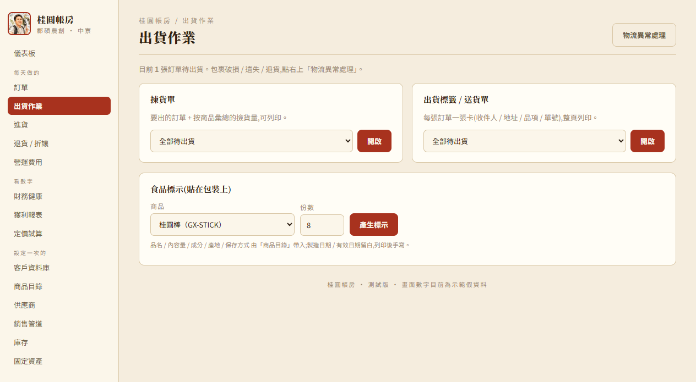

**應該看到:** 「揀貨單」(要出的訂單 + 按商品彙總的撿貨量,可列印)、「出貨標籤 / 送貨單」
(每張訂單一張卡,可整頁列印)、「食品標示」(選商品 + 份數,產生貼在包裝上的標示——品名/
內容量/成分/產地/保存方式從商品目錄帶入,製造日期/有效日期留白手寫)。

**怎麼講:** 「訂單標記已出貨前,先來這頁印撿貨單、出貨標籤;食品標示每包都要貼,法規要求的。」

**順手確認:** 右上「物流異常處理」——包裹破損/遺失/退貨,點右上這顆鈕處理,可以一鍵產生
「理賠重寄」訂單。

---

## 14. 退貨 / 折讓

**點:** 「每天做的 → 退貨 / 折讓」

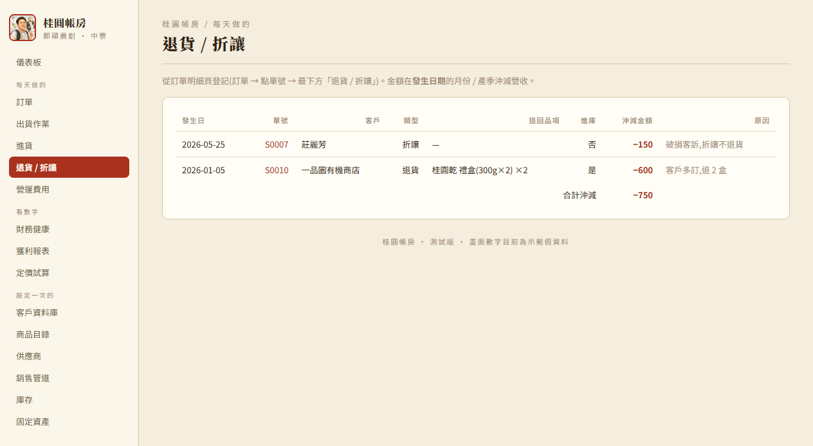

**應該看到:** 每筆退貨/折讓的發生日、單號、客戶、類型、退回品項、是否進庫、沖減金額、原因,
下面有合計沖減。

**示範登記:** 這頁本身**沒有「新增」按鈕**——退貨/折讓是從訂單明細頁登記的:開一張已出貨的
訂單 → 拉到最下方「退貨 / 折讓」卡 → 按「整筆退單(全退)」(全部品項退貨入庫、金額全額沖銷),
或用「進階」收合區登記部分退貨/折讓 → 存。

**怎麼講:** 「客訴、退貨都在原訂單那頁登記,不用另外開一張單,金額會自動沖到發生日期所在的
月份/產季,不會跑去改到原訂單那個月的營收。」

---

## 15. 定價試算

**點:** 「看數字 → 定價試算」

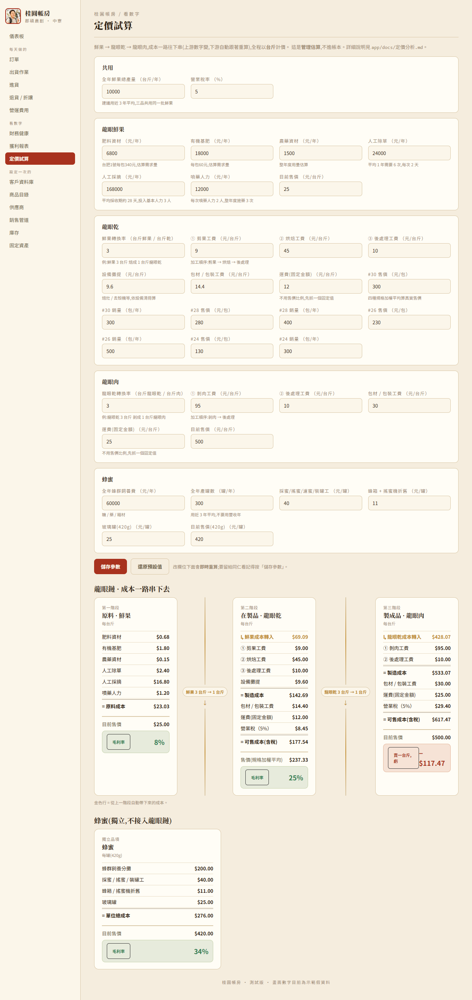

**應該看到:** 上面幾張卡「共用」「龍眼鮮果」「龍眼乾」「龍眼肉」「蜂蜜」,每張卡是一組成本
參數(改了旁邊數字,下面立刻重算);下面「龍眼鏈・成本一路串下去」是三階段成本堆疊圖——
原料鮮果 → 在製品龍眼乾 → 製成品龍眼肉,每個階段自動把上一階段的成本轉進來、加上自己那段的
加工費,算出「可售成本」,跟目前售價比出毛利率;蜂蜜是獨立一張卡,不接龍眼鏈。

**示範:** 改任一個參數(例如龍眼乾的「烘焙工資」)→ 下面數字即時重算 → 想固定住這組參數就
按「儲存參數」,或按「還原預設值」退回系統內建的估計值。

**怎麼講:** 「這是抓成本、抓售價用的估算工具,改參數看毛利率會不會太低,純試算,不會動到
真的訂單或帳。」

**順手確認:** 改完記得跟同仁說要按「儲存參數」,不然重新整理頁面就不見了。

---

## 16. 收尾:要跟家易確認 / 請他去問的事

**營運事實(他答得出):**
- 設備清單:每台大概買價、什麼時候買的、有沒有政府補助
- 申報表「研發費」的內容是什麼(新品?委外?其實是設備?)
- 「薪資支出」有沒有包含他自己下田 / 顧焙灶 / 剝肉的工
- 蜂蜜是自己養蜂採,還是收購生蜜回來瓶裝?
- 果園一年的管理開銷大概多少(施肥、疏果、防治、灌溉、人工)

**跟他說清楚:**
- 這些數字全是假的,換成真資料要一起做「切轉日盤點」(現有庫存、設備、現金、應收應付)
- 目前系統不處理報稅,只算「賣出後實際收到多少錢」——如果之後真的需要報稅底稿,是另一個
  獨立的專案

---

## 17. demo 前自己檢查清單

- [ ] 舊的伺服器視窗有關掉(不然看到的是舊版)
- [ ] `python seed.py --force` 重灌過一次乾淨假資料
- [ ] 每頁都打得開、沒有 500 錯誤
- [ ] 左側選單完整(現在應該是:儀表板 / 訂單・出貨作業・進貨・退貨折讓・營運費用 /
  財務健康・獲利報表・定價試算 / 客戶資料庫・商品目錄・供應商・銷售管道・庫存・固定資產)
- [ ] 儀表板「需要注意」標籤都點得動、跳得到對應頁
- [ ] 財務健康趨勢圖點得動、損益明細會出來
- [ ] 開一張測試訂單能存、能標記已收款、已出貨(demo 完記得刪掉或重灌 `seed.py --force`)
- [ ] 進貨、固定資產 各記一筆能存
