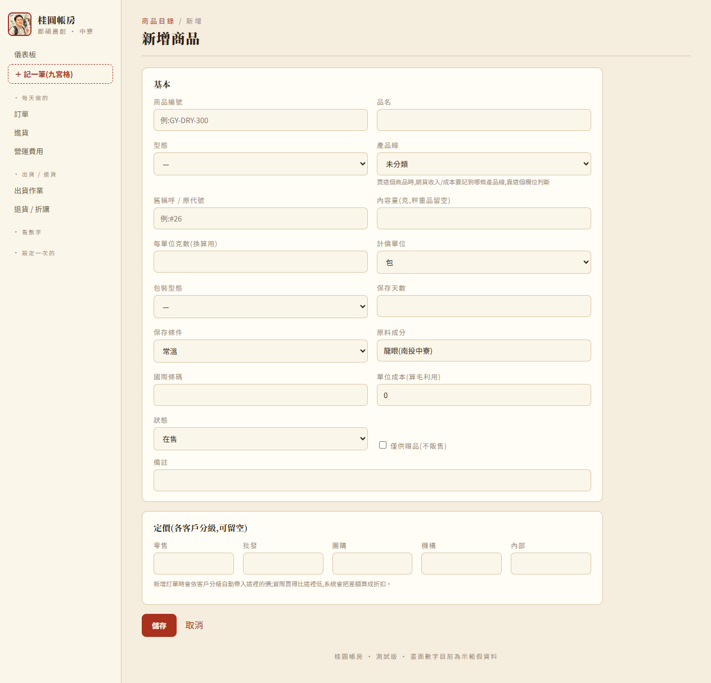
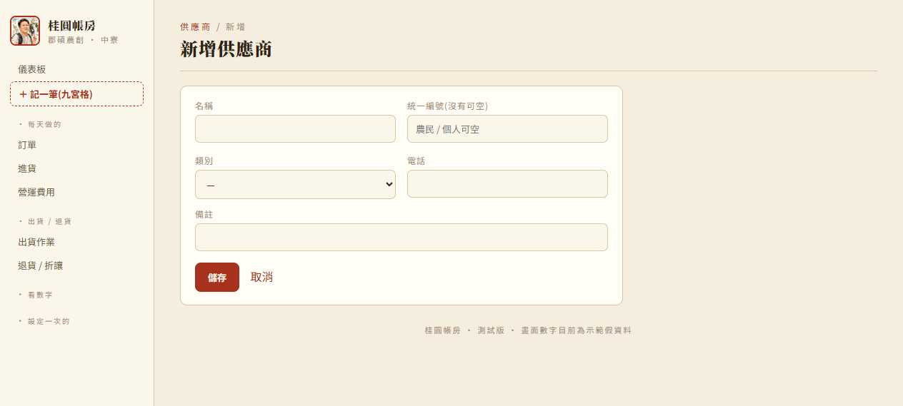
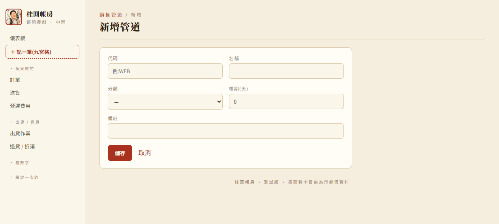
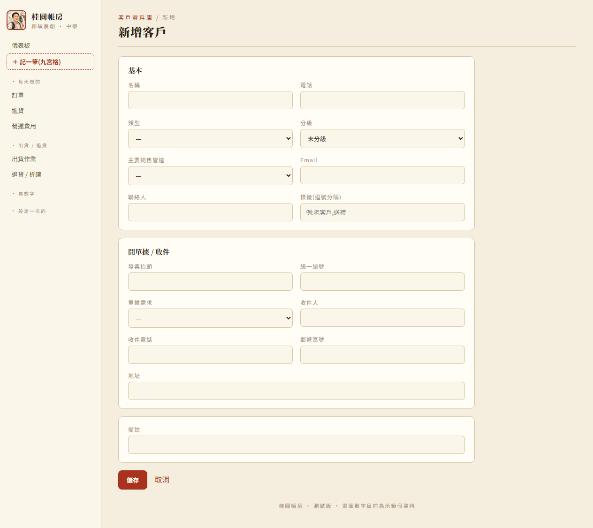
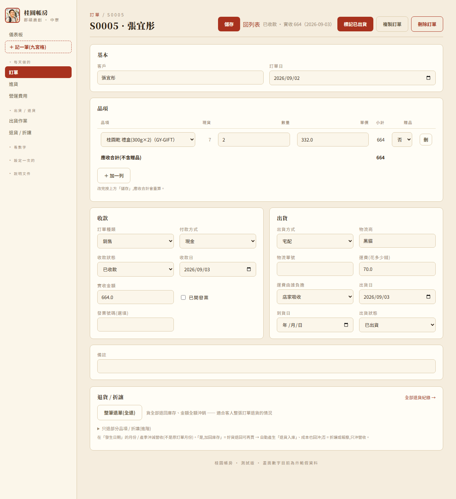

# 桂圓帳房 · 營運流程 SOP

這份不是「畫面導覽」(那份是 [展示腳本.md](展示腳本.md) / [使用手冊.md](使用手冊.md),
照左側選單一頁一頁介紹功能)。**這份是「做生意的順序」**——照這個順序做,系統裡的數字才會
一步步疊出來,而不是東點一塊、西點一塊。第一次上手照這份走一遍;之後想查某個畫面怎麼
操作,查使用手冊.md 比較快。

全部截圖是 `seed.py` 產生的**示範假資料**,畫面長相跟真的操作一樣,只是數字是假的。

> 所有記帳動作(包含這份 SOP 提到的訂單、進貨、營運費用、固定資產)都可以從左上角
> **「＋ 記一筆(九宮格)」** 一次進入,九張卡片點進去就是原本這份 SOP 講的那些畫面——
> 這份 SOP 走的是業務發生的順序,九宮格是另一種「先想好要記哪一種再進去」的入口,
> 兩種殊途同歸,選你順手的用就好。

---

## 整體邏輯:三個階段

| 階段 | 做什麼 | 做幾次 |
|---|---|---|
| **一、開店設定** | 商品、價格、供應商、銷售管道、客戶、既有設備 | 只做一次(之後有新品項/新客戶才補) |
| **二、日常營運循環** | 進貨 → 訂單 → 出貨 → 收款 → (退貨)→ 盤點 | 每天 / 每筆重複 |
| **三、定期檢視** | 營運費用、財務健康、獲利報表、總帳、儀表板 | 每月 / 每季回頭看 |

**為什麼要照這個順序**:訂單要挑客戶、挑商品——客戶跟商品都還沒建好,訂單根本填不出來。
客戶要選分級、選管道——分級跟管道也要先設好。所以「先設定、再營運、最後定期回顧」不是
選擇,是系統結構本身要求的順序。

---

## 第一階段:開店設定(只需要做一次)

### 1. 定價試算 —— 先抓成本、抓售價

**為什麼是第一步:** 還沒開始賣之前,要先知道「賣多少錢才不會虧」。這是一個純估算工具,
不會動到任何訂單或帳,可以放心試。

**點:** 左側「看數字 → 定價試算」


**怎麼做:** 上面幾張卡分別是「共用」「龍眼鮮果」「龍眼乾」「龍眼肉」「蜂蜜」的成本參數
(人工、包材、運費…),填自己的真實數字 → 下面「龍眼鏈・成本一路串下去」會自動把上一階段
的成本轉進下一階段、算出可售成本、跟目前售價比出毛利率。改完按「儲存參數」留住這組數字。

**產出:** 算出來的「可售成本」「建議售價」,就是下一步要填進商品目錄的數字。

---

### 2. 商品目錄 —— 把商品跟價格建起來

**為什麼現在做:** 上一步算好的成本、售價,要填進這裡才會變成一個「真的可以拿來開訂單」
的商品。

**點:** 左側「設定一次的 → 商品目錄」


**示範新增:** 「＋新增商品」→ 商品編號(必填,例:GY-DRY-300)、品名(必填)、型態、內容量、
計價單位、保存天數/條件、原料成分 →「**單位成本**」填上一步算出來的可售成本(這是算毛利的
關鍵)→ 下方「定價」把零售/批發/團購/機構各分級的售價填上 → 存。



**順手確認:** 一個規格建一個編號(例:300g 跟 500g 是兩個商品);之後編輯商品可以隨時改價。

---

### 3. 供應商 —— 建立進貨對象

**為什麼現在做:** 之後每次進貨都要選「跟誰買的」,供應商要先建檔,進貨表單才選得到。

**點:** 左側「設定一次的 → 供應商」


**示範新增:** 「＋新增供應商」→ 名稱(必填)、統一編號(農民/個人可空)、類別、電話 → 存。



---

### 4. 銷售管道 —— 建立賣貨的通路

**為什麼現在做:** 客戶要掛在「哪個管道」底下(官網?LINE 社群?批發?),管道要先建好,
下一步建客戶時才選得到。

**點:** 左側「設定一次的 → 銷售管道」


**示範新增:** 「＋新增管道」→ 代碼(必填,例:WEB)、名稱(必填)、分類、帳期(天)→ 存。



---

### 5. 客戶資料庫 —— 建立客戶

**為什麼是這裡才做:** 新增客戶時要選「分級」(決定訂單自動帶哪個價,回頭對到第 2 步設的
定價)、要選「主要銷售管道」(對到第 4 步)——這兩樣都要前面步驟先設好,客戶才建得完整。

**點:** 左側「設定一次的 → 客戶資料庫」


**示範新增:** 「＋新增客戶」→ 名稱(必填)、電話、類型、**分級**、**主要銷售管道**、Email、
聯絡人 → 下面「開單據 / 收件」填發票抬頭、收件地址 → 存。



---

### 6. 固定資產(如果本來就有設備)

**為什麼放這裡:** 開始營運前先把既有的焙灶、機器建卡,折舊才會從正確的取得日開始算,
之後每月自動算進財務健康,也會自動記進總帳,不用手動記。沒有既有設備的話這步可以跳過,
之後買新設備再回來補。

**點:** 左側「設定一次的 → 固定資產」→「＋新增一台」


**怎麼做:** 填名稱、選類別(自動帶耐用年數)、取得日、成本、政府補助(沒有填 0)、
付款帳戶(留白 = 現金)→「殘值」留白讓系統自動算 → 存。存檔後系統會自動記一筆「設備
取得」分錄;之後每個月只要打開這頁,系統會順便把還沒記過的折舊月份補齊,不用手動一筆
一筆記。

---

## 第二階段:日常營運循環(每天 / 每筆訂單重複的事)

第一階段的設定做完後,平常會不斷重複下面這個循環:**進貨補原料 → 客人下單 → 出貨 →
收款 → (偶爾要處理退貨)→ 定期盤點**。這個順序就是一筆生意實際發生的順序。

### 7. 進貨 —— 補原料 / 包材

**為什麼是循環的起點:** 要先有原料、包材,才能做出商品賣給客人。

**點:** 左側「每天做的 → 進貨」→「＋記一筆進貨」

**怎麼做:** 日期、供應商(選第 3 步建好的)、類別(原料/包材/委外加工/設備)、金額 →
存。設備類記得勾「這是設備」,系統會另外幫你走固定資產那條路,不算一次性費用。


存檔後(設備除外)會先看到一次「確認分錄」畫面,看一眼付款帳戶、稅額對不對,**憑證類型
選「發票」的話發票號碼是必填的**,按「確認存檔」才會真的存進去。


---

### 8. 新增訂單 —— 客人下單

**為什麼現在才填得出來:** 訂單要挑客戶(第 5 步建的)、挑商品(第 2 步建的,單價還會依
客戶分級自動帶出來)——這正是為什麼客戶、商品要先設定好的原因。

**點:** 左側「每天做的 → 訂單」→「＋新增訂單」

**怎麼做:** 打客戶名字搜尋 → 點選 → 品項選商品(單價自動帶)→ 填數量 → 有開發票記得
勾「已開發票」並填發票號碼(勾了沒填不給存檔)→ 存檔。


**如果是一批訂單(例如 Google 表單收單、或客人給一份 Excel 名單):** 不用一筆一筆手動開,
訂單清單頁右上角「匯入」,不確定欄位怎麼打可以先點「下載範本」,上傳 `.csv`/`.xlsx`,
系統會先給你看預覽、確認無誤才會真的建單,細節看 [使用手冊.md](使用手冊.md) 第五節。

---

### 9. 出貨作業 —— 揀貨、貼標、出貨

**為什麼在訂單之後:** 訂單確認了,才知道要出哪些貨、印哪些標籤。

**點:** 左側「出貨 / 退貨 → 出貨作業」


**怎麼做:** 「揀貨單」列出要出的訂單 + 彙總撿貨量,可列印;「出貨標籤 / 送貨單」每張訂單
一張卡;「食品標示」選商品 + 份數就能產生貼在包裝上的標示。

---

### 10. 回訂單頁:標記已出貨 / 標記已收款

**為什麼放這裡:** 貨出了、錢收了,要回到訂單明細頁把狀態更新,儀表板跟財務健康的數字
才會跟著動。



**怎麼做:** 訂單明細頁,先在「收款」卡填實收金額 → 按「標記已收款」;出貨完成,先在
「出貨」卡選出貨方式 → 按「標記已出貨」。

**要注意:** 「標記已收款」只卡這個動作本身,不會卡到出貨——訂單可以照樣出貨,不管有沒有
收到錢(配合貨到付款、月結批發的實況)。標記已收款的同時,系統會在總帳補一筆收款分錄,
不用你管。這兩顆按鈕都會檢查必填的欄位(實收金額 / 出貨方式)有沒有填,沒填會提醒你,
不會讓狀態跟實際資料對不上(例如畫面寫已收款,總帳卻沒有對應的那張傳票)。

---

### 11. 退貨 / 折讓(有狀況才做)

**為什麼是選擇性的一步:** 不是每筆訂單都會發生,但客訴、退貨隨時可能出現,順序上接在
「已出貨」之後。

**怎麼做:** **這頁本身沒有新增按鈕**——回到原訂單明細頁,拉到最下方「退貨 / 折讓」卡,按
「整筆退單(全退)」或用「進階」收合區登記部分退貨/折讓 → 存。金額會自動沖減發生日期
所在月份的營收,系統也會依這張訂單有沒有收過款,自動記對應的分錄(已收款記成真的退現金、
沒收款記成打折欠款)。

**點:** 左側「出貨 / 退貨 → 退貨 / 折讓」看所有紀錄


---

### 12. 庫存盤點

**為什麼放循環的最後:** 訂單出貨會自動扣庫存,但實際盤點(耗損、清點差異)要人工不定期
核對登錄,抓循環中間有沒有跟系統帳對不上的地方。

**點:** 左側「設定一次的 → 庫存」


**怎麼做:** 「生產入庫」卡登記剛做好的成品數量 + 值多少錢(會多記一筆分錄);「分裝入庫 /
期初 / 退貨入庫」卡只登錄數量;右邊「盤點調整 / 損耗報廢」卡登錄實際清點的差異。

---

## 第三階段:定期檢視(每月 / 每季回頭看)

日常循環在跑的同時,有幾件事要**定期**(通常是每月)回來做一次,系統才看得出真實的損益。

### 13. 營運費用 —— 每月固定要填

**為什麼要「主動」填:** 訂單相關的營收/成本系統自動算,但人事、行銷、設備維護這些費用
不會自己跑進系統,要每月手動記一次,淡季也要填,不然損益會失真。

**點:** 左側「每天做的 → 營運費用」→「＋新增一筆」


**怎麼做:** 月份、項目(直接人工/研發/場地倉儲…)、金額、一次性大支出填「攤提月數」→ 存。
跟進貨一樣,存檔前會先看一次分錄確認畫面,憑證類型選「發票」發票號碼一樣必填。

---

### 14. 財務健康 —— 看月損益

**點:** 左側「看數字 → 財務健康」


**怎麼看:** 月稅前利潤趨勢(綠賺紅虧)、累積稅前利潤、毛利率趨勢;點某個月看完整損益明細。

---

### 15. 獲利報表 —— 拆更細看

**點:** 左側「看數字 → 獲利報表」,3 個頁籤:

| 頁籤 | 回答什麼問題 |
|---|---|
| 獲利分析 | 哪個商品/哪個通路賺?客戶回不回購?本季誰是 Top 客戶? |
| 收款帳齡 | 還沒收到的貨款,卡在誰那裡多久了?最近誰又收回來了? |
| 跨產季比較 | 今年比去年同期好不好? |


---

### 16. 總帳 / 銀行帳戶明細 / 存貨管理(比較深入,同事在看的居多)

**為什麼放在這裡:** 前面每一步存檔,系統都已經自動記好分錄,這幾頁是把記好的東西整理
成不同角度可以核對:

| 頁面 | 看什麼 |
|---|---|
| **總帳** | 所有分錄的明細,依來源 / 日期 / 關鍵字篩,可以勾選整張傳票刪除(連來源紀錄一起刪) |
| **正式報表** | 給同事報稅用的試算表 / 資產負債表 / 綜合損益表,固定用西曆年(1~12 月),跟其他頁用的「產季」不是同一條時間軸 |
| **銀行帳戶** | 各付款帳戶的固定代碼清單,打錯字可以改名、同一家銀行打成兩個名字可以併入 |
| **銀行帳戶明細** | 現金 / 各銀行帳戶各自的進出流水 + 累計餘額 |
| **存貨管理(含金額)** | 庫存不只數量,連值多少錢都算出來(從庫存頁右上角進去) |


平常不用特別看這幾頁,想深入了解記帳邏輯、科目對照,看 [功能手冊.md](功能手冊.md)。

**全鏈路毛利分析**(選單「看數字」)不算在這幾頁裡——它是**估算工具,不是真的帳**,
把已經付出去的採購款拆解成「供應端(小農/加工品供應者)大概賺多少、公司大概賺多少」,
給自己決策參考用,不影響總帳或正式報表的任何數字。想用的話直接進去看,不用照順序來,
細節看 [使用手冊.md](使用手冊.md) 第十六節。

---

### 17. 儀表板 —— 平常隨時看的總覽

**為什麼放在最後:** 前面所有步驟的資料建好、循環跑起來之後,首頁儀表板才會有東西可看——
它其實是把所有階段的結果彙總成一頁。設定好之後,這頁會變成平常**打開系統第一眼看的畫面**。


**看什麼:** 頂端「需要注意」的待辦提醒、4 個 KPI(營收/稅前利潤/毛利率/未收貨款)、
本產季損益簡表、產季目標進度、月營收趨勢圖。

**回頭校正:** 如果發現某個商品毛利率一直不理想,回到第 1 步的「定價試算」調整參數、
回第 2 步改商品售價——這就是為什麼定價試算跟商品目錄放在最前面,因為之後會一直回來調。

---

## 一張圖看完整順序

```
【一、開店設定,只做一次】
  定價試算 → 商品目錄 → 供應商 → 銷售管道 → 客戶資料庫 → (固定資產)
                                                          │
                                                          ▼
【二、日常循環,每天 / 每筆重複】
  進貨 → 新增訂單(或批次匯入) → 出貨作業 → 標記已收款/已出貨 → (退貨/折讓) → 庫存盤點
                                                          │
                                                          ▼
【三、定期檢視,每月 / 每季】
  營運費用 → 財務健康 → 獲利報表 → 總帳/正式報表/銀行帳戶/存貨管理 → 儀表板(回頭校正定價,調整循環)
                            (全鏈路毛利分析:想用隨時進去看,不用照順序)
```
