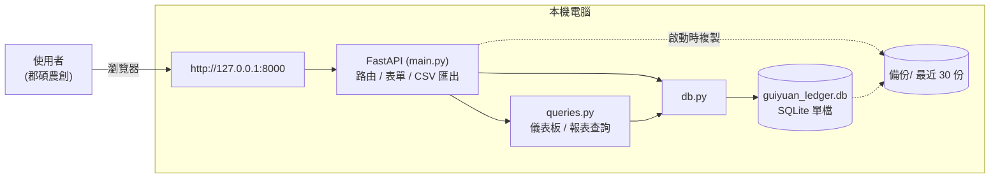
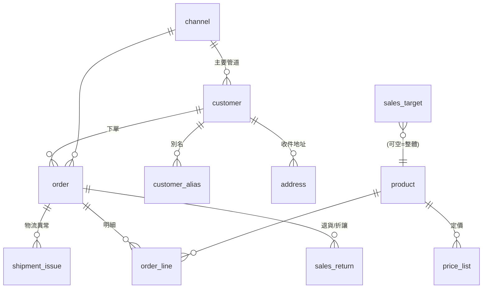

# 桂圓帳房 — 系統文件

南投中寮 · 郡碩農創 桂圓 / 龍眼乾銷售與物流管理平台。
本文件為開發 / 維護用途;操作說明見 [使用手冊.md](使用手冊.md)。

---

## 1. 概觀

| 項目 | 內容 |
|---|---|
| 型態 | 單機本地 Web 應用,資料全部留在使用者電腦 |
| 後端 | Python 3 + FastAPI |
| 樣板 | Jinja2(伺服器渲染)+ 少量原生 JavaScript |
| 資料庫 | SQLite 單檔 `guiyuan_ledger.db` |
| 前端框架 | 無(無打包步驟);CSS 為單一 `static/app.css` |
| 執行 | `啟動.bat`(建立 venv、裝套件、必要時建庫、開瀏覽器、跑 uvicorn) |
| 網址 | http://127.0.0.1:8000 |
| 風格 | 「帳房・宣紙」:米黃底、墨褐明體標題、朱印紅重點(Noto Serif TC / Noto Sans TC) |

### 設計原則
- 人(customer)、貨(product)、單(order / order_line)、錢(收款欄位)、物流(出貨欄位 + shipment_issue)五件事各自獨立。
- 一張原始出貨 = 一張 `order`,底下掛 `order_line`。
- 「贈送 / 樣品 / 理賠重寄」是**訂單種類**(`order_kind`),不是付款方式,可單獨統計成本。
- 產季(4 月開花養果起、到隔年 3 月這批桂圓乾賣完,共 12 個月)是一等公民;分析可切產季或看全部。

### 系統架構圖



全部在同一台電腦,無雲端、無登入、無外部連線。

### 資料模型(關聯)



- **主檔**:channel / product(+ price_list,含單位成本)/ customer(+ alias + address)/ supplier
- **交易**:order(+ order_line)、shipment_issue、sales_return、purchase
- **輔助**:sales_target、review_queue(未與其他表建外鍵關聯)、fixed_asset、op_expense
- **dormant(表還在、UI 已不寫入)**:batch(焙製批次,order_line.batch_id / stock_move.batch_id 舊資料保留)、business_unit / product_group(product.product_group_id 舊資料保留)

---

## 2. 目錄結構

```
app/
  啟動.bat            啟動腳本(純英文內容,避免 cmd 中文亂碼)
  requirements.txt    fastapi / uvicorn / jinja2 / python-multipart
  schema.sql          14 張表的 DDL
  seed.py             建庫 + 灌示範假資料(2025、2026 兩個產季)
  guiyuan_ledger.db   SQLite 資料庫(執行後產生)
  備份/               每次啟動自動複製當日 .db,保留最近 30 份
  .venv/              虛擬環境(啟動時建立)

  db.py               SQLite 連線與 q / q1 / execute 三個小工具
  queries.py          儀表板 / 報表的所有查詢
  main.py             FastAPI 應用:路由、CSV 匯出、備份、啟動時 ensure_db / migrate_db
  paths.py            DATA_DIR / RES_DIR 解析(本機 / 雲端兩種);讀 GY_DATA_DIR
  wsgi.py             WSGI 進入點(給 PythonAnywhere 等只吃 WSGI 的主機;a2wsgi 包 ASGI)
  manual_export.py    核心手冊 .md 即時轉自包含 HTML(給 /manuals 下載用,見 §4「下載手冊」)

  templates/          Jinja2 樣板(見 §6)
  static/app.css      全站樣式(以 ?v=N 破快取)
  docs/               本文件與使用手冊
```

### 部署 / 執行環境(兩種)
| 環境 | 進入點 | 資料庫位置 | 備註 |
|---|---|---|---|
| 本機開發 | `啟動.bat` → `uvicorn main:app` | `app/guiyuan_ledger.db` | |
| 雲端 / WSGI 主機 | `wsgi.py`(`from wsgi import application`) | 環境變數 `GY_DATA_DIR` 指定(程式碼目錄外) | 見 `docs/上雲-pythonanywhere.md`,**目前的主要交付方式** |

> 原本還有第三種「免安裝 exe」(`launch.py` + `打包.bat`,PyInstaller),但這台開發機的 SAC
> 會硬擋未簽章的 exe,從沒成功交付過;2026-10-02 決定改走雲端架站,相關程式與文件
> (`launch.py`/`打包.bat`/`交付說明.md`/`臨時分享.md`)都已拿掉,`paths.py` 也同步簡化。

**環境變數**(只雲端用,本機不設):
- `GY_DATA_DIR` —— 資料庫 + 備份放哪(讓 `git pull` 不會蓋到資料)
- `GY_PASSWORD` —— 設了 → `main.py` 掛一個 middleware,整站要這組共用密碼(Basic Auth,帳號欄隨便打;`/static` 除外)

`ensure_db()`(`main.py` 啟動時):資料庫不存在 → 自動 `seed.py --force` 建示範庫(雲端首次部署的保險)。

### 啟動流程(`啟動.bat`)
1. 找 Python:優先 `py -3.11`,退而求其次 `py`、`python`。
2. `.venv` 不存在 → 建立。
3. `pip install -r requirements.txt`(靜默)。
4. `guiyuan_ledger.db` 不存在 → `python seed.py --force`。
5. 開瀏覽器 `http://127.0.0.1:8000`,啟動 `uvicorn main:app`。

> 沒有 `--reload`。**改完 .py / 樣板要關掉黑視窗、重跑 `啟動.bat`** 才會生效;純粹在畫面上新增 / 修改資料不用重啟。
> `watchfiles`(uvicorn 自動重載所需)在此機器需要 C++ 編譯器,已刻意不採用。

### 區網存取(iPad / 其他裝置)
- uvicorn 綁 `--host 0.0.0.0`,同一個 Wi-Fi 下其他裝置以 `http://<本機區網IP>:8000` 連入。
- `啟動.bat` 會用 `ipconfig` 印出可用的 IPv4 位址。
- `templates/base.html` 帶 `manifest.webmanifest` + `apple-touch-icon` + `apple-mobile-web-app-*` meta,iPad Safari 可「加入主畫面」成獨立視窗 App。圖示為 `static/icon-{180,192,512}.png`(朱紅底白「郡」字,由 Pillow 一次性產生,非執行期相依)。
- `main.SENDER` 常數 = 出貨標籤 / 食品標示上的寄件人(名稱、地區、地址、電話),地址電話目前為 `[寄件地址]` 佔位待填。
- `app.css` `@media print` 隱藏側欄 / 按鈕,供揀貨單、標籤、食品標示列印;`.lbl` / `.foodlbl` 為標籤卡樣式。
- `app.css` `@media (max-width: 900px)` 讓側邊選單轉為頂部橫列、格線收成單欄、寬表格於卡片內橫向捲動。
- 仍無登入 / HTTPS;僅限信任的區網使用。要對外需另加驗證與反向代理。

---

## 3. 資料庫結構

`schema.sql`(v2),`PRAGMA foreign_keys = ON`。金額欄位單位皆為 NT$。

> **v2 改造現況(2026-09)**:原本規劃「一套資料、兩種報表」——A 產品線全成本損益、B 報稅支援。
> **B 層報稅支援已整個取消**(田家易無會計背景,系統不追求報稅產出,見 [報稅參考.md](報稅參考.md))。
> **A 層「各產品線賺不賺」也已從畫面隱藏**(程式碼保留、路由仍在,只是不連導覽列),回合 12f/12g
> 進一步把「產品線」分類欄位從進貨 / 營運費用 / 固定資產表單移除、把「焙製批次」整個拿掉,
> 毛利改用商品自己的 `unit_cost`。詳細沿革見 [開發路線.md](開發路線.md) 回合 12–12g。

### 3.0 business_unit / product_group — 產品線分類(**dormant,畫面已不用**)

三層:**事業別 `business_unit`** → **產品群組 `product_group`** → **SKU `product`**。這套結構是 v2 回合 1
做的,原本要撐「各產品線賺不賺」分析與報稅稅別分類;2026-09 兩者都已停用/隱藏,**表與資料還在,
但目前沒有任何表單會寫入 `product.product_group_id`**(進貨 / 營運費用 / 固定資產的「歸哪條產品線」
下拉都已移除)。之後真的要做該分析再一起打開。

| 表 / 欄位 | 說明 |
|---|---|
| `business_unit`(bu_id, name, sort, note) | 事業別:龍眼(自有果園)/ 蜂蜜(自養蜂)。`name` 唯一。**這兩個命名是回合 1 的舊假設,2026-10-01 已確認郡碩完全沒有自有果園/自養蜂,全部跟小農採購(見開發路線.md §五)——dormant 資料沒有跟著改名,之後重新啟用這套分類時要一併修正** |
| `product_group`(pg_id, bu_id→business_unit, name, tax_class, sort, note) | 產品群組:龍眼鮮果 / 龍眼乾 / 龍眼肉 / 蜂蜜。`UNIQUE(bu_id, name)` |
| `product_group.tax_class` | 報稅稅別欄位,dormant,不再維護 |
| `product.product_group_id` → product_group | SKU 歸屬的產品群組;現在不會有 UI 再寫入,舊資料保留 |

維護畫面 `GET /product-lines` + `POST /product-lines/{bu,group,assign}` 仍在、可直連 URL 進,但已從
`base.html` 導覽列移除。

### 3.1 product — 商品目錄(= SKU / 品項)
| 欄位 | 說明 |
|---|---|
| product_id | PK |
| sku | 商品編號,唯一,人可讀(如 `GY-DRY-300`) |
| name | 品名 |
| product_type | 型態:單品 / 組合 / 禮盒 / 裸裝 / 試吃包 / 加購贈品 |
| type_code_raw | 對方舊代號(如 `#26`) |
| net_weight_g / gross_weight_g | 內容量 / 毛重(克) |
| package_form | 夾鏈袋 / 罐 / 禮盒 / 真空袋 / 裸裝 |
| uom | 計價單位:包 / 斤 / 盒 / 罐 / 支 |
| grams_per_uom | 1 計價單位 = 幾克(斤↔克換算) |
| shelf_life_days | 保存天數(從製造日起算) |
| storage_condition | 常溫 / 冷藏 / 冷凍 |
| ingredients / origin / allergen / barcode | 標示用 |
| gift_only | 1 = 僅供贈品,不販售 |
| status | 在售 / 停售 |
| unit_cost | 商品單位成本(v2 回合 12g 新增),商品目錄表單直接填。取代舊的「焙製批次」成本,所有毛利 / COGS 計算(`kpi`/`monthly`/`by_channel`/`finance_month`/`season_finance`/`profit_by_product`/退貨回沖成本)全面改用這個值,不分批次,精準度打折但夠簡單。既有資料庫升級時 `migrate_db()` 會用舊批次成本的平均值帶初值 |

可從 `/products/{id}/edit` 刪除,`_product_delete_block_reason()` 檢查是否有訂單明細 / 現有庫存 /
退貨紀錄 / 舊焙製批次 / 產季目標引用,有就組成具體的白話原因擋下刪除(例:「有 5 張訂單用過這個商品、
現有庫存還有 7 包」)。

### 3.2 price_list — 定價表
| 欄位 | 說明 |
|---|---|
| product_id | FK product |
| customer_segment | 零售 / 批發 / 團購 / 機構 / 內部 |
| channel_id | 通路特定價(NULL = 通用);目前 UI 只寫通用價 |
| unit_price | 單價 |
| effective_from / effective_to | 生效區間(UI 存 `2000-01-01` 起) |

> 儲存商品時,該商品的通用定價(channel_id IS NULL)會**整批刪除重寫**,不留歷史。

### 3.3 customer — 客戶主檔
`display_name`、`customer_type`(個人 / 公司 / 機構團體 / 通路商 / 內部)、
`segment`(零售 / 批發 / 團購主 / 機構 / 公關對象)、`primary_channel_id`、
`phone`、`email`、`contact_person`、`invoice_title`、`tax_id`、
`tax_doc_pref`(電子發票二聯 / 三聯 / 農民收據 / 免開立)、`tags`、`note`、`first_order_date`。

> `customer.segment` 與 `price_list.customer_segment` 值域不同,對照:
> 團購主→團購、公關對象→內部,其餘同名。程式常數 `SEG_MAP`(main.py)。

### 3.4 customer_alias — 別名對照
`alias_text`(唯一)→ `customer_id`。歷史各種寫法、暱稱都對到同一人;搜尋與比對都會查這張表。

### 3.5 address — 收件地址
一個客戶可多筆:`label`、`recipient_name`、`recipient_phone`、`zipcode`、`address_full`、`is_default`。
UI 目前只維護一筆預設地址(upsert)。

### 3.6 channel — 銷售管道
`code`(唯一)、`name`、`category`、`commission_pct`(dormant,回合 12 拿掉通路抽成自動試算後
UI 不再讀寫這欄)、`settlement_lag_days`。可從 `/channels/{id}/edit` 刪除,被 `order` / `customer.primary_channel_id`
/ `price_list` 引用時擋下並說明原因。

### 3.7 batch — 焙製批次(**dormant,回合 12g 已從 UI 移除**)
`batch_code`(唯一)、`season`、`product_id`(可 NULL = 多品)、`roast_start/end`、
`raw_source`、`raw_input_kg`、`output_qty`、`output_uom`、`mfg_date`(效期基準)、`unit_cost`。
表與資料保留,但 `/batches` 系列路由、訂單 / 退貨 / 食品標示的批次選擇欄位都已移除。
毛利 / COGS 一律改用 `product.unit_cost`(見 3.1)。`order_line.batch_id` / `stock_move.batch_id`
仍是資料庫欄位(dormant,舊資料不受影響),但新流程都不再寫入。

### 3.8 order — 訂單
| 群組 | 欄位 |
|---|---|
| 識別 | order_no(唯一)、order_date、season、customer_id、channel_id |
| 性質 | order_kind:銷售 / 贈送-公關 / 贈送-捐贈 / 樣品 / 理賠重寄 / 換貨補出 / 內部領用;source_ref(手動新增的訂單是 NULL;訂單匯入寫入的訂單是 `gform:<原始時間戳記>`,當作防止重複匯入的唯一識別,見 3.20) |
| 金額 | discount_total、shipping_fee_charged(**dormant,回合 12 起 UI 不寫**)、platform_fee(**dormant,通路抽成試算已拿掉**)、order_total |
| 收款 | payment_method、payment_account、payment_status(待收款 / 部分收款 / 已收款 / 免收款)、paid_date、paid_amount(**標記已收款時要求輸入的實收金額,是本產季營收/毛利計算唯一的依據**) |
| 單據 | tax_doc_type(**dormant,畫面已不用**)、invoiced(0/1,這筆有沒有開發票,單純記錄不算稅,v2 回合 12)、tax_doc_no(發票號碼,選填) |
| 物流 | ship_method、carrier、tracking_no、ship_from、shipped_date、delivered_date、shipping_cost_actual(**唯一的運費欄位,我方實際花費**)、ship_payer(店家吸收 / 客戶付,純記錄不影響任何計算,v2 回合 12)、packaging_cost、ship_status(待出貨 / 已出貨 / 已送達 / 退回 / 遺失 / 破損) |
| 其他 | note、created_at |

`order_total` = Σ(非贈品 line_subtotal) − discount_total,於建立 / 編輯 / 複製 / 標記收款時重算
(`shipping_fee_charged` 不再加進 `order_total`——v2 回合 12 起運費不進訂單應收,只當費用單獨記)。

`POST /orders/{oid}/delete`:刪除訂單,連同 `order_line`、關聯的 `sales_return`、`stock_move`
(`ref_order_id` = 該單)一起刪除,無法復原。

### 3.9 order_line — 訂單明細
`product_id`(FK)、`batch_id`(FK,可 NULL,**dormant,回合 12g 起表單不再選批次**)、`qty`、`unit_price`(成交價)、
`list_price`(當下標準價,建立時由 price_list 帶入)、`line_discount`(目前未用)、
`line_subtotal` = qty × unit_price、`is_gift`(1 = 搭贈,不計收入)、`expiry_stated`(歷史效期原值,保留欄)。

> 「賣得比定價低」的折扣**不寫回 discount_total**(避免與整單折讓重複扣);
> 由報表 / 警示以 `(list_price − unit_price) × qty` **即時計算**。

### 3.10 shipment_issue — 物流異常 / 退補
`order_id`(FK)、`issue_type`(遺失 / 破損 / 退貨 / 客訴 / 到期回收)、`issue_date`、
`qty_affected`、`resolution`(重寄 / 退款 / 換貨 / 折讓 / 無)、`linked_reship_order_id`、
`cost_impact`、`reason_note`。

### 3.11 sales_target — 產季目標
`season`、`product_id`(NULL = 整體)、`target_qty`、`target_amount`。
維護畫面:`GET/POST /targets`(每季一筆 `product_id IS NULL` 的整體目標;存檔為先刪後插,
因 SQLite `UNIQUE` 不約束 NULL)。儀表板「產季目標 & 進度」卡與 `queries.season_progress()` 使用。

### 3.12 review_queue — 待確認佇列
`source`(import / form)、`raw_json`、`issue_type`、`status`(待處理 / 已修 / 已忽略)、
`resolved_order_id`、`note`。新增客戶擋重名等情境會寫入。

### 3.14 stock_move — 庫存異動(SKU 層)
`move_date`、`product_id`(FK)、`batch_id`(FK,可空,dormant)、`qty`(正=入庫 負=出庫)、
`move_type`(期初庫存 / 分裝入庫 / 銷售出庫 / 贈送出庫 / 盤點調整 / 損耗報廢 / 退貨入庫)、
`ref_order_id`(關聯訂單,NULL = 手動登錄)、`note`。
現有量 = Σ `qty`。
訂單建立 / 編輯 / 複製 / 理賠重寄時,`main.sync_order_stock(oid)` 會重建該訂單的「銷售出庫 / 贈送出庫」列。
`product.low_stock` 為低庫存警戒量(NULL = 不設);現有量 ≤ 0 觸發「超賣」警示,0 < 現有量 ≤ low_stock 觸發「偏低」警示。
`POST /stock/moves/{mid}/delete`:只能刪 `ref_order_id IS NULL` 的手動登錄列(分裝入庫 / 盤點調整 /
損耗報廢 / 退貨入庫);訂單自動產生的列會被擋下(`?perr=1`),要改要從訂單本身下手。

### 3.13 op_expense — 營運費用(月)(v2 回合 2b 升級)
`ym`(YYYY-MM;攤提時 = 起始月)、`category`、`amount`(實際花的錢)、
`product_group_id`(FK product_group,**dormant,回合 12f 起表單移除「歸哪條產品線」欄位**)、
`amortize_months`(攤提月數;NULL/1 = 當月全額,N = 從 ym 起每月 amount/N)、
`tax_amount`(dormant)、`tax_deductible`(dormant)、`doc_type`(dormant)、`note`。
`Q.OPEX_CATS`:完整清單見 `app/queries.py`(對應科目見 `app/ledger.py` 的 `EXPENSE_ACCOUNTS`)。
維護:`GET /finance/expenses`(清單)· `/finance/expenses/new` · `/finance/expenses/{id}/edit` · `POST /finance/expenses`(`_delete=1`)。

**攤提展開**:`Q.opex_rows(lo=None, hi=None)` 把每筆依 `amortize_months` 攤成逐月列;
`season_finance` / `finance_month` / `months_with_data` / `finance_trend` 都改用它。

### 3.15 supplier — 供應商(v2 回合 2a)
`name`、`tax_id`(統編,可空)、`category`(原料 / 包材 / 委外加工 / 設備 / 服務 / 其他)、`phone`、`note`。
維護:`GET /suppliers` · `/suppliers/new` · `/suppliers/{id}/edit` · `POST /suppliers`(`_delete=1`;有進貨紀錄不可刪)。

### 3.16 purchase — 進貨單(v2 回合 2a)
買進來的成本。欄位:`purchase_date`、`supplier_id`(FK,可空)、`category`(同 supplier)、
`product_group_id`(FK product_group,**dormant,回合 12f 起表單移除**)、`amount`、
`tax_amount`(dormant)、`tax_deductible`(dormant)、`doc_type`(dormant)、
`is_fixed_asset`(0/1,打勾標記;固定資產卡回合 3 才建)、`note`。
維護:`GET /purchases`(`?pg=<id>|common` `?ym=YYYY-MM` 篩)· `/purchases/new` · `/purchases/{id}/edit` · `POST /purchases`。
**目前只做登錄** —— 進貨金額不進損益表(避免和 `product.unit_cost` 重複計算)。
標了 `is_fixed_asset` 的可從 `/purchases` 頁「建卡 →」帶入 `fixed_asset`。

### 3.17 fixed_asset — 固定資產卡(v2 回合 3)
`name`、`category`(機器設備 / 生財器具 / 運輸設備 / 電腦設備 / 房屋建築 / 其他)、
`product_group_id`(FK,**dormant,回合 12f 起表單移除**)、`acquire_date`、`cost`、`grant_amount`(政府補助,不提折舊)、
`salvage`(殘值;留白時系統以 (成本−補助)÷(年數+1) 自動抓)、`life_years`、`method`(平均法)、
`source_purchase_id`(FK purchase,可空)、`disposed_date`(處分後停止折舊)、`note`。
維護:`GET /assets` · `/assets/new`(`?purchase=<id>` 從進貨帶入)· `/assets/{id}/edit` · `POST /assets`。

**折舊自動入損益**:平均法,每月 =(成本 − 補助 − 殘值)÷ 年數 ÷ 12,攤在耐用年數內、處分後停。
`queries._asset_dep_rows()` 產生逐月「折舊」類別列,`opex_rows()` 併入 → `season_finance` / `finance_month` /
月損益趨勢自動含折舊,**不另存 op_expense 列**(不會重複)。`Q.asset_list()` 另算累計折舊 / 帳面淨值。

### 3.19 sales_return — 銷貨退回 / 折讓(v2 回合 8;整筆退單為回合 12 新增)
`order_id`(FK,原銷售單)、`return_date` + `season`(**認列期間看這個**,不是原單月份)、
`kind`(退貨 / 折讓)、`amount`(沖減營收金額,正數)、`product_id` / `qty` / `batch_id`(batch_id 已 dormant)、
`restock`(1 = 好貨進庫可再賣 → 產生「退貨入庫」stock_move、成本回沖;0 = 折讓或報廢,只沖營收)、`reason`。
維護:
- `POST /orders/{oid}/return_all`(v2 回合 12,訂單明細頁「整筆退單(全退)」按鈕):把該單所有非贈品品項
  各建一筆 `kind='退貨'`、`amount=line_subtotal`、`restock=1` 的紀錄並全部產生退貨入庫,一次全額沖銷。
- `POST /orders/{oid}/return`(訂單明細頁「進階」展開的表單):自訂日期 / 類型 / 沖減金額 / 品項數量 /
  是否進庫,適合部分退貨或純折讓。
- `POST /returns/{rid}/delete`:連對應的「退貨入庫」`stock_move` 一起刪。

**已接進**:`kpi`(`returns` / `net_revenue`)、`season_finance` / `finance_month` / `finance_summary`
(多一列「− 銷貨退回與折讓」,`cogs` 為回沖後淨額 → 無銷售月可能負)、`monthly`(趨勢淨額)。
`product_line_pnl` 仍有接,但該頁面已從導覽列隱藏(見 3.0)。

### 3.18 pricing_param — 定價試算參數(v2 回合 10)
單一 key-value 表(`key` TEXT PK、`value` REAL)。**只是管理估算的輸入,不進帳本、不影響任何營收 / 成本數字。**
欄位定義(標籤 / 單位 / 預設值 / 分組)在 `queries.PRICING_FIELDS`;`queries.pricing_params()` 讀取(沒設的用預設)。
維護:`GET /pricing`(表單 + 即時試算)· `POST /pricing`(`_reset=1` 清空回預設)。
成本模型與試算邏輯寫在 `templates/pricing.html` 的前端 JS(材料 → 直接人工〔工時 × 時薪〕→ 製造費用 →
單位製造成本 → 分攤共同費用〔% 佔比〕→ 單位總成本 → 對照售價 / 反推建議售價)。背景見 `docs/定價分析.md`。

### 3.20 訂單匯入(Google 表單 / Excel,v2 回合 13)
沒有新資料表,是在既有的 `order`/`order_line`/`customer` 上多開一條寫入路徑,跟手動新增訂單
共用同一套入帳邏輯(`sync_order_stock()` + `_post_order_ledger()`),差別只在資料來源。

解析/比對邏輯獨立成 `app/order_import.py`(不碰資料庫寫入,純函式):
- **固定欄位規格**(表頭文字要完全相符):`時間戳記`(或 `Timestamp`)、`客戶姓名`、`客戶電話`
  (必填,比對客戶的依據)、`收件地址`、`付款方式`、`備註`。除此之外**任何欄名等於某個
  「在售」商品的品名或 SKU,自動當成那個商品的數量欄**——表單建議用下拉/核取方塊呈現商品,
  這樣欄名由家易自己在表單端設定好,不會有客人手誤打錯字的問題。
- `parse_file(filename, content)`:`.csv` 用內建 `csv`(嘗試 `utf-8-sig`/`cp950`/`utf-8` 解碼);
  `.xlsx` 用 `openpyxl`(`requirements.txt` 新增套件)。
- `match_rows(headers, raw_rows, pay_methods)`:逐列判斷狀態 `ok`(電話比對到既有客戶)/
  `new_customer`(電話比對不到,待人工決定建新客戶或指到既有客戶,**絕不自動模糊比對姓名**)/
  `error`(缺電話、缺時間戳記、或一個商品都沒勾)/`duplicate`(`gform:<時間戳記>` 已經是某張
  訂單的 `source_ref`,自動略過)。電話比對前用 `normalize_phone()` 去掉空格/破折號,
  `_phone_from_cell()` 修正 xlsx 把電話存成數字、開頭 0 不見的問題。

路由(`main.py`,訂單管理區塊內):
- `GET /orders/import`:上傳畫面(選銷售管道 + 選 .csv/.xlsx)。
- `GET /orders/import/template`(2026-10-02 新增):下載範本 .csv——固定欄位(時間戳記/客戶
  姓名/客戶電話/收件地址/付款方式/備註)+ 查詢目前 `status='在售'` 的商品現組出對應欄位,
  附一列範例資料(示範格式,請家易刪掉再填真的資料)。欄位**即時**依商品目錄產生,不是
  存在檔案系統裡的靜態檔,商品改名/新增/下架隔天範本就會跟著變,不用另外維護。沿用
  `csv_response()`(BOM,Excel 中文正常)。
- `POST /orders/import/preview`:解析 + 比對,渲染預覽畫面;整批列資料(含每列明細)用隱藏欄位
  `rows_json` 帶到下一步(沿用 `ledger_confirm.html` 那套「不額外存檔,靠表單隱藏欄位帶資料」
  的既有模式,走 Jinja 自動跳脫,沒有另外的暫存檔或資料表)。
- `POST /orders/import/confirm`:讀 `rows_json` + 每列的 `resolve_i`(`new` 或某個
  `customer_id`)+ `skip_i`(略過整列),建立客戶(需要的話,`segment` 固定給 `零售`)→
  建訂單/明細(單價查 `price_list` 的方式跟手動新增完全一樣)→
  `sync_order_stock()` + `_post_order_ledger()`。導回 `/orders?imported=N`。

畫面:`templates/orders_import.html`(上傳)、`templates/orders_import_preview.html`
(預覽/確認,KPI 卡顯示可匯入/待確認/有問題/已匯入過四個數字)。

### 3.21 ledger_entry — 總帳(複式記帳,v2 回合「九宮格記帳」,2026-09-21 起)

`voucher_no`(傳票號碼,同一張傳票共用,見 §4「傳票前綴」表)、`entry_date`、`account_code`、
`account_name`、`debit`/`credit`、`source_type`(CHECK 限定 11 種來源,見下)、`source_id`
(對應來源表的 PK)、`note`。`ix_ledger_voucher`、`ix_ledger_source(source_type, source_id)` 兩個索引。

訂單銷售/收款、進貨、營運費用、固定資產買入/折舊、銷貨退回折讓、生產入庫、其他收益、資本異動、
帳務調整、年度結轉——這 11 種來源**各自**存檔時由 `ledger.py` 的 `compose_*_entries()` 組出借貸分錄
(list of legs),再呼叫 `ledger.save_voucher(source_type, source_id, date, legs, prefix, note)` 寫入。
大多數來源是「存檔整張重開」(`save_voucher` 內部先刪除該 `source_type`+`source_id` 的舊分錄再整批
插入,改金額/改日期不會留下舊傳票);**折舊是例外**,用 `save_voucher_if_new()`——同一筆資產同一個
月份只補一次,不會因為重複打開 `/assets` 頁而重複入帳。`ledger.delete_voucher_for(source_type,
source_id)` 給各來源刪除時連動刪分錄。所有科目代碼常數定義在 `ledger.py`,完整清單見
`ledger.ALL_ACCOUNTS`(`_all_accounts()` 彙總各 `*_ACCOUNTS` dict 產生)。

畫面:`GET /ledger`(可用 `?source=` 篩 11 種來源之一,見 §5)。`POST /ledger/delete` 給單筆分錄的
手動刪除(正常不會用到,來源表自己的刪除會連動刪分錄;這是補救用的後門)。

### 3.22 other_income — 其他收益(9 宮格 B 類,2026-09)

不屬於訂單銷售的現金收入。`income_date`、`category`(利息收入 / 政府補助收入 / 其他,對應
`ledger.OTHER_INCOME_ACCOUNTS`)、`amount`、`tax_amount`(銷項稅額,通常 0)、`payment_account`
(自由文字,例:現金/合庫)、`note`。存檔呼叫 `ledger.compose_other_income_entries()`,傳票前綴 `I`。

### 3.23 equity_txn — 資本異動(9 宮格 B 類,2026-09)

`txn_date`、`txn_type`(CHECK:現金增資 / 盈餘轉列公積)、`amount`、`payment_account`(現金增資才有
意義)、`note`。存檔呼叫 `ledger.compose_equity_entries()`,傳票前綴 `Q`。

### 3.24 manual_entry — 帳務調整(9 宮格 B 類,2026-09)

其他 8 類來源都涵蓋不到的例外狀況,直接在表單指定一組借/貸科目手動記一筆。`entry_date`、
`debit_code`/`debit_name`、`credit_code`/`credit_name`、`amount`、`note`。表單的科目下拉來源是
`ledger.ALL_ACCOUNTS`(全科目清單)。存檔呼叫 `ledger.compose_manual_entries()`,傳票前綴 `M`。

### 3.25 bank_account — 銀行帳戶主檔(2026-09-23,正式三表)

取代「所有銀行帳戶共用科目代碼 1103」的舊做法——同事的正式科目表對每家銀行都有自己的子代碼
(`1103-01`/`1103-02`…)。`name`(UNIQUE,例:合庫、凱基、郵局)、`account_code`(UNIQUE,例
`1103-01`)、`note`。銀行名字**第一次**在任何付款帳戶欄位被打出來時,`ledger._cash_account()`
自動在這張表新增一筆、依序指派下一個子代碼,不需要家易先手動開戶。代碼一旦指派永久不變,這張表
**不提供刪除**,只能改名(`bank_account_id` 是 `AUTOINCREMENT`,刪除也不會重複發號——但目前
UI 本來就沒做刪除)。

畫面:`GET /bank-accounts`(清單,含每帳戶餘額)、`POST /bank-accounts`(改名,`bank_account_save()`
會**回溯更新**該代碼所有既有 `ledger_entry.account_name`,新舊名稱在總帳上保持一致)、
`POST /bank-accounts/merge`(把來源帳戶的所有歷史 `ledger_entry`〔`account_code`/`account_name`〕
改指到目標帳戶、刪除來源列——用來處理「同一家銀行,家易前後打字不一致建出兩筆」的情況)。

### 3.26 chain_cost_param — 全鏈路毛利分析估算參數(2026-10,管理視角,不進總帳/不影響報稅)

`season`、`pg_name`(龍眼鮮果/龍眼乾/龍眼肉/蜂蜜,跟 `ledger.COGS_INVENTORY_ACCOUNTS` 同一組
字串)、`supply_cost`(供應端生產成本估算,**整季總額**,不是單價)、`note`、`updated_at`,
`PRIMARY KEY(season, pg_name)`。

設計取捨(2026-10-02 定案):原本設想拆「田間管理」/「採收工資」兩欄,比照 `/pricing` 的成本鏈
模型,但郡碩沒有自有果園,公司向老闆(家易)本人或其他小農採購**鮮果或已加工成品皆有可能**,
同一條產品線每季的供應方式都可能不同,系統沒辦法、也不該去猜是哪條路徑——因此簡化成一個不預設
情境的通用欄位,讓家易自己估「這筆採購款裡面大概多少算供應端自己的成本」。查不到當季資料時,
`queries.chain_cost_params(season)` 往回找最近一季的值當**顯示用預設值**(不會自動寫入這一季的
列,使用者沒按儲存前,這一季在資料庫裡仍然沒有對應的行)。

畫面:`GET/POST /chain-margin`(`?season=` 單選,不經過 `_season_ctx`——這頁固定只看產季,
沒有依西曆年切換的選項,跟 `/statements` 相反)。

---

## 4. 關鍵商業邏輯

### 產季(season)
原始 Excel 沒有「產季」概念。這裡定義:**一個產季 = 當年 4 月初 ~ 隔年 3 月底**,以起始年命名。
從 4 月開花養果、7–9 月採收柴焙、9 月~隔年 3 月銷售(旺季在中秋~過年)、隔年春天尾貨出清,剛好一輪不重疊。
所以 `2026 產季` = `2026-04-01 ~ 2027-03-31`。
訂單的 `season` 由訂單日推算:`queries.season_of(date)` —— 月份 ≥ 4 取當年,≤ 3 取前一年;`order_create` / `order_update` 皆自動帶入。
`batch` 表(dormant)的 `season` 曾由表單填;seed 目前留 2 筆舊示範批次(上一季已過期 / 本季快到期各一)。

### 財務健康 · 月份清單
`queries.months_with_data()` = (有訂單的月份) ∪ (有登錄營運費用的月份),並補滿中間的空月。
所以**淡月(4–8 月開花養果期、幾乎沒收入)照樣列出**,`稅前利潤 = −該月營運費用`(純虧),月趨勢會顯示紅條。

`season_finance(season)` 計「整個產季合計」:該季銷售月的實收營收 − 已經過去月份的營運費用。
產季全長是 4 月初~隔年 3 月底共 12 個月,**進行中的產季只算「已經過去的月份」,不會預先把還沒發生的
費用也算進去**(2026-09-14 修正,原本會把整季 12 個月費用都算進去,讓進行中產季的稅前利潤看起來
異常負;已完成的產季不受影響,照樣算整季)。`finance_summary(season)`:單一產季 → `season_finance`;
`season=None` → 各產季相加。`season_progress(season)`:目標達成率、依速度預估季末(實際 ÷ 已出貨旺季
月數比例,旺季 = 9 月~隔年 3 月共 7 月)、損益兩平所需營收(固定成本 ÷ 毛利率)。

### 各產品線損益(`queries.product_line_pnl(season, basis)`)(v2 回合 6,**目前從儀表板 / 導覽列隱藏**)

2026-09 決定先簡化系統,這張表與相關卡片(儀表板「各產品線賺不賺」)已從畫面拿掉,`main.py` 對應的
`pl` 變數與 `dashboard.html` 那段區塊都用註解留著,程式碼與 `/lines` 路由本身沒動,之後要恢復把註解
打開即可。邏輯上仍依賴已 dormant 的 `product_group_id` 分類與 `batch.unit_cost`,如果真的要重新啟用,
要先確認這兩者的資料是否還跟得上(現在的商品 / 進貨 / 費用表單都不再填 `product_group_id` 了)。

### 結算基準日(as_of)
所有「天數 / 逾期」的基準。**2026-09-09 拿掉「結算日」下拉**:`queries.as_of(asof)` 一律回傳系統今天
(`asof` 參數仍保留、但已忽略,只為相容舊呼叫)。

### 毛利
`毛利 = Σ line_subtotal − Σ(qty × product.unit_cost)`(僅 `order_kind='銷售'`,回合 12g 起改用商品的
`unit_cost`,不再依批次)。商品沒填 `unit_cost` 時該列成本以 0 計。

### 營收(現金基礎,v2 回合 12)
`kpi()` / `monthly()` / `season_finance()` 的「營收」一律用 `paid_amount`(標記已收款時填的實收金額),
且只算 `payment_status IN ('已收款','部分收款')` 的訂單(`queries.PAID_O` 常數)——**訂單建立 / 出貨不影響
營收計算,只有真的收到錢才算**。`order_total`(訂單開出來的金額)只用在應收帳齡、清單顯示等地方,
不再是損益計算的依據。

### 運費
只有 `shipping_cost_actual`(我方實際花費)一個欄位進損益,直接以費用減去,不再有「跟客人收的運費」
與其相減的「運費賺賠」概念(`shipping_fee_charged` 欄位還在但 dormant)。`ship_payer` 純粹是記錄用標籤。

### 自動帶價 + 折扣
新增訂單選了客戶 + 品項,單價欄留白時,前端 JS 依「客戶分級 → price_list」帶入標準價;
送出時後端再以 `SEG_MAP` 對照、由 price_list 查一次權威標準價寫進 `order_line.list_price`。
成交價低於標準價的差額 = 折扣,只在報表 / 警示即時算,不改 order_total。

### 儀表板警示規則(`queries.alerts`)
| 警示 | 條件 | 連結 |
|---|---|---|
| 貨款逾期未收 | payment_status='待收款' 且 今天 − order_date > 30 | /orders?filter=overdue |
| 超過 3 天還沒出貨 | ship_status='待出貨' 且 今天 − order_date > 3 | /orders?filter=unshipped |
| 破損 / 遺失待處理 | shipment_issue 中破損/遺失且 resolution 空 | /issues |
| 折扣佔比 | (整單折讓 + 低於定價差額) / 定價基礎 > 3% | /reports |
| 待確認資料 | review_queue 有「待處理」 | /review |
| 庫存為負 / 偏低 | `stock_low_count()`:現有量 ≤ 0 / 0 < 現有量 ≤ low_stock | /stock |

### 客戶合併(`POST /customers/{id}/merge`)
來源客戶的 `order`、`address`(is_default 歸零)、`customer_alias`(含 display_name)全部搬到目標客戶,來源客戶刪除。不能併給自己。無法復原。

### 理賠重寄(`POST /issues/{id}`,勾「一併建立」)
複製原訂單的品項,新開一張 `order_kind='理賠重寄'`、金額 0 的訂單,回填 `shipment_issue.linked_reship_order_id`。

### 複式記帳總帳(v2 回合「九宮格記帳」,2026-09-21 起;見 §3.21)

12 種會寫入 `ledger_entry` 的來源(`source_type` CHECK 約束列舉的全部),各自對應一個傳票號碼前綴(`ledger.next_voucher_no(prefix, date)`
格式 `{prefix}{YYYYMMDD}-{序號}`,例 `P20260917-001`):

| 前綴 | 來源(`source_type`) |
|---|---|
| `P` | purchase(進貨) |
| `E` | op_expense(營運費用) |
| `S` | order_sale(訂單銷售) |
| `R` | order_payment(訂單收款) |
| `F` | production_in(生產入庫) |
| `I` | other_income(其他收益) |
| `Q` | equity(資本異動) |
| `M` | manual_adjustment(帳務調整) |
| `K` | asset_acquire(固定資產買入) |
| `D` | asset_depreciation(折舊) |
| `T` | sales_return(銷貨退回/折讓) |
| `Y` | year_closing(年度結轉) |

**存檔即入帳**,各表單的 `POST` 路由存完主表資料後緊接著呼叫對應的 `ledger.compose_*_entries()` +
`save_voucher()`,使用者不會另外跑一個「過帳」步驟。除了折舊用 `save_voucher_if_new()`(同資產
同月份只補一次,見 §3.21),其餘都是刪舊重寫,金額/日期改了會整張重開傳票。`/purchases/confirm`、
`/finance/expenses/confirm` 這類「確認分錄」頁(`ledger_confirm.html`)讓使用者在真正存檔前先看會
產生哪些借貸分錄,存檔動作仍是同一個 `POST` 路由完成,不是獨立路由。

**金額正負號顯示**(`queries._is_debit_normal(account_code)` / `_display_balance()`,2026-10-01
整理):借方科目(資產/費用)跟貸方科目(負債/權益/收入)天生餘額方向不同,`/statements` 三個
頁籤(試算表/資產負債表/損益表)原本各自手動喬正負號顯示,容易不一致,已收斂成這兩個共用函式。
**待辦**:`/ledger`、`/cash` 這些非三表的畫面還沒套用同一套規則,目前各頁呈現正負號的方式不完全
統一,之後如果要擴大共用規則的範圍需要留意。

**年度結轉**(`GET/POST /statements`、`ledger.compose_year_closing_entries(year)`,見 §3.21/§5):
把該年所有收入/費用科目餘額結轉進保留盈餘(`EQUITY_RETAINED_ACCOUNT`,`3351 累積盈虧`),傳票前綴
`Y`。`/statements/reopen-year` 可以撤銷(刪除該年的 `year_closing` 傳票),`queries._unclosed_pnl()`
給**還沒結轉**的年度算暫時損益(讓試算表/資產負債表在結轉前也能呈現當年累積數字,不會空白)——
這個函式修好過一個抓錯科目範圍的 bug,見 `開發路線.md` 2026-09-23 那筆記錄。`/statements` 固定只看
**西曆年**(1–12 月),跟其他報表用的「產季」(4 月–隔年 3 月)是兩套互不影響的時間軸——這是
刻意設計,不是疏漏:三表要跟法定會計年度對齊,其他營運報表要跟桂圓產季對齊。

### 全鏈路毛利分析(`queries.chain_margin(season)`,見 §3.26)

刻意**重用** `product_line_pnl(season)` 算出來的 `revenue`/`qty`/`direct_material`/`ship_cost`
四個欄位,不重寫一套算法;**刻意不用** `product_line_pnl` 的 `profit`/`shared_alloc`(那組含共同
費用分攤與折舊,跟這裡「供應端 vs 公司端」的簡化拆法是兩回事,混進來會讓「供應端估算淨利」這個
數字失去意義)。算法:`supply_profit = direct_material − supply_cost`、
`company_profit = revenue − direct_material − ship_cost`(簡化版,不含共同費用分攤/折舊,避免
跟 `product_line_pnl` 的複雜分攤重複造成混淆——這是本頁故意保持單純換來的代價,見 §9)、
`chain_profit = supply_profit + company_profit`、`chain_margin_pct = chain_profit / revenue`。

### 下載手冊(`manual_export.py`,2026-10-02)

只開放 4 份「給別人看的核心手冊」下載(`manual_export.CORE_MANUALS`:建置資料SOP / 使用手冊 /
功能手冊 / 營運流程SOP),**系統文件.md / 開發路線.md / 工作日誌.md 這些開發用文件不對外**。

每次請求都重新讀 `app/docs/*.md` 現轉(`markdown` 套件,`tables`/`fenced_code`/`toc` 擴充),
不快取、不是部署時就固定好的靜態檔——手冊內容改了,網站上下載到的就是新版本,不用另外觸發
重新產生的動作。圖片用 `_embed_images()` 轉成 base64 `data:` URI 直接內嵌進 HTML,下載下來是
單一自包含檔案,離線雙擊也看得到圖,不用額外帶著 `screenshots/` 資料夾。

**已知限制**:手冊之間互相引用的 Markdown 連結(例如使用手冊.md 裡寫「詳細流程見
營運流程SOP.md」)轉成 HTML 後還是相對路徑連結,下載下來的單一檔案離線開啟時這些連結點了
會失效(找不到同目錄的另一個檔案)——沒有做成把被連到的手冊也自動一起打包或轉絕對網址,
目前視為可接受的小缺陷,不影響手冊本身內容的完整性。

---

## 5. 路由

### 頁面
| 路徑 | 說明 |
|---|---|
| `GET /` | 儀表板;吃 `?season=`(可複選)`?asof=`(已忽略) |
| `GET /orders` | 訂單清單;`?filter=all\|overdue\|unpaid\|unshipped` `?q=` |
| `GET /orders/new` · `POST /orders` | 新增訂單 |
| `GET /orders/import` · `GET /orders/import/template` · `POST /orders/import/preview` · `POST /orders/import/confirm` | 訂單匯入(Google 表單 / Excel,v2 回合 13);`template` 是依商品目錄現組的範本下載(2026-10-02);見 3.20 |
| `GET /orders/{id}` · `POST /orders/{id}` | 訂單明細 / 儲存(含品項重寫、改客戶) |
| `POST /orders/{id}/paid` · `/shipped` · `/copy` · `/delete` | 標記已收款 / 已出貨 / 複製 / 刪除(連品項、退貨、庫存異動一起刪) |
| `GET /customers` · `/customers/new` · `POST /customers` | 客戶資料庫 / 新增 / 存(含擋重名;`POST` 可 `_delete=1`,有訂單則擋) |
| `GET /customers/{id}` · `/customers/{id}/edit` | 客戶明細 / 編輯 |
| `GET /customers/{id}/merge` · `POST /customers/{id}/merge` | 合併 |
| `GET /product-lines` · `POST /product-lines/{bu,group,assign}` | **dormant**,已從導覽列移除;產品線:事業別 / 產品群組 / SKU 歸類 |
| `GET /suppliers` · `/suppliers/new` · `/suppliers/{id}/edit` · `POST /suppliers` | 供應商(v2 回合 2a;`_delete=1`,有進貨紀錄則擋) |
| `GET /assets` · `/assets/new`(`?purchase=`) · `/assets/{id}/edit` · `POST /assets` | 固定資產卡 + 折舊(v2 回合 3) |
| `GET /lines` | **dormant**,已從導覽列/儀表板移除;各產品線損益表(v2 回合 6);`?season=` `?basis=rev\|qty\|dm` |
| `GET /pricing` · `POST /pricing` | 定價試算(v2 回合 10,回合 12g 改造成鮮果→龍眼乾→龍眼肉成本鏈);參數存 `pricing_param`,`_reset=1` 回預設。純估算不進帳本 |
| `GET /returns` · `POST /orders/{id}/return_all` · `/return` · `POST /returns/{id}/delete` | 銷貨退回 / 折讓(v2 回合 8);`return_all` = 訂單頁「整筆退單」一鍵全退(v2 回合 12);`return` = 進階表單部分退貨 / 折讓;認列在 `return_date` 的期間,`restock=1` 連動庫存 |
| `GET /purchases` · `/purchases/new` · `/purchases/{id}/edit` · `POST /purchases` | 進貨單(v2 回合 2a);`?pg=` `?ym=` 篩 |
| `GET /products` · `/products/new` · `/products/{id}/edit` · `POST /products` | 商品目錄(含定價、單位成本;`POST` 可 `_delete=1`,擋下時附具體原因) |
| `GET /channels` · `/channels/new` · `/channels/{id}/edit` · `POST /channels` | 銷售管道(`_delete=1`,擋下時附具體原因) |
| `GET /reports` | 報表;`?tab=profit\|aging\|compare` `?season=` `?asof=`(已忽略) |
| `GET /shipping` | 出貨作業首頁 |
| `GET /shipping/picklist` · `/shipping/labels` | 揀貨單(含 SKU 彙總)/ 出貨標籤;`?date=` 指定訂單日,否則全部『待出貨』 |
| `GET /shipping/foodlabel` | 食品標示;`?product_id=&copies=`(v2 回合 12g 起不再選批次,製造日期 / 有效日期留白手寫) |
| `GET /stock` | 庫存總覽(依商品品項,無批次分頁);`POST /stock/move` 登錄分裝入庫 / 盤點 / 報廢 / 退貨 |
| `GET /stock/value` | 庫存現值;`?from=&to=`(預設本月初~今天) |
| `GET /stock/moves` · `POST /stock/moves/{id}/delete` | 庫存異動明細;`?product_id=&type=`;刪除只限手動登錄列(`ref_order_id IS NULL`) |
| `POST /stock/produce` | 9 宮格 B 類「生產入庫」(見 3.21):寫一筆 `move_type='生產入庫'` 的 `stock_move` + 對應分錄(傳票前綴 `F`) |
| `GET /manuals` · `GET /manuals/{key}/download` | 下載手冊(2026-10-02,見 §4「下載手冊」);`key` 限 `manual_export.CORE_MANUALS` 的 4 個 |
| `GET /finance` | 財務健康 · 月損益;`?ym=YYYY-MM` |
| `GET /finance/expenses` · `/finance/expenses/new` · `/finance/expenses/{id}/edit` · `POST /finance/expenses` | 營運費用維護(攤提;`_delete=1`) |
| `GET /targets` · `POST /targets` | 產季營收目標維護(每季一筆整體目標) |
| `GET /review` · `POST /review/{id}` | 待確認 / 更新狀態 |
| `GET /issues` · `POST /issues/{id}` | 物流異常 / 處理(可產生重寄單) |
| `GET /entry` | 9 宮格記帳入口頁(`ENTRY_CARDS` 常數,純導覽,不寫資料) |
| `GET /other-income` · `/other-income/new` · `/other-income/{id}/edit` · `POST /other-income` | 其他收益(9 宮格 B 類,見 3.22);`_delete=1` |
| `GET /equity` · `/equity/new` · `/equity/{id}/edit` · `POST /equity` | 資本異動(9 宮格 B 類,見 3.23);`_delete=1` |
| `GET /adjustments` · `/adjustments/new` · `/adjustments/{id}/edit` · `POST /adjustments` | 帳務調整(9 宮格 B 類,見 3.24);`_delete=1`,科目下拉來源 `ledger.ALL_ACCOUNTS` |
| `GET /ledger` · `POST /ledger/delete` | 總帳(見 §3.21/§4);`?source=` 篩 12 種來源之一 |
| `GET /bank-accounts` · `POST /bank-accounts` · `POST /bank-accounts/merge` | 銀行帳戶主檔(2026-09-23,見 3.25);改名會回溯更新既有 `ledger_entry.account_name`,無刪除 |
| `GET /statements` · `POST /statements/close-year` · `/statements/reopen-year` | 正式三表(試算表/資產負債表/損益表)+ 年度結轉(2026-09-23,見 §4「複式記帳總帳」);固定看西曆年,不受產季切換影響 |
| `GET /cash` | 銀行帳戶明細(逐筆進出 + 餘額);`?account=code\|name` |
| `GET /chain-margin` · `POST /chain-margin` | 全鏈路毛利分析(2026-10,見 3.26/§4);`?season=` 單選,管理視角估算,不進總帳 |

> `/batches`(焙製批次 CRUD)系列路由已於 v2 回合 12g **整個移除**(不是 dormant,main.py 裡已無這些
> 路由定義);`templates/batches.html` / `batch_form.html` 還在檔案系統裡但沒有路由會用到它們。

### API(給前端 JS)
| 路徑 | 回傳 |
|---|---|
| `GET /api/customers?q=` | 客戶搜尋(名稱 / 別名 / 電話);空 q 回最近開單的 8 位 |
| `GET /api/customers/{id}` | 客戶明細 + 預設地址 + 最近 3 筆訂單 + 累計消費 |

### CSV 匯出(BOM,Excel 中文正常)
| 路徑 | 內容 |
|---|---|
| `GET /export/order_lines.csv?season=` | 每列一筆訂單明細 |
| `GET /export/orders.csv?season=` | 每列一筆訂單 |
| `GET /export/customers.csv` | 全部客戶 + 訂單數 + 累計 |
| `GET /export/report.csv?tab=&season=&asof=` | 依報表頁籤匯出對應表 |

---

## 6. 檔案職責

| 檔 | 內容 |
|---|---|
| `db.py` | `DB` 路徑常數;`q(sql,args)` 回 list[dict]、`q1` 回單筆、`execute` 回 lastrowid。每次呼叫開新連線。 |
| `queries.py` | `seasons()`、`as_of()`(一律回今天)、`_S(season,alias)`(產季 WHERE 片段 + 參數,`season` 可傳清單);`kpi / alerts / monthly / by_channel / ar_aging / product_mix / new_vs_repeat / top_customers`(營收皆用實收 `paid_amount`);`orders_filter / orders_list / order_get / review_list / issues_list`;報表 `profit_by_product / season_compare`;退貨 `_returns_agg / _returns_month / returns_list`;財務 `finance_month / finance_trend / season_finance(進行中產季只算已過去月份) / finance_summary / cumulative_trend / opex_rows(攤提展開 + 折舊) / asset_list / season_progress / sales_target_get / sales_target_set`;`product_line_pnl`(各產品線損益,dormant,畫面已隱藏);`season_of(date)`(訂單日→產季)。 |
| `main.py` | FastAPI 應用、全部路由、`backup_db()`、`csv_response()`、Jinja 過濾器 `money` / `pct`、下拉選項常數(PAY_METHODS / SHIP_STATUS / PROD_TYPES …)。 |
| `order_import.py` | 訂單匯入(v2 回合 13)的解析/比對邏輯:`parse_file`(.csv / .xlsx → 原始列)、`match_rows`(逐列比對客戶電話 + 商品欄名,判斷 ok / new_customer / error / duplicate)。不碰資料庫寫入,寫入在 `main.py` 的 `/orders/import/confirm`。 |
| `manual_export.py` | 下載手冊(2026-10-02,見 §4「下載手冊」):`CORE_MANUALS`(4 份核心手冊的檔名/標題/說明)、`export_html(key)` 即時讀 `.md` 轉 HTML(`markdown` 套件)+ `_embed_images()` 把圖片轉 base64 內嵌,回傳自包含單檔。 |
| `ledger.py` | 複式記帳對照表 + 組分錄函式(2026-09-21 起,見 §3.21/§4)。科目代碼常數(`EXPENSE_ACCOUNTS`/`REVENUE_ACCOUNTS`/`OTHER_INCOME_ACCOUNTS`/`FIXED_ASSET_ACCOUNTS`/…,彙總成 `ALL_ACCOUNTS`);`compose_*_entries()` 系列(12 種來源各一個,組出借貸分錄 list);`_cash_account()`(銀行名稱→`bank_account` 子代碼,找不到自動建);`next_voucher_no()`、`save_voucher()`(刪舊重寫)、`save_voucher_if_new()`(只用於折舊,同資產同月份只補一次)、`delete_voucher_for()`。 |
| `seed.py` | 通路 → 商品(含定價、單位成本)→ 批次(2 筆,dormant 資料,舊機制殘留)→ 客戶(含別名、地址)→ 訂單(11 筆手工資料,2025/2026 兩產季,2026-10 補一筆讓「龍眼鮮果」也有真實銷售資料)→ 退貨 2 筆 / 產季目標 / 供應商 2 + 進貨 3(其中 1 筆設備)/ 固定資產卡 2 / `chain_cost_param` 估算示範(4 條產品線,刻意留「龍眼鮮果」不填示範「沒填過」的情境)→ 逾期 / 物流異常 / 待確認 示範資料。`--force` 建 schema + 灌全部示範資料(清空重建);`--empty` 只建 schema、完全不灌資料(給交付前 / 教學截圖用,見 `建置資料SOP.md`)。 |
| `templates/base.html` | 版面骨架、左側選單、載入 `app.css?v=N` |
| `templates/_season_msel.html` | 產季複選下拉(儀表板 / 財務健康 / `/lines` 共用;`?season=` 可帶多值,預設最新一季) |
| `templates/_filterbar.html` | 產季單選下拉(`/reports` 用,無結算日) |
| 其餘 `templates/*.html` | 各頁面,命名對應路由 |
| `static/app.css` | 設計 token(`--paper` `--seal` …)、卡片 / 表格 / 藥丸 / 搜尋下拉 樣式 |

---

## 7. 備份

`main.py` 匯入時執行 `backup_db()`:
- 複製 `guiyuan_ledger.db` → `備份/guiyuan_ledger_YYYYMMDD.db`
- 同一天只備一次
- 只保留最近 30 份,更舊的自動刪
- 失敗只印訊息,不影響啟動

還原:關掉 App → 把 `備份/` 內某個檔複製回 `app/` 並改名為 `guiyuan_ledger.db` → 重新啟動。
另建議定期把整個 `app/` 資料夾(或至少 `.db` 與 `備份/`)複製到隨身碟 / 雲端資料夾。

---

## 8. 維護指引

- **改程式後**:關黑視窗、重跑 `啟動.bat`。改 `app.css` 時把 `base.html` 的 `?v=N` +1。
- **手動查 / 改資料**:用 DB Browser for SQLite 開 `guiyuan_ledger.db`。
- **重建示範資料**:`python seed.py --force`(會清空現有資料)。
- **加一個欄位**:改 `schema.sql` → 若已有正式資料,用 DB Browser 執行 `ALTER TABLE ... ADD COLUMN ...`(SQLite 支援);純示範階段直接 `seed.py --force`。
- **新增下拉選項**:改 `main.py` 對應常數(如 `SHIP_METHODS`),CHECK 約束在 `schema.sql`。
- **多機 / 多人**:目前不支援;SQLite 單檔、無登入,設計為單人本機。

---

## 9. 已知限制 / 待辦

- **匯入歷史 2024 / 2025 真實資料**:尚未做;需先對照商品 / 客戶 / 通路。
- **現金水位 / 現金流 / 跑道**、**應付帳款**:尚未做(第二批規劃;進貨 / 供應商登記已在回合 2a 做了,但進貨金額還不進損益表)。
- 客戶合併後可能沒有預設地址(is_default 全歸零)。
- `line_discount` 欄位保留未用。
- 報表「物流商異常」不隨產季篩(異常量少,顯示全期)。
- **報稅相關**:系統不追求任何報稅產出,`tax_doc_type` / `tax_amount` / `tax_deductible` / `doc_type` /
  `product_group.tax_class` 等欄位皆 dormant,不會再接進任何畫面(見 [報稅參考.md](報稅參考.md))。
- **焙製批次 / 產品線分類**:已從畫面拿掉(見 §3.0、§3.7),表與資料保留但不會再有新資料寫入,除非之後決定重新啟用。
- **訂單匯入(§3.20)**:程式已完成並驗證過,但 Google 表單的實際欄位(商品用下拉還是核取
  方塊、哪些設必填)還沒跟家易一起設計出來,也還沒交給他試用過。
- **科目對照表待確認**(`ledger.py`,見 §3.21/§4):`1616-02`(運輸設備,正式表沒有這個子科目)、
  `3310`(法定盈餘公積)、`3351-03`(`3351 累積盈虧` 的子代碼,來自同事截圖的公式,意義還沒問清楚)
  三處還沒跟同事核對確認,目前先沿用第一版猜測。
- **金額正負號規則待統一**(見 §4「複式記帳總帳」):`/statements` 三個頁籤已經收斂成
  `queries._is_debit_normal()` / `_display_balance()` 共用規則,`/ledger`、`/cash` 等其他畫面
  還沒套用,各自呈現正負號的方式不完全一致。
- **全鏈路毛利分析的「公司端毛利」是簡化版**(§3.26/§4):`company_profit` 只扣採購款跟運費,
  不含共同費用分攤與折舊(那是 `product_line_pnl()` 在做的事),兩個頁面的「毛利」數字口徑不同,
  不能直接拿來比較或相加。
