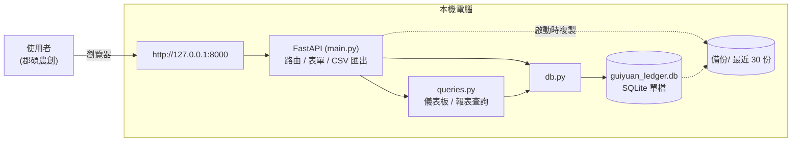
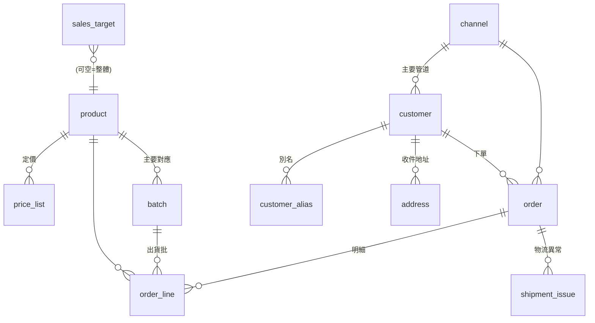

# 桂圓帳房 — 系統文件

南投中寮 · 郡碩農創 桂圓 / 龍眼乾銷售與物流管理平台。
本文件為開發 / 維護用途;操作說明見 [使用手冊.md](使用手冊.md)。

---

## 1. 概觀

| 項目 | 內容 |
|---|---|
| 型態 | 單機本地 Web 應用,資料全部留在使用者電腦 |
| 後端 | Python 3 + FastAPI |
| 樣板 | Jinja2(伺服器渲染)+ 少量原生 JavaScript |
| 資料庫 | SQLite 單檔 `guiyuan_ledger.db` |
| 前端框架 | 無(無打包步驟);CSS 為單一 `static/app.css` |
| 執行 | `啟動.bat`(建立 venv、裝套件、必要時建庫、開瀏覽器、跑 uvicorn) |
| 網址 | http://127.0.0.1:8000 |
| 風格 | 「帳房・宣紙」:米黃底、墨褐明體標題、朱印紅重點(Noto Serif TC / Noto Sans TC) |

### 設計原則
- 人(customer)、貨(product / batch)、單(order / order_line)、錢(收款欄位)、物流(出貨欄位 + shipment_issue)五件事各自獨立。
- 一張原始出貨 = 一張 `order`,底下掛 `order_line`。
- 「贈送 / 樣品 / 理賠重寄」是**訂單種類**(`order_kind`),不是付款方式,可單獨統計成本。
- 產季(4 月開花養果起、到隔年 3 月這批桂圓乾賣完,共 12 個月)是一等公民;分析可切產季或看全部。

### 系統架構圖



全部在同一台電腦,無雲端、無登入、無外部連線。

### 資料模型(關聯)



- **主檔**:channel / product(+ price_list)/ batch / customer(+ alias + address)
- **交易**:order(+ order_line)、shipment_issue
- **輔助**:sales_target、review_queue(未與其他表建外鍵關聯)

---

## 2. 目錄結構

```
app/
  啟動.bat            啟動腳本(純英文內容,避免 cmd 中文亂碼)
  requirements.txt    fastapi / uvicorn / jinja2 / python-multipart
  schema.sql          14 張表的 DDL
  seed.py             建庫 + 灌示範假資料(2024、2025 兩個產季)
  guiyuan_ledger.db   SQLite 資料庫(執行後產生)
  備份/               每次啟動自動複製當日 .db,保留最近 30 份
  .venv/              虛擬環境(啟動時建立)

  db.py               SQLite 連線與 q / q1 / execute 三個小工具
  queries.py          儀表板 / 報表的所有查詢
  main.py             FastAPI 應用:路由、CSV 匯出、備份

  templates/          Jinja2 樣板(見 §6)
  static/app.css      全站樣式(以 ?v=N 破快取)
  docs/               本文件與使用手冊
```

### 啟動流程(`啟動.bat`)
1. 找 Python:優先 `py -3.11`,退而求其次 `py`、`python`。
2. `.venv` 不存在 → 建立。
3. `pip install -r requirements.txt`(靜默)。
4. `guiyuan_ledger.db` 不存在 → `python seed.py --force`。
5. 開瀏覽器 `http://127.0.0.1:8000`,啟動 `uvicorn main:app`。

> 沒有 `--reload`。**改完 .py / 樣板要關掉黑視窗、重跑 `啟動.bat`** 才會生效;純粹在畫面上新增 / 修改資料不用重啟。
> `watchfiles`(uvicorn 自動重載所需)在此機器需要 C++ 編譯器,已刻意不採用。

### 區網存取(iPad / 其他裝置)
- uvicorn 綁 `--host 0.0.0.0`,同一個 Wi-Fi 下其他裝置以 `http://<本機區網IP>:8000` 連入。
- `啟動.bat` 會用 `ipconfig` 印出可用的 IPv4 位址。
- `templates/base.html` 帶 `manifest.webmanifest` + `apple-touch-icon` + `apple-mobile-web-app-*` meta,iPad Safari 可「加入主畫面」成獨立視窗 App。圖示為 `static/icon-{180,192,512}.png`(朱紅底白「郡」字,由 Pillow 一次性產生,非執行期相依)。
- `main.SENDER` 常數 = 出貨標籤 / 食品標示上的寄件人(名稱、地區、地址、電話),地址電話目前為 `[寄件地址]` 佔位待填。
- `app.css` `@media print` 隱藏側欄 / 按鈕,供揀貨單、標籤、食品標示列印;`.lbl` / `.foodlbl` 為標籤卡樣式。
- `app.css` `@media (max-width: 900px)` 讓側邊選單轉為頂部橫列、格線收成單欄、寬表格於卡片內橫向捲動。
- 仍無登入 / HTTPS;僅限信任的區網使用。要對外需另加驗證與反向代理。

---

## 3. 資料庫結構

`schema.sql`,`PRAGMA foreign_keys = ON`。金額欄位單位皆為 NT$。

### 3.1 product — 商品目錄
| 欄位 | 說明 |
|---|---|
| product_id | PK |
| sku | 商品編號,唯一,人可讀(如 `GY-DRY-300`) |
| name | 品名 |
| product_type | 型態:單品 / 組合 / 禮盒 / 裸裝 / 試吃包 / 加購贈品 |
| type_code_raw | 對方舊代號(如 `#26`) |
| net_weight_g / gross_weight_g | 內容量 / 毛重(克) |
| package_form | 夾鏈袋 / 罐 / 禮盒 / 真空袋 / 裸裝 |
| uom | 計價單位:包 / 斤 / 盒 / 罐 / 支 |
| grams_per_uom | 1 計價單位 = 幾克(斤↔克換算) |
| shelf_life_days | 保存天數(從製造日起算) |
| storage_condition | 常溫 / 冷藏 / 冷凍 |
| ingredients / origin / allergen / barcode | 標示用 |
| gift_only | 1 = 僅供贈品,不販售 |
| status | 在售 / 停售 |

### 3.2 price_list — 定價表
| 欄位 | 說明 |
|---|---|
| product_id | FK product |
| customer_segment | 零售 / 批發 / 團購 / 機構 / 內部 |
| channel_id | 通路特定價(NULL = 通用);目前 UI 只寫通用價 |
| unit_price | 單價 |
| effective_from / effective_to | 生效區間(UI 存 `2000-01-01` 起) |

> 儲存商品時,該商品的通用定價(channel_id IS NULL)會**整批刪除重寫**,不留歷史。

### 3.3 customer — 客戶主檔
`display_name`、`customer_type`(個人 / 公司 / 機構團體 / 通路商 / 內部)、
`segment`(零售 / 批發 / 團購主 / 機構 / 公關對象)、`primary_channel_id`、
`phone`、`email`、`contact_person`、`invoice_title`、`tax_id`、
`tax_doc_pref`(電子發票二聯 / 三聯 / 農民收據 / 免開立)、`tags`、`note`、`first_order_date`。

> `customer.segment` 與 `price_list.customer_segment` 值域不同,對照:
> 團購主→團購、公關對象→內部,其餘同名。程式常數 `SEG_MAP`(main.py)。

### 3.4 customer_alias — 別名對照
`alias_text`(唯一)→ `customer_id`。歷史各種寫法、暱稱都對到同一人;搜尋與比對都會查這張表。

### 3.5 address — 收件地址
一個客戶可多筆:`label`、`recipient_name`、`recipient_phone`、`zipcode`、`address_full`、`is_default`。
UI 目前只維護一筆預設地址(upsert)。

### 3.6 channel — 銷售管道
`code`(唯一)、`name`、`category`、`commission_pct`(0.05 = 5%)、`settlement_lag_days`。

### 3.7 batch — 焙製批次
`batch_code`(唯一)、`season`、`product_id`(可 NULL = 多品)、`roast_start/end`、
`raw_source`、`raw_input_kg`、`output_qty`、`output_uom`、`mfg_date`(效期基準)、`unit_cost`。
剩餘量 = `output_qty` − Σ(該批的 order_line.qty),即時算,不落欄。

### 3.8 order — 訂單
| 群組 | 欄位 |
|---|---|
| 識別 | order_no(唯一)、order_date、season、customer_id、channel_id |
| 性質 | order_kind:銷售 / 贈送-公關 / 贈送-捐贈 / 樣品 / 理賠重寄 / 換貨補出 / 內部領用;source_ref |
| 金額 | discount_total、shipping_fee_charged、platform_fee、order_total |
| 收款 | payment_method、payment_account、payment_status(待收款 / 部分收款 / 已收款 / 免收款)、paid_date、paid_amount |
| 單據 | tax_doc_type、tax_doc_no |
| 物流 | ship_method、carrier、tracking_no、ship_from、shipped_date、delivered_date、shipping_cost_actual、packaging_cost、ship_status(待出貨 / 已出貨 / 已送達 / 退回 / 遺失 / 破損) |
| 其他 | note、created_at |

`order_total` = Σ(非贈品 line_subtotal) − discount_total + shipping_fee_charged,於建立 / 編輯 / 複製 / 標記收款時重算。

### 3.9 order_line — 訂單明細
`product_id`(FK)、`batch_id`(FK,可 NULL)、`qty`、`unit_price`(成交價)、
`list_price`(當下標準價,建立時由 price_list 帶入)、`line_discount`(目前未用)、
`line_subtotal` = qty × unit_price、`is_gift`(1 = 搭贈,不計收入)、`expiry_stated`(歷史效期原值,保留欄)。

> 「賣得比定價低」的折扣**不寫回 discount_total**(避免與整單折讓重複扣);
> 由報表 / 警示以 `(list_price − unit_price) × qty` **即時計算**。

### 3.10 shipment_issue — 物流異常 / 退補
`order_id`(FK)、`issue_type`(遺失 / 破損 / 退貨 / 客訴 / 到期回收)、`issue_date`、
`qty_affected`、`resolution`(重寄 / 退款 / 換貨 / 折讓 / 無)、`linked_reship_order_id`、
`cost_impact`、`reason_note`。

### 3.11 sales_target — 產季目標
`season`、`product_id`(NULL = 整體)、`target_qty`、`target_amount`。
維護畫面:`GET/POST /targets`(每季一筆 `product_id IS NULL` 的整體目標;存檔為先刪後插,
因 SQLite `UNIQUE` 不約束 NULL)。儀表板「產季目標 & 進度」卡與 `queries.season_progress()` 使用。

### 3.12 review_queue — 待確認佇列
`source`(import / form)、`raw_json`、`issue_type`、`status`(待處理 / 已修 / 已忽略)、
`resolved_order_id`、`note`。新增客戶擋重名等情境會寫入。

### 3.14 stock_move — 庫存異動(SKU 層)
`move_date`、`product_id`(FK)、`batch_id`(FK,可空)、`qty`(正=入庫 負=出庫)、
`move_type`(期初庫存 / 分裝入庫 / 銷售出庫 / 贈送出庫 / 盤點調整 / 損耗報廢 / 退貨入庫)、
`ref_order_id`(關聯訂單)、`note`。
現有量 = Σ `qty`;可再依 `batch_id` 分組看批次分布。
訂單建立 / 編輯 / 複製 / 理賠重寄時,`main.sync_order_stock(oid)` 會重建該訂單的「銷售出庫 / 贈送出庫」列。
`product.low_stock` 為低庫存警戒量(NULL = 不設);現有量 ≤ 0 觸發「超賣」警示,0 < 現有量 ≤ low_stock 觸發「偏低」警示。

### 3.13 op_expense — 營運費用(月)
`ym`(YYYY-MM)、`category`(人事 / 場地・倉儲 / 行銷 / 金流手續費 / 設備維護 / 培訓 / 其他)、`amount`、`note`。逐月逐項一筆,供財務健康頁計算稅前利潤。由郡碩農創逐月維護。

---

## 4. 關鍵商業邏輯

### 產季(season)
原始 Excel 沒有「產季」概念。這裡定義:**一個產季 = 當年 4 月初 ~ 隔年 3 月底**,以起始年命名。
從 4 月開花養果、7–9 月採收柴焙、9 月~隔年 3 月銷售(旺季在中秋~過年)、隔年春天尾貨出清,剛好一輪不重疊。
所以 `2026 產季` = `2026-04-01 ~ 2027-03-31`。
訂單的 `season` 由訂單日推算:`queries.season_of(date)` —— 月份 ≥ 4 取當年,≤ 3 取前一年;`order_create` / `order_update` 皆自動帶入。
批次(batch)的 `season` 仍由表單填(預設帶當前產季)。seed 產生 2024、2025 兩批。

### 財務健康 · 月份清單
`queries.months_with_data()` = (有訂單的月份) ∪ (有登錄營運費用的月份),並補滿中間的空月。
所以**淡月(4–8 月開花養果期、幾乎沒收入)照樣列出**,`稅前利潤 = −該月營運費用`(純虧),月趨勢會顯示紅條。
`season_finance(season)` 另計「整個產季合計」:該季銷售月的營收 − 產季 12 個月(`{s}-04` ~ `{s+1}-03`)的營運費用 = 產季稅前利潤 —— 回答「這批貨扣掉整年固定成本到底賺不賺」。
`finance_summary(season)`:單一產季 → `season_finance`;`season=None` → 各產季相加。
`season_progress(season)`:目標達成率、依速度預估季末(實際 ÷ 已出貨旺季月數比例,旺季 = 9 月~隔年 3 月共 7 月)、損益兩平所需營收(固定成本 ÷ 毛利率)。

### 結算日(as_of)
所有「天數 / 逾期 / 到期倒數」的基準。`queries.as_of(asof)`:
- `latest`(預設)→ 資料庫中最新 `order_date`
- `today` → 系統今天
- 其他字串 → 當成日期直接用

用真資料、且訂單是即時輸入時,`latest` 會自然貼近今天;示範假資料若用 `today` 會全部變成逾期一百多天。

### 毛利
`毛利 = Σ line_subtotal − Σ(qty × batch.unit_cost)`(僅 `order_kind='銷售'`)。
批次沒設 `unit_cost` 時該列成本以 0 計。運費損益、通路抽成另計,不含在毛利內(通路報表的毛利有再扣 platform_fee)。

### 運費損益
`shipping_fee_charged − shipping_cost_actual`。負值 = 我方補貼客人。
補貼率 = `(cost − charged) / cost`。

### 自動帶價 + 折扣
新增訂單選了客戶 + 品項,單價欄留白時,前端 JS 依「客戶分級 → price_list」帶入標準價;
送出時後端再以 `SEG_MAP` 對照、由 price_list 查一次權威標準價寫進 `order_line.list_price`。
成交價低於標準價的差額 = 折扣,只在報表 / 警示即時算,不改 order_total。

### 批次去化 / 效期
去化率 = 已出 / 產出;剩餘 = 產出 − 已出;剩餘貨值 = 剩餘 × unit_cost。
到期日 = `mfg_date + shelf_life_days`;批次未綁 product 時,`shelf_life_days` 退回「該批賣出過的商品中最短的保存天數」。

### 儀表板警示規則(`queries.alerts`)
| 警示 | 條件 | 連結 |
|---|---|---|
| 貨款逾期未收 | payment_status='待收款' 且 結算日 − order_date > 30 | /orders?filter=overdue |
| 超過 3 天還沒出貨 | ship_status='待出貨' 且 結算日 − order_date > 3 | /orders?filter=unshipped |
| 破損 / 遺失待處理 | shipment_issue 中破損/遺失且 resolution 空 | /issues |
| 批 X 約 N 天到期 | 某批到期日距結算日 0–60 天 | /reports?tab=batch |
| 折扣佔比 | (整單折讓 + 低於定價差額) / 定價基礎 > 3% | /reports |
| 待確認資料 | review_queue 有「待處理」 | /review |

### 客戶合併(`POST /customers/{id}/merge`)
來源客戶的 `order`、`address`(is_default 歸零)、`customer_alias`(含 display_name)全部搬到目標客戶,來源客戶刪除。不能併給自己。無法復原。

### 理賠重寄(`POST /issues/{id}`,勾「一併建立」)
複製原訂單的品項,新開一張 `order_kind='理賠重寄'`、金額 0 的訂單,回填 `shipment_issue.linked_reship_order_id`。

---

## 5. 路由

### 頁面
| 路徑 | 說明 |
|---|---|
| `GET /` | 儀表板;吃 `?season=` `?asof=` |
| `GET /orders` | 訂單清單;`?filter=all\|overdue\|unpaid\|unshipped` `?q=` |
| `GET /orders/new` · `POST /orders` | 新增訂單 |
| `GET /orders/{id}` · `POST /orders/{id}` | 訂單明細 / 儲存(含品項重寫、改客戶) |
| `POST /orders/{id}/paid` · `/shipped` · `/copy` | 標記已收款 / 已出貨 / 複製 |
| `GET /customers` · `/customers/new` · `POST /customers` | 客戶資料庫 / 新增 / 存(含擋重名) |
| `GET /customers/{id}` · `/customers/{id}/edit` | 客戶明細 / 編輯 |
| `GET /customers/{id}/merge` · `POST /customers/{id}/merge` | 合併 |
| `GET /products` · `/products/new` · `/products/{id}/edit` · `POST /products` | 商品目錄(含定價) |
| `GET /batches` · `/batches/new` · `/batches/{id}/edit` · `POST /batches` | 焙製批次 |
| `GET /channels` · `/channels/new` · `/channels/{id}/edit` · `POST /channels` | 銷售管道 |
| `GET /reports` | 報表;`?tab=profit\|customer\|logistics\|aging\|batch\|compare` `?season=` `?asof=` |
| `GET /shipping` | 出貨作業首頁 |
| `GET /shipping/picklist` · `/shipping/labels` | 揀貨單(含 SKU 彙總)/ 出貨標籤;`?date=` 指定訂單日,否則全部『待出貨』 |
| `GET /shipping/foodlabel` | 食品標示;`?product_id=&batch_id=&copies=` |
| `GET /stock` | 庫存總覽;`POST /stock/move` 登錄分裝入庫 / 盤點 / 報廢 / 退貨 |
| `GET /stock/moves` | 庫存異動明細;`?product_id=&type=` |
| `GET /finance` | 財務健康 · 月損益;`?ym=YYYY-MM` |
| `GET /finance/expenses` · `POST /finance/expenses` | 營運費用維護(新增 / 修改 / 刪除,`_delete=1`) |
| `GET /targets` · `POST /targets` | 產季營收目標維護(每季一筆整體目標) |
| `GET /review` · `POST /review/{id}` | 待確認 / 更新狀態 |
| `GET /issues` · `POST /issues/{id}` | 物流異常 / 處理(可產生重寄單) |

### API(給前端 JS)
| 路徑 | 回傳 |
|---|---|
| `GET /api/customers?q=` | 客戶搜尋(名稱 / 別名 / 電話);空 q 回最近開單的 8 位 |
| `GET /api/customers/{id}` | 客戶明細 + 預設地址 + 最近 3 筆訂單 + 累計消費 |

### CSV 匯出(BOM,Excel 中文正常)
| 路徑 | 內容 |
|---|---|
| `GET /export/order_lines.csv?season=` | 每列一筆訂單明細 |
| `GET /export/orders.csv?season=` | 每列一筆訂單 |
| `GET /export/customers.csv` | 全部客戶 + 訂單數 + 累計 |
| `GET /export/report.csv?tab=&season=&asof=` | 依報表頁籤匯出對應表 |

---

## 6. 檔案職責

| 檔 | 內容 |
|---|---|
| `db.py` | `DB` 路徑常數;`q(sql,args)` 回 list[dict]、`q1` 回單筆、`execute` 回 lastrowid。每次呼叫開新連線。 |
| `queries.py` | `seasons()`、`as_of()`、`_S(season,alias)`(產季 WHERE 片段 + 參數);`kpi / alerts / monthly / by_channel / ar_aging / batch_progress / issues_by_carrier / product_mix / new_vs_repeat / top_customers`;`orders_list / order_get / review_list / issues_list`;報表 `profit_by_product / customer_analysis / logistics_report / batch_report / season_compare`;財務 `finance_month / finance_trend / season_finance / finance_summary / cumulative_trend(累積稅前利潤,逐月累加)/ season_progress / sales_target_get / sales_target_set`;`season_of(date)`(訂單日→產季)。 |
| `main.py` | FastAPI 應用、全部路由、`backup_db()`、`csv_response()`、Jinja 過濾器 `money` / `pct`、下拉選項常數(PAY_METHODS / SHIP_STATUS / PROD_TYPES …)。 |
| `seed.py` | 通路 → 商品(含定價)→ 批次(2024/2025 各三批)→ 客戶(含別名、地址)→ 訂單(兩產季、每月數筆銷售 + 1–2 筆公關)→ 逾期 / 物流異常 / 產季目標 / 待確認 示範資料。`--force` 直接重建。 |
| `templates/base.html` | 版面骨架、左側選單、載入 `app.css?v=N` |
| `templates/_filterbar.html` | 產季 / 結算日 下拉(儀表板、報表共用) |
| 其餘 `templates/*.html` | 各頁面,命名對應路由 |
| `static/app.css` | 設計 token(`--paper` `--seal` …)、卡片 / 表格 / 藥丸 / 搜尋下拉 樣式 |

---

## 7. 備份

`main.py` 匯入時執行 `backup_db()`:
- 複製 `guiyuan_ledger.db` → `備份/guiyuan_ledger_YYYYMMDD.db`
- 同一天只備一次
- 只保留最近 30 份,更舊的自動刪
- 失敗只印訊息,不影響啟動

還原:關掉 App → 把 `備份/` 內某個檔複製回 `app/` 並改名為 `guiyuan_ledger.db` → 重新啟動。
另建議定期把整個 `app/` 資料夾(或至少 `.db` 與 `備份/`)複製到隨身碟 / 雲端資料夾。

---

## 8. 維護指引

- **改程式後**:關黑視窗、重跑 `啟動.bat`。改 `app.css` 時把 `base.html` 的 `?v=N` +1。
- **手動查 / 改資料**:用 DB Browser for SQLite 開 `guiyuan_ledger.db`。
- **重建示範資料**:`python seed.py --force`(會清空現有資料)。
- **加一個欄位**:改 `schema.sql` → 若已有正式資料,用 DB Browser 執行 `ALTER TABLE ... ADD COLUMN ...`(SQLite 支援);純示範階段直接 `seed.py --force`。
- **新增下拉選項**:改 `main.py` 對應常數(如 `SHIP_METHODS`),CHECK 約束在 `schema.sql`。
- **多機 / 多人**:目前不支援;SQLite 單檔、無登入,設計為單人本機。

---

## 9. 已知限制 / 待辦

- **匯入歷史 2024 / 2025 真實資料**:尚未做;需先對照商品 / 客戶 / 通路。
- **現金水位 / 現金流 / 跑道**、**進貨 / 供應商 / 應付帳款**:尚未做(第二批規劃)。
- **出貨標籤 / 揀貨單列印**、**食品標示套印**:未做。
- 批次(batch)的 `season` 仍靠人工填(訂單已改為自動推算)。
- 客戶合併後可能沒有預設地址(is_default 全歸零)。
- `line_discount` 欄位保留未用。
- 報表「物流商異常」不隨產季篩(異常量少,顯示全期)。
